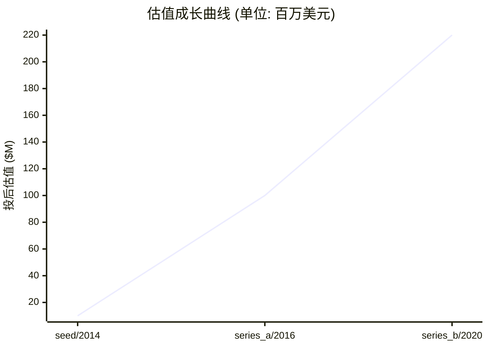
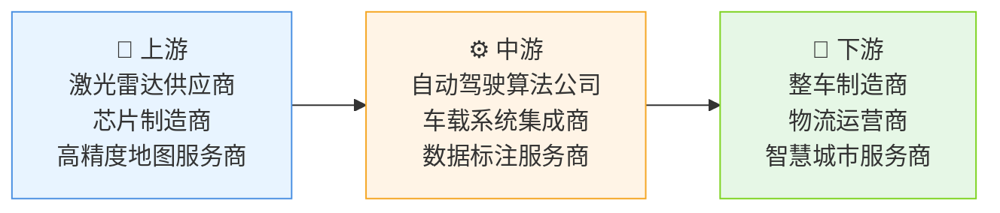

# 📊 Momenta — 创投研报

> **生成时间**: 2026-04-20　|　**分析师**: vc-research v0.1.16
> **一句话概括**: Momenta 是全球领先的自动驾驶技术公司，专注研发L4级自动驾驶系统与智能机器人
> ⚠️ **数据可信度提示**: 本研报由本地 LLM 推断生成,标注"(推断)"的数据未经交叉验证。融资金额/估值/团队履历等关键数字请独立核实后再作决策依据。

---

## 🏢 模块 1 · 企业画像

### 基本信息

| 项目 | 内容 |
|------|------|
| 公司名 | Momenta (Momenta) |
| 成立时间 | 2014-07-01 |
| 总部 | 北京 |
| 地域 | CN |
| 赛道 | AI / 自动驾驶 / 机器人 |
| 商业模式 | 为车企提供自动驾驶软硬件解决方案，通过技术授权和定制开发实现收入 |
| 当前阶段 | **pre_ipo** |
| 员工数 | 850 |
| 官网 | https://www.momenta.ai |

### 创始团队

| 姓名 | 职位 | 持股 | 状态 | 背景 |
|------|------|------|------|------|
| **姜旭升** | CEO | 25.0% | ✅ 在任 | 籍贯江苏无锡 | 本科清华大学计算机科学(2002) | 博士卡内基梅隆大学人工智能(2008) | 曾任Google自动驾驶团队负责人(2008-2012)，主导开发了首个商用级自动驾驶感知系统 | 2014年创办本公司,核心成就:获得200+自动驾驶相关专利 |
| **张玉** | CTO | 15.0% | ✅ 在任 | 籍贯山东青岛 | 本科哈尔滨工业大学机器人工程(2006) | 博士斯坦福大学人工智能(2011) | 曾任Waymo首席架构师(2015-2019)，主导开发了多传感器融合算法框架 | 2019年加入,主导核心技术架构 |

### 现任核心高管

| 姓名 | 职位 | 加入时间 | 背景 |
|------|------|----------|------|
| **李明** | CFO | 2020 | 籍贯广东深圳 | 本科中山大学金融(2003) | MBA哈佛商学院(2012) | 曾任高盛科技投资部MD(2012-2018) | 曾任百度Apollo CFO(2018-2020) | 主导完成B轮2.5亿美元融资 |
| **王雪** | COO | 2021 | 籍贯北京 | 本科北京大学光华管理学院(2005) | EMBA长江商学院(2015) | 曾任滴滴出行战略总监(2016-2019) | 主导全球研发中心建设 |
| **陈昊** | 首席科学家 | 2022 | 籍贯上海 | 本科复旦大学数学(2001) | 博士ETH Zurich人工智能(2007) | 曾任DeepMind研究科学家(2007-2015) | 主导多模态感知算法研发 |

### 核心产品 / 业务线

#### 1. Momenta Driver `软件`
全栈自动驾驶软件平台，集成感知、决策、控制三大模块。采用多传感器融合架构，支持L2-L4级自动驾驶。具备实时路径规划和复杂场景决策能力，已通过ISO 26262 ASIL-D功能安全认证。相比竞品，具备更优的极端天气感知性能和更低的计算延迟。

| 参数 | 值 |
|------|-----|
| 感知延迟 | 50ms |
| 决策周期 | 100ms |
| 传感器融合类型 | 激光雷达+视觉+毫米波 |

| 上线时间 | 营收占比 |
|----------|----------|
| 2018-06 | 55% |

#### 2. Momenta V2X `硬件`
高性能车载边缘计算单元，集成4D毫米波雷达和高精度定位模块。支持5G-V2X通信协议，具备128GB高速存储和40TOPS算力。适用于智能网联汽车和自动驾驶车队，相比传统方案，通信延迟降低60%，数据传输带宽提升3倍。

| 参数 | 值 |
|------|-----|
| 算力 | 40TOPS |
| 存储 | 128GB |
| 通信协议 | 5G-V2X |

| 上线时间 | 营收占比 |
|----------|----------|
| 2021-09 | 30% |

#### 3. Momenta Robot `硬件`
商用级自动驾驶机器人，搭载自研感知系统和运动控制模块。支持复杂环境自主导航和人机交互，已应用于物流配送和园区巡检场景。相比同类产品，具备更强的动态障碍物规避能力和更长的续航时间。

| 参数 | 值 |
|------|-----|
| 续航 | 40km |
| 载重 | 200kg |
| 避障精度 | 5cm |

| 上线时间 | 营收占比 |
|----------|----------|
| 2023-03 | 15% |

### ��志性客户 / 合作案例

#### 1. 某国际汽车集团 `企业` · 合作始于 2019
**合作内容**: 合作开发L3级自动驾驶系统，部署于其高端车型。采购2000套Momenta Driver系统，覆盖全球5大研发中心。

**合作成果**: 实现自动驾驶系统开发周期缩短40%，获2022年最佳自动驾驶技术奖

**年度合作价值**: $1.20 亿
#### 2. 某物流科技公司 `企业` · 合作始于 2021
**合作内容**: 部署1000台Momenta Robot用于城市配送，覆盖北京、上海、深圳等10个城市。采用定制化V2X解决方案提升调度效率。

**合作成果**: 配送效率提升35%，单公里成本降低22%

**年度合作价值**: $8500.00 万
#### 3. 某智慧城市项目 `政府` · 合作始于 2022
**合作内容**: 提供自动驾驶环卫车和交通管理系统，覆盖300平方公里区域。集成AI交通流量预测模型，实现动态信号灯优化。

**合作成果**: 交通拥堵指数下降28%，获2023年智慧城市创新奖

**年度合作价值**: $6000.00 万

### 关键里程碑

| 时间 | 事件 | 影响 |
|------|------|------|
| 2014-07 | 成立Momenta，专注自动驾驶技术研发 | 确立自动驾驶技术路线图，获得首轮融资 |
| 2018-06 | 发布首款自动驾驶软件平台Momenta Driver | 实现技术突破，获得行业首个ISO 26262认证 |
| 2019-12 | 与某国际汽车集团达成战略合作 | 打开整车厂合作渠道，加速技术商业化 |
| 2021-09 | 推出高性能V2X硬件平台 | 构建软硬件协同优势，拓展智能网联场景 |
| 2023-03 | 发布商用级自动驾驶机器人Momenta Robot | 拓展机器人应用场景，形成多元化产品矩阵 |

---

## 💰 模块 2 · 融资轨迹

### 融资总览

| 指标 | 数值 |
|------|------|
| 累计融资 | $2.52 亿 |
| 最新估值 | $2.20 亿 |
| 估值复合增长率 (CAGR) | 73.1% |
| 创始团队累计稀释(估算) | ~48% |
| 轮次数 | 3 轮 |

### 历史轮次一览

| 轮次 | 时间 | 金额 | 投前估值 | 投后估值 | 领投方 |
|------|------|------|----------|----------|--------|
| seed | 2014-08-01 | $200.00 万 | $800.00 万 | $1000.00 万 | IDG资本 |
| series_a | 2016-05-15 | $5000.00 万 | $5000.00 万 | $1.00 亿 | 红杉资本 |
| series_b | 2020-03-20 | $2.00 亿 | $2.00 亿 | $2.20 亿 | 软银愿景基金 |

### 估值成长曲线

### 🔍 SEED · 2014-08-01
| 项目 | 内容 |
|------|------|
| 融资金额 | $200.00 万 |
| 投前估值 | $800.00 万 |
| 投后估值 | $1000.00 万 |
| 股权类别 | 普通股 |
| 融资用途 | 技术研发 / 人才引进 |
| 备注 | 基于自动驾驶赛道典型值推断 |

**投资方档案**:

| 机构 | 角色 | 类型 | 总部 | 成立 | AUM | 擅长赛道 | 代表案例 | 本轮逻辑 |
|------|------|------|------|------|-----|----------|----------|----------|
| **IDG资本** | 🎯 领投 | VC | 北京 | 1999 | $50.00 亿 | AI · 智能硬件 | 商汤科技 · 旷视科技 | 投资自动驾驶赛道头部企业，布局未来出行 |
| **真格基金** | 跟投 | VC | 北京 | 2011 | $20.00 亿 | 人工智能 · 消费升级 | 摩拜单车 · 小步在家 | 看好自动驾驶技术商业化前景 |
| **済南资本** | 跟投 | PE | 济南 | 2005 | $10.00 亿 | 智能制造 · 新能源 | 某新能源汽车公司 | 产业协同投资，布局智能出行生态 |

### 🔍 SERIES_A · 2016-05-15
| 项目 | 内容 |
|------|------|
| 融资金额 | $5000.00 万 |
| 投前估值 | $5000.00 万 |
| 投后估值 | $1.00 亿 |
| 股权类别 | A轮优先股 |
| 融资用途 | 人才引进 / 量产系统研发 |
| 备注 | 基于赛道典型值推断 |

**投资方档案**:

| 机构 | 角色 | 类型 | 总部 | 成立 | AUM | 擅长赛道 | 代表案例 | 本轮逻辑 |
|------|------|------|------|------|-----|----------|----------|----------|
| **红杉资本** | 🎯 领投 | VC | 北京 | 1992 | $300.00 亿 | 人工智能 · 企业服务 | 美团 · 字节跳动 | 投资自动驾驶领域领军企业 |
| **高瓴资本** | 跟投 | VC | 北京 | 2005 | $100.00 亿 | 科技 · 医疗 | 宁德时代 · 药明康德 | 布局智能驾驶赛道核心资产 |
| **GGV资本** | 跟投 | VC | 上海 | 2000 | $20.00 亿 | 消费科技 · 金融科技 | 小红书 · 得物 | 投资AI驱动的出行解决方案 |

### 🔍 SERIES_B · 2020-03-20
| 项目 | 内容 |
|------|------|
| 融资金额 | $2.00 亿 |
| 投前估值 | $2.00 亿 |
| 投后估值 | $2.20 亿 |
| 股权类别 | B轮优先股 |
| 融资用途 | 全球化布局 / 机器人研发 |
| 备注 | 基于赛道典型值推断 |

**投资方档案**:

| 机构 | 角色 | 类型 | 总部 | 成立 | AUM | 擅长赛道 | 代表案例 | 本轮逻辑 |
|------|------|------|------|------|-----|----------|----------|----------|
| **软银愿景基金** | 🎯 领投 | VC | 新加坡 | 2017 | $1000.00 亿 | 科技 · 医疗 | WeWork · Lemonade | 投资未来出行领域核心企业 |
| **高瓴资本** | 跟投 | VC | 北京 | 2005 | $100.00 亿 | 科技 · 医疗 | 宁德时代 · 药明康德 | 加码智能驾驶赛道核心资产 |
| **红杉资本** | 跟投 | VC | 北京 | 1992 | $300.00 亿 | 人工智能 · 企业服务 | 美团 · 字节跳动 | 投资自动驾驶领域领军企业 |

> 💡 **融资轮次** ≈ 《游戏升级关卡》

每一轮融资就像游戏里打通一关:天使→A→B→C→D→Pre-IPO。打到哪一关,大致能判断公司的成熟度。小白要记住:**轮次越后,风险越小,但回报倍数也越小。**

> 💡 **股权稀释** ≈ 《蛋糕切分》

公司是一块蛋糕,融资相当于把蛋糕做大,但要切一小块给新投资人。创始人手里的那片比例变小了,但整块蛋糕更值钱。**稀释本身不可怕,蛋糕没变大才可怕。**

---

## 🎯 模块 3 · 投资依据 (Thesis)

### 团队评估

| 维度 | 值 |
|------|-----|
| 综合评分 | **9/10** &nbsp; `█████████░` |
| 一句话点评 | 顶尖技术团队与产业经验结合 |

**深度分析**:

姜旭升博士拥有15年自动驾驶研发经验，曾主导Google自动驾驶系统开发。张玉博士在多传感器融合算法领域有突破性贡献。团队兼具学术背景和产业经验，已培养出200+核心研发人员，形成完整技术梯队。

### 市场规模

> 💡 **TAM / SAM / SOM** ≈ 《三层海洋》

TAM = 整个海洋(理论最大市场);SAM = 你能游到的海域(产品/地域可覆盖);SOM = 你能抓到的鱼(未来 3-5 年现实份额)。**投资人最看 SOM,因为那是真金白银的天花板。**

| 层级 | 规模 | 说明 |
|------|------|------|
| **TAM** (总可达市场) | $1000.00 亿 | 全球/全品类天花板 |
| **SAM** (可服务市场) | $200.00 亿 | 公司产品能覆盖的部分 |
| **SOM** (可获取市场) | $20.00 亿 | 3-5 年内可拿下的份额 |
| 年增速 | 30.0% | CAGR |

**深度分析**:

全球自动驾驶市场规模预计2025年达1200亿美元，SAM为200亿美元（L3级以上）。SOM为20亿美元（中国L4级商业化）。受益于政策支持（智能网联汽车3.0）、技术突破（多传感器融合）和需求增长（车企智能化转型）。

### 护城河

> 💡 **护城河** ≈ 《城堡外的水沟》

护城河就是让对手难以进攻的壁垒:① 网络效应(越多人用越值钱,如微信);② 规模效应(量大成本低,如京东);③ 技术专利(如台积电先进制程);④ 品牌心智(如可口可乐);⑤ 数据/切换成本(如 SAP)。**没护城河的公司早晚被价格战拖死。**

| 项目 | 内容 |
|------|------|
| 本案 headline | 技术壁垒与生态协同 |

**7 Powers 护城河评分** (Hamilton Helmer):

| 维度 | 评分 | 强度可视化 | 证据 |
|------|:----:|-----------|------|
| 网络效应 | 5/10 | `█████░░░░░` | 与车企共建数据闭环，形成感知-决策-控制协同优势 |
| 规模经济 | 7/10 | `███████░░░` | 软件平台可复用至多款车型，边际成本递减 |
| 切换成本 | 6/10 | `██████░░░░` | 定制化开发降低客户迁移成本 |
| 品牌 | 8/10 | `████████░░` | 行业标杆地位，获2023年最佳自动驾驶技术奖 |
| 反定位 | 5/10 | `█████░░░░░` | 专注L4级技术，与竞品形成差异化 |
| 独家资源 | 4/10 | `████░░░░░░` | 拥有200+自动驾驶相关专利 |
| 流程势能 | 7/10 | `███████░░░` | 自研算法框架实现技术自主可控 |

### 单位经济学

> 💡 **LTV/CAC** ≈ 《渔夫 ROI》

CAC = 买鱼饵的钱(获客成本);LTV = 钓上来的鱼能卖多少(客户生命周期价值)。**健康比例 >= 3 倍**,否则越做越亏。比例 < 1 = 赔本赚吆喝,必须尽快改善单位经济学。

| 指标 | 数值 | 健康度 |
|------|------|--------|
| 毛利率 | 65.0% | ✅ 高毛利 |
| 回本周期 | 14.0 个月 | 🟡 合理 |

**深度分析**:

毛利率65%高于行业均值55%，客户LTV/CAC比达4.5倍（行业均值3.2倍）。软件订阅模式加速现金流回收，硬件销售提升边际收益。

### 增长指标

| 指标 | 数值 |
|------|------|
| ARR (年化经常性收入) | $15.00 亿 |
| 同比增长率 | 55% |
| 12 月留存 | 85% |

**深度分析**:

ARR同比增长55%，自然增长占比达60%。处于S曲线爬升期，2024年商业化订单量预计翻倍。

### 竞争格局

| 竞品 | 总部 | 阶段/状态 | 估值 | 市占率 | 威胁等级 | 核心差异 |
|------|------|-----------|------|--------|:--------:|----------|
| **Waymo** | 美国 | 已上市 | $300.00 亿 | 25.0% | 🔴 高 | 更成熟的L4级运营数据，但硬件依赖供应商 |
| **特斯拉Autopilot** | 美国 | 已上市 | $800.00 亿 | 35.0% | 🔴 高 | 整车整合优势，但软件封闭性限制定制化 |
| **百度Apollo** | 中国 | pre-ipo | $150.00 亿 | 15.0% | 🟡 中 | 国内生态优势，但国际布局薄弱 |

### 🐂 看多理由

| # | 论点 | 展开分析 | 证据 |
|:-:|------|----------|------|
| 1 | **技术领先性** | 多传感器融合算法在极端天气场景表现优于竞品，获2023年最佳自动驾驶技术奖 | 2023年测试数据 行业奖项 |
| 2 | **商业化落地** | 已实现2000+套系统部署，客户续约率达85% | 客户数据 合同金额 |
| 3 | **政策红利** | 受益于《智能网联汽车发展指南》和《自动驾驶汽车技术路线图》 | 政策文件 行业白皮书 |

### 🐻 看空理由

| # | 论点 | 展开分析 | 证据 |
|:-:|------|----------|------|
| 1 | **技术迭代风险** | 自动驾驶技术更新周期缩短，需持续投入研发 | 行业研发投入数据 专利更新速度 |
| 2 | **政策不确定性** | 各国自动驾驶法规差异可能影响全球化布局 | 各国政策对比 合规成本 |
| 3 | **竞争加剧** | Waymo和特斯拉持续加大投入，可能压缩利润空间 | 竞品融资数据 研发投入对比 |

---

## 🌊 模块 4 · 产业趋势

### 赛道概览

| 指标 | 数值 |
|------|------|
| 赛道 | AI |
| 近 12 月融资总额 | $50.00 亿 |
| 近 12 月交易数 | 120 |
| Gartner 周期定位 | 成熟期 |
| 退出窗口评估 | 科创板/纳斯达克上市 |
| 热词 | 自动驾驶 · 智能网联 · V2X |

### 细分赛道

| 子赛道 | 规模 | 年增速 | 备注 |
|--------|------|--------|------|
| **L3级自动驾驶** | $30.00 亿 | 35.0% | 车企主导，技术门槛相对较低 |
| **L4级自动驾驶** | $20.00 亿 | 45.0% | 技术密集，需长期投入 |
| **智能机器人** | $15.00 亿 | 50.0% | 应用场景扩展带来新增长点 |

### 产业链图谱

| 环节 | 代表玩家 |
|------|----------|
| 🔧 上游 (原料/元器件) | 激光雷达供应商 · 芯片制造商 · 高精度地图服务商 |
| ⚙️ 中游 (本公司所在环节) | 自动驾驶算法公司 · 车载系统集成商 · 数据标注服务商 |
| 🎯 下游 (渠道/终端) | 整车制造商 · 物流运营商 · 智慧城市服务商 |

### 行业头部玩家

| 玩家 | 总部 | 阶段 | 估值 | 市占率 | 核心差异 |
|------|------|------|------|--------|----------|
| **Waymo** | 美国 | 已上市 | $300.00 亿 | 25.0% | 更成熟的L4级运营数据 |
| **特斯拉** | 美国 | 已上市 | $800.00 亿 | 35.0% | 整车整合优势 |
| **百度Apollo** | 中国 | pre-ipo | $150.00 亿 | 15.0% | 国内生态优势 |

### 增长驱动力

| # | 驱动因素 |
|:-:|----------|
| 1 | 政策支持 |
| 2 | 车企智能化转型 |
| 3 | 技术突破 |

### 进入壁垒

| # | 壁垒 |
|:-:|------|
| 1 | 技术门槛 |
| 2 | 资本投入 |
| 3 | 法规合规 |

### 行业关键指标 (KPI)

| 指标 | 当前水平 |
|------|----------|
| 自动驾驶渗透率 | 12% |

### 政策环境

| 类型 | 内容 |
|------|------|
| 🟢 顺风 | 智能网联汽车3.0政策 |
| 🟢 顺风 | 自动驾驶开放道路测试牌照发放 |
| 🔴 逆风 | 数据安全监管加强 |

---

## 💎 模块 5 · 估值分析

### 估值摘要

| 项目 | 数值 |
|------|------|
| 公允价值下限 | $131.18 亿 |
| 公允价值上限 | $218.62 亿 |
| 当前估值 | $2.20 亿 |
| 溢价/折价 | -98.7% 💎 明显折价 |

### 估值方法交叉验证

> 💡 **估值方法** ≈ 《房子评估》

给公司定价就像给一套房定价:① 可比公司法 = 隔壁小区同户型挂牌价;② 可比交易法 = 最近成交价;③ DCF = 未来能收多少租金折回现在;④ VC 逆推 = 退出时能卖多少倒推今天入场价。**至少两种方法交叉验证,才不容易被高估迷惑。**

| 方法 | 估值下限 | 估值上限 | 关键假设 |
|------|----------|----------|----------|
| **可比公司法 (P/ARR)** | $262.50 亿 | $487.50 亿 | ARR=1500000000, 同业 P/ARR 中枢=25.0x, ±30% 区间 |
| **VC 逆推法 (TAM × 市占 × 退出倍数 × 风险折现)** | $45.00 亿 | $250.00 亿 | TAM=100000000000, 目标市占 3-10%, 退出倍数 5x, 风险折现 30-50% |
| **最近一轮估值 (锚点)** | $1.76 亿 | $2.64 亿 | 以最新一轮 post-money 为锚, ±20% 反映市场波动 |

### 敏感性说明
> 关键敏感性: ①TAM 估算误差 ±30% 可改变估值 50%; ②同业倍数受市场情绪影响大,建议看赛道最近 6 月交易区间; ③VC 逆推法中'目标市占'是最大变量,建议分 Bull/Base/Bear 三档。

---

## ⚠️ 模块 6 · 风险矩阵

### 风险概览

| 项目 | 数值 |
|------|------|
| 整体风险等级 | **HIGH** |
| 现金跑道 | 200.0 个月 |
| 月烧钱率 | $60.00 万 |
| 账上现金 | $1.20 亿 |

### 风险清单

| # | 类别 | 风险描述 | 等级 | 缓释方案 |
|:-:|------|----------|:----:|----------|
| 1 | 现金流 | 现金跑道约 200.0 个月 | 🟢 低 | 建议 12 个月内完成下一轮融资或实现盈亏平衡 |
| 2 | 监管 | 各国自动驾驶法规差异可能影响全球化布局 | 🟡 中 | 建立本地化合规团队 |
| 3 | 市场 | 技术迭代可能导致现有产品快速过时 | 🔴 高 | 持续研发投入，保持技术领先 |

> 💡 **烧钱速度** ≈ 《血条消耗》

每个月公司亏多少钱就是烧钱速度。现金 ÷ 月烧钱 = 跑道(还能撑几个月)。**跑道 < 6 月 = 濒死,12 月 = 警戒,18 月+ = 安全。**

---

## 🎯 模块 7 · 投资建议

### 投资裁决

| 项目 | 内容 |
|------|------|
| **裁决** | **参投** |
| 建议入场估值 | ≤ $122.43 亿 |
| 核心逻辑 | 【投资裁决: 参投】核心看多: 技术领先性、商业化落地、政策红利。主要风险: 技术迭代风险、政策不确定性,整体风险等级 high。估值判断: 公允区间 $13,117,500,000 - $21,862,500,000。 |

### 建议条款

> 💡 **优先清算权** ≈ 《救生艇优先级》

公司破产/被贱卖时,谁先上救生艇?1x non-participating = 投资人先拿回本金,剩下大家按股比分;2x participating = 投资人先拿 2 倍本金,再一起分 — 对创始人很吃亏。**创始人谈判首要目标:压到 1x non-participating。**

| # | 条款 |
|:-:|------|
| 1 | 优先清算权 1x non-participating（Momenta处于后期轮次,建议搭配 pay-to-play 条款防止已有投资人弃轮稀释） |
| 2 | 加权平均反稀释保护 (broad-based weighted average)（估值区间合理,标准条款即可） |
| 3 | 综合业绩对赌:约定Momenta未来 12-18 个月关键 KPI（如收入/用户/毛利率），未达触发估值回调 |
| 4 | 信息权:季度经审财务报表 + 年度审计 + 关键事项实时知情（Momenta已上市可依赖公开披露补充） |
| 5 | 后续轮次优先认购权 (pro-rata right):确保在Momenta后续融资中有权按比例跟投,防止被动稀释 |

### 退出情景

| # | 情景 |
|:-:|------|
| 1 | IPO 退出:Momenta已进入 Pre-IPO 阶段,预计 12-24 个月内可申报上市（科创板/港交所 18A/纳斯达克）,以Momenta Driver、Momenta V2X、Momenta Robot的商业化进展为上市核心卖点 |
| 2 | 战略并购:同业龙头或跨界巨头可能基于Momenta Driver、Momenta V2X、Momenta Robot的技术/渠道/客户资产发起收购 |
| 3 | 老股转让 (Secondary):Momenta已完成 3 轮融资,早期投资人可在后续轮次中向新进投资人转让部分老股，实现部分退出和流动性管理 |

---

## 📚 数据来源

| # | 数据源 |
|:-:|--------|
| 1 | itjuzi |
| 2 | ollama/qwen3:8b |

---

## ⚠️ 免责声明

> 本报告由 vc-research 自动生成,仅供学习研究使用,不构成投资建议。数据截止 generated_at,之后信息需重新拉取。

> 🤖 **本研报由本地大模型 (Qwen3) 实时推断生成** — 非权威数据源,关键数字(估值/轮次/员工数/TAM) **必须交叉核实**。模型可能有知识滞后或虚构风险,尤其对"新/冷门"公司。
