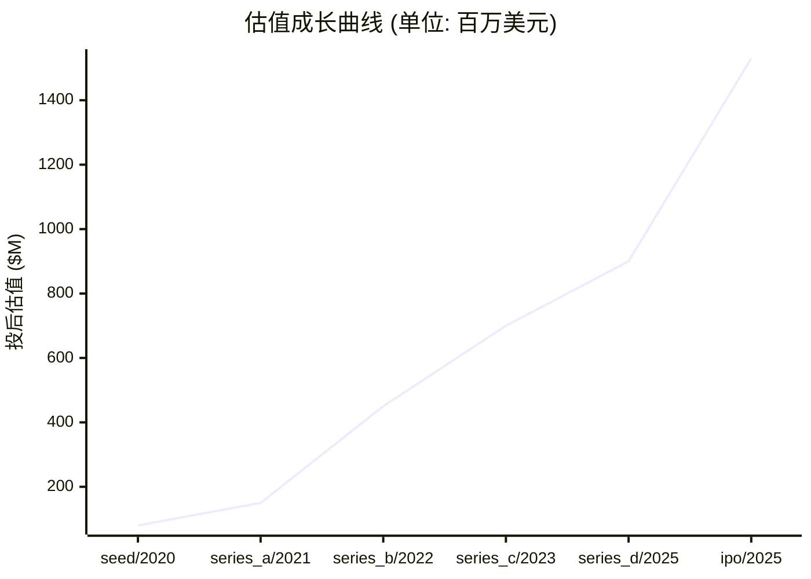

# 📊 强一股份 — 创投研报

> **生成时间**: 2026-04-16　|　**分析师**: vc-research v0.1
> **一句话概括**: 国内唯一实现 MEMS 探针卡批量产业化的厂商,2023 年位列全球探针卡行业第 9,打破 FormFactor/Technoprobe/MJC 外资垄断的国产替代核心标的

---

## 🏢 模块 1 · 企业画像

### 基本信息

| 项目 | 内容 |
|------|------|
| 公司名 | 强一股份 (强一半导体(苏州)股份有限公司 (Maxone Semiconductor (Suzhou) Co., Ltd.)) |
| 成立时间 | 2015-08-01 |
| 总部 | 江苏苏州工业园区东长路88号 S3 幢 |
| 地域 | CN |
| 赛道 | 半导体设备/材料 / 晶圆测试 - MEMS 探针卡 |
| 商业模式 | MEMS 探针卡定制化设计+制造+销售(单次探针卡销售+持续耗材替换+客户定制化NRE),面向 Fabless/Foundry/OSAT |
| 当前阶段 | **ipo** |
| 员工数 | 700 |

### 创始团队

| 姓名 | 职位 | 持股 | 状态 | 背景 |
|------|------|------|------|------|
| **周明** | 创始人/董事长/实际控制人 | 31.2% | ✅ 在任 | 1973 年生,华东交通大学机械制造工艺与设备本科;2015-08 于苏州工业园区创立强一半导体,聚焦 MEMS 垂直探针自研,带领公司成为境内唯一量产 MEMS 探针卡厂商 |

---

## 💰 模块 2 · 融资轨迹

### 融资总览

| 指标 | 数值 |
|------|------|
| 累计融资 | $750,000,000 |
| 最新估值 | $1,530,000,000 |
| 估值复合增长率 (CAGR) | 69.7% |
| 创始团队累计稀释(估算) | ~65% |
| 轮次数 | 6 轮 |

### 历史轮次一览

| 轮次 | 时间 | 金额 | 投前估值 | 投后估值 | 领投方 |
|------|------|------|----------|----------|--------|
| seed | 2020-06-01 | $10,000,000 | — | $80,000,000 | 丰年资本 |
| series_a | 2021-06-01 | $30,000,000 | — | $150,000,000 | 华为哈勃, 元禾璞华 |
| series_b | 2022-06-01 | $150,000,000 | — | $450,000,000 | 元禾璞华, 基石资本 |
| series_c | 2023-12-01 | $120,000,000 | — | $700,000,000 | 基石资本, 中信建投 |
| series_d | 2025-06-01 | $60,000,000 | — | $900,000,000 | 君海创芯, 中信建投, 基石资本, 君桐资本, 国发创投, 融沛资本, 海达投资, 泰达科投 |
| ipo | 2025-12-29 | $380,000,000 | — | $1,530,000,000 | 中信建投证券(保荐) |

### 估值成长曲线

### 🔍 SEED · 2020-06-01
| 项目 | 内容 |
|------|------|
| 融资金额 | $10,000,000 |
| 投后估值 | $80,000,000 |
| 备注 | 天使轮,切入 MEMS 垂直探针赛道 |

### 🔍 SERIES_A · 2021-06-01
| 项目 | 内容 |
|------|------|
| 融资金额 | $30,000,000 |
| 投后估值 | $150,000,000 |
| 备注 | 华为哈勃以增资+受让老股约 621.9 万元合计持股 6.4%,完成产业链绑定 |

### 🔍 SERIES_B · 2022-06-01
| 项目 | 内容 |
|------|------|
| 融资金额 | $150,000,000 |
| 投后估值 | $450,000,000 |
| 备注 | 亿元级融资,加速 3D MEMS 垂直探针卡研发推广(苏州工业园区科技招商中心披露) |

### 🔍 SERIES_C · 2023-12-01
| 项目 | 内容 |
|------|------|
| 融资金额 | $120,000,000 |
| 投后估值 | $700,000,000 |
| 备注 | IPO 前最后一轮私募,对应估值约 50 亿人民币 |

### 🔍 SERIES_D · 2025-06-01
| 项目 | 内容 |
|------|------|
| 融资金额 | $60,000,000 |
| 投后估值 | $900,000,000 |
| 备注 | 数亿元 D 轮,IPO 冲刺前老股东加持 + 保荐券商旗下基金参投 |

### 🔍 IPO · 2025-12-29
| 项目 | 内容 |
|------|------|
| 融资金额 | $380,000,000 |
| 投后估值 | $1,530,000,000 |
| 备注 | 科创板 688809.SH 挂牌,发行价 85.09 元/股,发行 3238.99 万股(25%),募资 27.55 亿元(超募约 12.5 亿),发行后市值约 110 亿元人民币 |

> 💡 **融资轮次** ≈ 《游戏升级关卡》

每一轮融资就像游戏里打通一关:天使→A→B→C→D→Pre-IPO。打到哪一关,大致能判断公司的成熟度。小白要记住:**轮次越后,风险越小,但回报倍数也越小。**

> 💡 **股权稀释** ≈ 《蛋糕切分》

公司是一块蛋糕,融资相当于把蛋糕做大,但要切一小块给新投资人。创始人手里的那片比例变小了,但整块蛋糕更值钱。**稀释本身不可怕,蛋糕没变大才可怕。**

---

## 🎯 模块 3 · 投资依据 (Thesis)

### 团队评估

| 维度 | 值 |
|------|-----|
| 综合评分 | **7/10** &nbsp; `███████░░░` |
| 一句话点评 | 周明工程师出身、聚焦赛道 10 年,公司核心是垂直探针 know-how 与工艺积累;管理层相对低调,研发团队中博士/硕士占比高,产业资本(华为哈勃+元禾璞华)深度绑定带来客户背书 |

### 市场规模

> 💡 **TAM / SAM / SOM** ≈ 《三层海洋》

TAM = 整个海洋(理论最大市场);SAM = 你能游到的海域(产品/地域可覆盖);SOM = 你能抓到的鱼(未来 3-5 年现实份额)。**投资人最看 SOM,因为那是真金白银的天花板。**

| 层级 | 规模 | 说明 |
|------|------|------|
| **TAM** (总可达市场) | $2,987,000,000 | 全球/全品类天花板 |
| **SAM** (可服务市场) | $357,000,000 | 公司产品能覆盖的部分 |
| **SOM** (可获取市场) | $90,000,000 | 3-5 年内可拿下的份额 |
| 年增速 | 25.0% | CAGR |

### 护城河

> 💡 **护城河** ≈ 《城堡外的水沟》

护城河就是让对手难以进攻的壁垒:① 网络效应(越多人用越值钱,如微信);② 规模效应(量大成本低,如京东);③ 技术专利(如台积电先进制程);④ 品牌心智(如可口可乐);⑤ 数据/切换成本(如 SAP)。**没护城河的公司早晚被价格战拖死。**

| 项目 | 内容 |
|------|------|
| 本案 headline | 自主 MEMS 垂直探针工艺+量产能力(国内唯一)+400+ 客户覆盖(长电/通富微电/华虹/盛合晶微/伟测/韦尔/兆易/卓胜微/地平线/摩尔线程等)+华为哈勃产业链绑定+中信建投保荐的科创板稀缺标的 |

### 单位经济学

> 💡 **LTV/CAC** ≈ 《渔夫 ROI》

CAC = 买鱼饵的钱(获客成本);LTV = 钓上来的鱼能卖多少(客户生命周期价值)。**健康比例 >= 3 倍**,否则越做越亏。比例 < 1 = 赔本赚吆喝,必须尽快改善单位经济学。

| 指标 | 数值 | 健康度 |
|------|------|--------|
| 毛利率 | 55.0% | 🟡 中等 |
| 回本周期 | 12.0 个月 | ✅ 优秀 |

### 增长指标

| 指标 | 数值 |
|------|------|
| ARR (年化经常性收入) | $90,000,000 |
| 同比增长率 | 81% |
| GMV | $90,000,000 |

### 竞争格局

| # | 竞品 |
|---|------|
| 1 | FormFactor (美) |
| 2 | Technoprobe (意) |
| 3 | MJC 日本电子材料 (日) |
| 4 | Micronics Japan |
| 5 | Korea Instrument |
| 6 | 强达电路(国内同行) |
| 7 | 木芯科技(国内同行) |

### 🐂 看多理由

| # | 看多理由 |
|:-:|----------|
| 1 | 2024 营收 6.41 亿同比增长 81%,净利润 2.33 亿同比增长 1149%,进入业绩爆发期 |
| 2 | 中国探针卡市场 2024 增长 69%(至 3.57 亿美元),国产化率<5%,国产替代空间巨大 |
| 3 | HBM/AI 芯片/先进制程推动 MEMS 探针卡需求,单片测试次数指数级增长 |
| 4 | 华为哈勃+元禾璞华持股,绑定海思+长三角产业链;科创板稀缺 MEMS 探针卡独苗 |
| 5 | 南通 12 亿募投项目投产后,产能可支撑 20 亿以上营收 |

### 🐻 看空理由

| # | 看空理由 |
|:-:|----------|
| 1 | 2024 净利润跳升部分来源于非经常损益和股份支付冲回,可持续性需观察 |
| 2 | IPO 鹰眼预警 19 条(客户集中度、应收账款高企、存货积压、兄弟公司亏损关联交易等) |
| 3 | 与 FormFactor/Technoprobe 在高端 HBM/先进逻辑探针卡仍有技术代差 |
| 4 | 半导体周期下行时,晶圆厂 CapEx 砍单直接冲击订单 |
| 5 | 兄弟公司/关联方 IPO 前夜巨亏,存在历史资产腾挪与独立性质疑 |

---

## 🌊 模块 4 · 产业趋势

### 赛道概览

| 指标 | 数值 |
|------|------|
| 赛道 | 半导体设备/材料 |
| 近 12 月融资总额 | $800,000,000 |
| 近 12 月交易数 | 35 |
| Gartner 周期定位 | 实质生产爬坡期(MEMS 探针卡国产化从 0 到 1 完成,进入 1 到 10 放量) |
| 退出窗口评估 | 2025-12-29 科创板挂牌,当前处于解禁前锁定期;二级市场估值依赖 2025/2026 订单兑现 |
| 热词 | MEMS 探针卡 · 晶圆测试 · 国产替代 · 华为哈勃 · HBM 测试 · 先进封装 |

### 政策环境

| 类型 | 内容 |
|------|------|
| 🟢 顺风 | 大基金三期 3440 亿重点投向半导体设备/材料 |
| 🟢 顺风 | 科创板第五套标准对半导体核心卡脖子环节倾斜 |
| 🟢 顺风 | 工信部《重点新材料首批次应用示范指导目录》将 MEMS 探针卡列入 |
| 🟢 顺风 | 长三角/苏州工业园区配套产业基金 |
| 🔴 逆风 | 美国 BIS 对先进制程设备出口管制,间接限制下游晶圆厂扩产 |
| 🔴 逆风 | 欧盟《芯片法案》补贴本土企业,挤压中国厂商出海空间 |
| 🔴 逆风 | IPO 审核收紧,科创板财务门槛上移 |

---

## 💎 模块 5 · 估值分析

### 估值摘要

| 项目 | 数值 |
|------|------|
| 公允价值下限 | $614,171,719 |
| 公允价值上限 | $1,023,619,531 |
| 当前估值 | $1,530,000,000 |
| 溢价/折价 | 86.8% ⚠️ 明显溢价 |

### 估值方法交叉验证

> 💡 **估值方法** ≈ 《房子评估》

给公司定价就像给一套房定价:① 可比公司法 = 隔壁小区同户型挂牌价;② 可比交易法 = 最近成交价;③ DCF = 未来能收多少租金折回现在;④ VC 逆推 = 退出时能卖多少倒推今天入场价。**至少两种方法交叉验证,才不容易被高估迷惑。**

| 方法 | 估值下限 | 估值上限 | 关键假设 |
|------|----------|----------|----------|
| **可比公司法 (P/ARR)** | $756,000,000 | $1,404,000,000 | ARR=90000000, 同业 P/ARR 中枢=12.0x, ±30% 区间 |
| **GMV 倍数法** | $157,500,000 | $292,500,000 | GMV=90000000, 同业 P/GMV=2.5x |
| **VC 逆推法 (TAM × 市占 × 退出倍数 × 风险折现)** | $134,415,000 | $746,750,000 | TAM=2987000000, 目标市占 3-10%, 退出倍数 5x, 风险折现 30-50% |
| **最近一轮估值 (锚点)** | $1,224,000,000 | $1,836,000,000 | 以最新一轮 post-money 为锚, ±20% 反映市场波动 |

### 敏感性说明
> 关键敏感性: ①TAM 估算误差 ±30% 可改变估值 50%; ②同业倍数受市场情绪影响大,建议看赛道最近 6 月交易区间; ③VC 逆推法中'目标市占'是最大变量,建议分 Bull/Base/Bear 三档。

---

## ⚠️ 模块 6 · 风险矩阵

### 风险概览

| 项目 | 数值 |
|------|------|
| 整体风险等级 | **HIGH** |
| 账上现金 | $450,000,000 |

### 风险清单

| # | 类别 | 风险描述 | 等级 | 缓释方案 |
|:-:|------|----------|:----:|----------|
| 1 | 客户集中度 | 前五大客户营收占比较高,长电/通富/华虹若砍单直接冲击业绩 | 🟡 中 | 客户数扩至 400+,积极开拓设计公司(地平线/摩尔线程/韦尔/卓胜微)分散结构 |
| 2 | 关联交易/独立性 | IPO 前夜兄弟公司巨亏、历史资产重组复杂,证监会多轮问询聚焦独立性 | 🔴 高 | 第二轮问询函回复已专项披露,保荐人中信建投出具核查意见 |
| 3 | 技术追赶 | 高端 HBM/Advanced Logic 探针卡仍由 FormFactor/Technoprobe 垄断,国产厂商代差 1-2 代 | 🔴 高 | IPO 募资 12 亿南通项目用于 3D MEMS 垂直探针卡,对标 HBM 应用 |
| 4 | 周期 | 半导体周期下行时晶圆厂 CapEx 砍单,探针卡作为耗材波动放大 | 🟡 中 | 耗材属性(单张探针卡寿命有限)带来周期性弱化,设计客户拉动新增需求 |
| 5 | 地缘 | 美国出口管制升级可能波及 MEMS 工艺设备/原材料进口 | 🟡 中 | 供应链国产替代,核心 MEMS 工艺已自主化 |

> 💡 **烧钱速度** ≈ 《血条消耗》

每个月公司亏多少钱就是烧钱速度。现金 ÷ 月烧钱 = 跑道(还能撑几个月)。**跑道 < 6 月 = 濒死,12 月 = 警戒,18 月+ = 安全。**

---

## 🎯 模块 7 · 投资建议

### 投资裁决

| 项目 | 内容 |
|------|------|
| **裁决** | **回避** |
| 建议入场估值 | ≤ $573,226,938 |
| 核心逻辑 | 【投资裁决: 回避】核心看多: 2024 营收 6.41 亿同比增长 81%,净利润 2.33 亿同比增长 1149%,进入业绩爆发期、中国探针卡市场 2024 增长 69%(至 3.57 亿美元),国产化率<5%,国产替代空间巨大、HBM/AI 芯片/先进制程推动 MEMS 探针卡需求,单片测试次数指数级增长。主要风险: 2024 净利润跳升部分来源于非经常损益和股份支付冲回,可持续性需观察、IPO 鹰眼预警 19 条(客户集中度、应收账款高企、存货积压、兄弟公司亏损关联交易等),整体风险等级 high。估值判断: 公允区间 $614,171,719 - $1,023,619,531。 |

### 建议条款

> 💡 **优先清算权** ≈ 《救生艇优先级》

公司破产/被贱卖时,谁先上救生艇?1x non-participating = 投资人先拿回本金,剩下大家按股比分;2x participating = 投资人先拿 2 倍本金,再一起分 — 对创始人很吃亏。**创始人谈判首要目标:压到 1x non-participating。**

| # | 条款 |
|:-:|------|
| 1 | 优先清算权 1x non-participating |
| 2 | 基于业绩的反稀释保护 (broad-based weighted average) |
| 3 | 对赌条款: 约定关键里程碑,未达则触发估值调整 |
| 4 | 要求预留 ESOP 不低于 10%,激励创始团队 |
| 5 | 董事会观察员席位(A 轮) / 董事席位(B 轮起) |
| 6 | 信息权: 季度财报 + 年度审计 + 关键事项知情权 |

### 退出情景

| # | 情景 |
|:-:|------|
| 1 | IPO: 若 ARR > $100M 且毛利率 > 70%,3-5 年内可冲刺美股/港股 |
| 2 | 战略并购: 同业龙头或跨界巨头(腾讯/字节/阿里)出手收购 |
| 3 | 回购/老股转让: 下一轮投资人或 SPV 接盘,保证流动性 |

---

## 📚 数据来源

| # | 数据源 |
|:-:|--------|
| 1 | [招股书] 上交所科创板 · 强一半导体(苏州)股份有限公司 第二轮审核问询函回复 2025-10 <https://static.sse.com.cn/stock/disclosure/announcement/c/202510/002051_20251031_6GDH.pdf> |
| 2 | [招股书] 上交所科创板 · 强一半导体 招股说明书 2025-11-05 <https://static.sse.com.cn/stock/disclosure/announcement/c/202511/002051_20251105_2NLS.pdf> |
| 3 | [公告] 中财网 · 强一股份 IPO 招股说明书提示性公告 2025-12-24 <https://www.cfi.net.cn/p20251224003170.html> |
| 4 | [公告] 中国证券网 · 强一股份 688809 披露专区 <https://xinpi.cnstock.com/p/xg/detail/688809> |
| 5 | [新闻] 证券时报 · 强一半导体启动上市辅导 推动 MEMS 探针卡国产替代 <https://www.stcn.com/article/detail/717424.html> |
| 6 | [新闻] 证券市场周刊 · 产品打破国外垄断！华为投资的又一家半导体企业启动 IPO (2025-09-15) <https://static.weeklyonstock.com/25/0915/zbf155702.html> |
| 7 | [深度] 腾讯新闻/知乎 · 强一半导体凭一根针获华为投资，IPO 前夜兄弟公司扛下巨亏 (2025-11-11) <https://news.qq.com/rain/a/20251111A01NJ900> |
| 8 | [融资聚合] 36Kr PitchHub · 强一半导体 <https://pitchhub.36kr.com/project/1958570332083207> |
| 9 | [行业] 思瀚产业研究院 · 2025 年探针卡行业结构、发展态势及竞争格局 <http://chinasihan.com/news/cykj/21678.html> |
| 10 | [行业] 智研咨询 · 2025 年中国半导体探针卡行业发展规模、产业链、竞争格局及发展趋势研判 <https://www.chyxx.com/industry/1217538.html> |
| 11 | [行业] Yole Développement · 2023 全球半导体探针卡厂商排名(强一位列第 9) |
| 12 | [官网] Maxone Semiconductor 强一半导体 <https://maxonesemi.com> |

---

## ⚠️ 免责声明

> 本报告由 vc-research 自动生成,仅供学习研究使用,不构成投资建议。数据截止 generated_at,之后信息需重新拉取。

