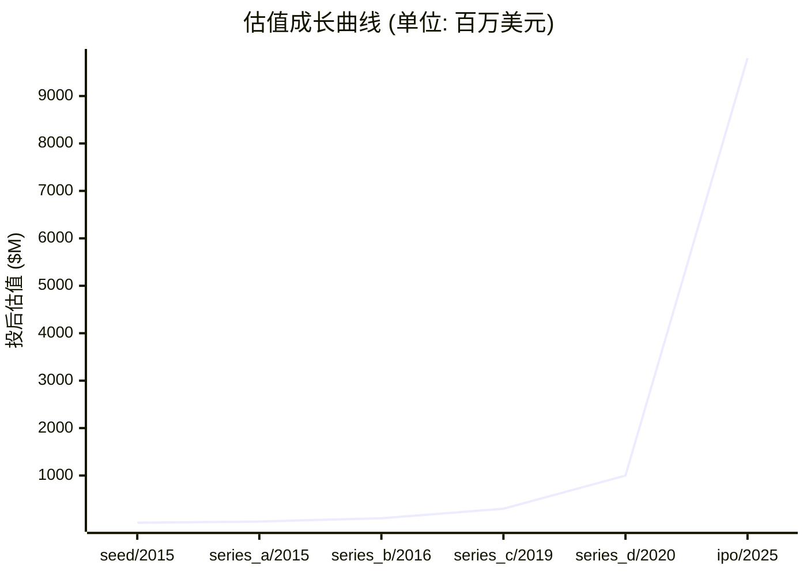

# 📊 影石创新 — 创投研报

> **生成时间**: 2026-04-16　|　**分析师**: vc-research v0.1.13
> **一句话概括**: 全球全景相机市占率第一的智能影像公司,以消费级 360 度相机和运动相机切入 vlog/极限运动市场

---

## 🏢 模块 1 · 企业画像

### 基本信息

| 项目 | 内容 |
|------|------|
| 公司名 | 影石创新 (影石创新科技股份有限公司 (Arashi Vision Inc. / Insta360)) |
| 成立时间 | 2015-07-01 |
| 总部 | 深圳 |
| 地域 | CN |
| 赛道 | 硬件 / 消费电子 - 全景/运动相机 |
| 商业模式 | 硬件销售为主(全景相机+运动相机+拇指相机) + 配件/软件订阅 + 海外电商与渠道分销 |
| 当前阶段 | **ipo** |
| 员工数 | 4,100 |

### 创始团队

| 姓名 | 职位 | 持股 | 状态 | 背景 |
|------|------|------|------|------|
| **刘靖康 (JK Liu)** | 创始人/董事长/CEO | 27.6% | ✅ 在任 | 1991 年生,广东中山人,南京大学软件学院 2014 届;2012 年破解周鸿祎电话号码/校园网漏洞在校内出名;2014 年获 IDG 资本百万美元天使投资,2015 年 7 月创办影石;34 岁成为科创板首位 90 后上市公司董事长 |
| **陈永强** | 联合创始人/首席行政官 | 2.0% | ✅ 在任 | 1991 年生,刘靖康大三在广州'超级课程表'实习时结识的合伙人,持有岚锋平台 5.93% |

---

## 💰 模块 2 · 融资轨迹

### 融资总览

| 指标 | 数值 |
|------|------|
| 累计融资 | $3.71 亿 |
| 最新估值 | $98.00 亿 |
| 估值复合增长率 (CAGR) | 109.0% |
| 创始团队累计稀释(估算) | ~65% |
| 轮次数 | 6 轮 |

### 历史轮次一览

| 轮次 | 时间 | 金额 | 投前估值 | 投后估值 | 领投方 |
|------|------|------|----------|----------|--------|
| seed | 2015-03-01 | $100.00 万 | — | $500.00 万 | IDG 资本 |
| series_a | 2015-12-01 | $500.00 万 | — | $3000.00 万 | 启明创投, IDG 资本 |
| series_b | 2016-04-13 | $1500.00 万 | — | $1.00 亿 | 迅雷, 苏宁易购, Frees Fund 峰瑞资本 |
| series_c | 2019-03-19 | $3000.00 万 | — | $3.00 亿 | MG Holding, 郎玛峰创投 |
| series_d | 2020-04-21 | $5000.00 万 | — | $10.00 亿 | 中信证券, 国投招商, 基石资本, 金石投资, GAIN Capital |
| ipo | 2025-06-11 | $2.70 亿 | — | $98.00 亿 | 中信证券 (保荐主承销) |

### 估值成长曲线

### 🔍 SEED · 2015-03-01
| 项目 | 内容 |
|------|------|
| 融资金额 | $100.00 万 |
| 投后估值 | $500.00 万 |
| 备注 | IDG 以约 $1M 获 20% 股权,刘靖康在校期间拿到的天使轮 |

### 🔍 SERIES_A · 2015-12-01
| 项目 | 内容 |
|------|------|
| 融资金额 | $500.00 万 |
| 投后估值 | $3000.00 万 |
| 备注 | Series A,具体金额未披露,按行业惯例估算 |

### 🔍 SERIES_B · 2016-04-13
| 项目 | 内容 |
|------|------|
| 融资金额 | $1500.00 万 |
| 投后估值 | $1.00 亿 |
| 备注 | 迅雷以战略投资者身份入局,同期苏宁 2016-08 追投 |

### 🔍 SERIES_C · 2019-03-19
| 项目 | 内容 |
|------|------|
| 融资金额 | $3000.00 万 |
| 投后估值 | $3.00 亿 |
| 备注 | Crunchbase 披露 C 轮 $30M,公司进入独角兽前夜 |

### 🔍 SERIES_D · 2020-04-21
| 项目 | 内容 |
|------|------|
| 融资金额 | $5000.00 万 |
| 投后估值 | $10.00 亿 |
| 备注 | Pre-IPO 轮,首次跨过独角兽门槛;同年 10 月首次申报科创板 |

### 🔍 IPO · 2025-06-11
| 项目 | 内容 |
|------|------|
| 融资金额 | $2.70 亿 |
| 投后估值 | $98.00 亿 |
| 备注 | 发行价 47.27 元/股,募资 19.38 亿元 (约 $270M),发行 4100 万股;开盘 182 元大涨 285%,上市首日市值超 700 亿元 (~$98 亿);2025-08 市值一度突破 1200 亿元 |

> 💡 **融资轮次** ≈ 《游戏升级关卡》

每一轮融资就像游戏里打通一关:天使→A→B→C→D→Pre-IPO。打到哪一关,大致能判断公司的成熟度。小白要记住:**轮次越后,风险越小,但回报倍数也越小。**

> 💡 **股权稀释** ≈ 《蛋糕切分》

公司是一块蛋糕,融资相当于把蛋糕做大,但要切一小块给新投资人。创始人手里的那片比例变小了,但整块蛋糕更值钱。**稀释本身不可怕,蛋糕没变大才可怕。**

---

## 🎯 模块 3 · 投资依据 (Thesis)

### 团队评估

| 维度 | 值 |
|------|-----|
| 综合评分 | **9/10** &nbsp; `█████████░` |
| 一句话点评 | 刘靖康是少有的'能写代码+懂硬件+能做海外品牌'的 90 后复合型创始人,核心团队从 2015 年一起走到 IPO 稳定度极高;管理层平均年龄不到 35,研发人员占比 57% 以上 |

### 市场规模

> 💡 **TAM / SAM / SOM** ≈ 《三层海洋》

TAM = 整个海洋(理论最大市场);SAM = 你能游到的海域(产品/地域可覆盖);SOM = 你能抓到的鱼(未来 3-5 年现实份额)。**投资人最看 SOM,因为那是真金白银的天花板。**

| 层级 | 规模 | 说明 |
|------|------|------|
| **TAM** (总可达市场) | $120.00 亿 | 全球/全品类天花板 |
| **SAM** (可服务市场) | $40.00 亿 | 公司产品能覆盖的部分 |
| **SOM** (可获取市场) | $10.00 亿 | 3-5 年内可拿下的份额 |
| 年增速 | 20.0% | CAGR |

### 护城河

> 💡 **护城河** ≈ 《城堡外的水沟》

护城河就是让对手难以进攻的壁垒:① 网络效应(越多人用越值钱,如微信);② 规模效应(量大成本低,如京东);③ 技术专利(如台积电先进制程);④ 品牌心智(如可口可乐);⑤ 数据/切换成本(如 SAP)。**没护城河的公司早晚被价格战拖死。**

| 项目 | 内容 |
|------|------|
| 本案 headline | 全景相机全球市占率第一 (Frost & Sullivan 披露 2023 年约 67%,数据待原文交叉) + 自研防抖/拼接算法 + Leica 联合品牌 + 海外电商与网红营销体系 + 700+ 专利组合 (与 GoPro 对抗的底气) |

### 单位经济学

> 💡 **LTV/CAC** ≈ 《渔夫 ROI》

CAC = 买鱼饵的钱(获客成本);LTV = 钓上来的鱼能卖多少(客户生命周期价值)。**健康比例 >= 3 倍**,否则越做越亏。比例 < 1 = 赔本赚吆喝,必须尽快改善单位经济学。

| 指标 | 数值 | 健康度 |
|------|------|--------|
| 毛利率 | 52.0% | 🟡 中等 |
| 回本周期 | 6.0 个月 | ✅ 优秀 |

### 增长指标

| 指标 | 数值 |
|------|------|
| ARR (年化经常性收入) | $7.80 亿 |
| 同比增长率 | 53% |
| MAU (月活) | 10,000,000 |
| GMV | $7.80 亿 |

### 竞争格局

| # | 竞品 |
|---|------|
| 1 | GoPro |
| 2 | 大疆 DJI (Osmo 系列) |
| 3 | 理光 Ricoh Theta |
| 4 | Garmin |
| 5 | Sony Action Cam |

### 🐂 看多理由

| # | 看多理由 |
|:-:|----------|
| 1 | 2024 年营收 55.74 亿元 (约 $780M) 同比 +53%,净利 9.95 亿元连续 3 年盈利,IPO 前已自给自足 |
| 2 | 全景相机全球市占率第一,X4/GO 3S/Ace Pro 多产品线覆盖 vlog/运动/VR 全场景 |
| 3 | 海外收入占比 76%-80%,北美/欧洲/日本渠道深厚,美元回流 + 天然对冲人民币汇率 |
| 4 | 2025-07 ITC 337 调查初裁:GoPro 五项实用专利全部被判不侵权或无效,海外扩张法律风险大幅出清 |
| 5 | NASA 火星直播 + Emmy 奖 + Apple Store 渠道,品牌溢价在全球消费电子里极少见 |

### 🐻 看空理由

| # | 看空理由 |
|:-:|----------|
| 1 | 2024 年海外销售占比 80% 叠加对美销售,关税/337/实体清单任一加剧都会重创利润 |
| 2 | 大疆 2024 Osmo Pocket 3/Action 5 Pro 强势反攻,运动相机端面临中国对手正面内卷 |
| 3 | Q1 2025 营收 13.55 亿 +40.7% 但运营利润同比 -15%,毛利承压信号需要观察 |
| 4 | 2020 年首次申报到 2025 年注册获批耗时 4 年余 (监管离职人员陈斌间接入股问题),治理瑕疵在二级市场会被放大审视 |
| 5 | IPO 前曾多轮老股转让,创始人及机构减持窗口开启后存在供给冲击 |

---

## 🌊 模块 4 · 产业趋势

### 赛道概览

| 指标 | 数值 |
|------|------|
| 赛道 | 硬件 |
| 近 12 月融资总额 | $5.00 亿 |
| 近 12 月交易数 | 20 |
| Gartner 周期定位 | 增长期 (全景相机+消费级 VR 内容生产);复苏期 (运动相机整体) |
| 退出窗口评估 | 已 IPO (科创板 688775),2025-06-11 上市首日市值 ~$98 亿,锁定期结束后关注大股东减持节奏 |
| 热词 | 全景相机 · 运动相机 · vlog · 出海 · Leica · AI 影像 · 拇指相机 |

### 政策环境

| 类型 | 内容 |
|------|------|
| 🟢 顺风 | 科创板对硬科技+出海型企业的通道支持 |
| 🟢 顺风 | 深圳对消费电子出海与供应链本地化补贴 |
| 🟢 顺风 | 国家鼓励自主品牌出海与跨境电商政策 |
| 🔴 逆风 | 美国 337 调查/特朗普 2.0 关税政策对中国消费电子出口压力 |
| 🔴 逆风 | 欧盟 CE / GDPR 合规成本持续上升 |
| 🔴 逆风 | A 股减持新规对实控人及机构股东退出的约束 |

---

## 💎 模块 5 · 估值分析

### 估值摘要

| 项目 | 数值 |
|------|------|
| 公允价值下限 | $30.47 亿 |
| 公允价值上限 | $50.78 亿 |
| 当前估值 | $98.00 亿 |
| 溢价/折价 | 141.2% ⚠️ 明显溢价 |

### 估值方法交叉验证

> 💡 **估值方法** ≈ 《房子评估》

给公司定价就像给一套房定价:① 可比公司法 = 隔壁小区同户型挂牌价;② 可比交易法 = 最近成交价;③ DCF = 未来能收多少租金折回现在;④ VC 逆推 = 退出时能卖多少倒推今天入场价。**至少两种方法交叉验证,才不容易被高估迷惑。**

| 方法 | 估值下限 | 估值上限 | 关键假设 |
|------|----------|----------|----------|
| **可比公司法 (P/ARR)** | $27.30 亿 | $50.70 亿 | ARR=780000000, 同业 P/ARR 中枢=5.0x, ±30% 区间 |
| **GMV 倍数法** | $5.46 亿 | $10.14 亿 | GMV=780000000, 同业 P/GMV=1.0x |
| **VC 逆推法 (TAM × 市占 × 退出倍数 × 风险折现)** | $5.40 亿 | $30.00 亿 | TAM=12000000000, 目标市占 3-10%, 退出倍数 5x, 风险折现 30-50% |
| **最近一轮估值 (锚点)** | $78.40 亿 | $117.60 亿 | 以最新一轮 post-money 为锚, ±20% 反映市场波动 |

### 敏感性说明
> 关键敏感性: ①TAM 估算误差 ±30% 可改变估值 50%; ②同业倍数受市场情绪影响大,建议看赛道最近 6 月交易区间; ③VC 逆推法中'目标市占'是最大变量,建议分 Bull/Base/Bear 三档。

---

## ⚠️ 模块 6 · 风险矩阵

### 风险概览

| 项目 | 数值 |
|------|------|
| 整体风险等级 | **HIGH** |
| 账上现金 | $5.00 亿 |

### 风险清单

| # | 类别 | 风险描述 | 等级 | 缓释方案 |
|:-:|------|----------|:----:|----------|
| 1 | 地缘/关税 | 海外收入占比 76%-80%,其中北美是最大单一市场,受中美关税与出口管制冲击最大 | 🔴 高 | 越南/泰国产能外迁 + 欧日市场结构优化 + 直面 ITC 诉讼并反诉 GoPro 争取对等博弈筹码 |
| 2 | 竞争 | 大疆 Osmo 产品线在运动相机端正面抢夺,GoPro 虽衰仍握有设计专利 | 🟡 中 | 专注全景+拇指相机差异化赛道,Leica 联合品牌守住高端;加速 AI 剪辑软件生态护城河 |
| 3 | 治理 | 监管离职人员陈斌 2018 年突击入股问题拖累 IPO 4 年,二级市场对信息披露仍存疑虑 | 🟡 中 | 注册阶段已清理敏感股东,上市后坚持季度合规披露节奏,重塑市场信任 |
| 4 | 知识产权 | GoPro 六项专利 337 调查剩余一项设计专利初裁侵权,2025-11 终裁结果待定 | 🟡 中 | 已提交新外观设计方案获 ITC 确认不侵权;同时在江苏高院/深圳中院/长沙中院反诉 GoPro 索赔累计约 1.9 亿元 |

> 💡 **烧钱速度** ≈ 《血条消耗》

每个月公司亏多少钱就是烧钱速度。现金 ÷ 月烧钱 = 跑道(还能撑几个月)。**跑道 < 6 月 = 濒死,12 月 = 警戒,18 月+ = 安全。**

---

## 🎯 模块 7 · 投资建议

### 投资裁决

| 项目 | 内容 |
|------|------|
| **裁决** | **观望** |
| 建议入场估值 | ≤ $28.44 亿 |
| 核心逻辑 | 【投资裁决: 观望】核心看多: 2024 年营收 55.74 亿元 (约 $780M) 同比 +53%,净利 9.95 亿元连续 3 年盈利,IPO 前已自给自足、全景相机全球市占率第一,X4/GO 3S/Ace Pro 多产品线覆盖 vlog/运动/VR 全场景、海外收入占比 76%-80%,北美/欧洲/日本渠道深厚,美元回流 + 天然对冲人民币汇率。主要风险: 2024 年海外销售占比 80% 叠加对美销售,关税/337/实体清单任一加剧都会重创利润、大疆 2024 Osmo Pocket 3/Action 5 Pro 强势反攻,运动相机端面临中国对手正面内卷,整体风险等级 high。估值判断: 公允区间 $3,046,875,000 - $5,078,125,000。 |

### 建议条款

> 💡 **优先清算权** ≈ 《救生艇优先级》

公司破产/被贱卖时,谁先上救生艇?1x non-participating = 投资人先拿回本金,剩下大家按股比分;2x participating = 投资人先拿 2 倍本金,再一起分 — 对创始人很吃亏。**创始人谈判首要目标:压到 1x non-participating。**

| # | 条款 |
|:-:|------|
| 1 | 优先清算权 1x non-participating |
| 2 | 基于业绩的反稀释保护 (broad-based weighted average) |
| 3 | 对赌条款: 约定关键里程碑,未达则触发估值调整 |
| 4 | 要求预留 ESOP 不低于 10%,激励创始团队 |
| 5 | 董事会观察员席位(A 轮) / 董事席位(B 轮起) |
| 6 | 信息权: 季度财报 + 年度审计 + 关键事项知情权 |

### 退出情景

| # | 情景 |
|:-:|------|
| 1 | IPO: 若 ARR > $100M 且毛利率 > 70%,3-5 年内可冲刺美股/港股 |
| 2 | 战略并购: 同业龙头或跨界巨头(腾讯/字节/阿里)出手收购 |
| 3 | 回购/老股转让: 下一轮投资人或 SPV 接盘,保证流动性 |

---

## 📚 数据来源

| # | 数据源 |
|:-:|--------|
| 1 | [招股书] 上交所科创板 · 影石创新 (688775.SH) 上市公告书 <http://money.finance.sina.com.cn/corp/view/vCB_AllBulletinDetail.php?stockid=688775&id=11171117> |
| 2 | [招股书] 上交所 · 影石创新首次公开发行股票并在科创板上市招股说明书 <https://www.fxbaogao.com/detail/4884553> |
| 3 | [新闻] 36Kr · 影石创新科创板上市:市值710亿 IDG 启明 迅雷收获IPO (2025-06-11) <https://www.36kr.com/p/3332076645935619> |
| 4 | [新闻] 证券时报 · 科创板首位90后敲钟 影石创新上市首日市值破700亿 (2025-06-11) <https://www.stcn.com/article/detail/1967325.html> |
| 5 | [新闻] 新浪财经 · 影石创新科创板上市 Q1营收13.6亿 (2025-06-11) <https://finance.sina.com.cn/tech/csj/2025-06-11/doc-inezsqme4739051.shtml> |
| 6 | [百科] Wikipedia · Insta360 (EN) <https://en.wikipedia.org/wiki/Insta360> |
| 7 | [融资聚合] Crunchbase · Insta360 <https://www.crunchbase.com/organization/insta360> |
| 8 | [融资聚合] Tracxn · Insta360 Funding and Investors <https://tracxn.com/d/companies/insta360> |
| 9 | [新闻] 21世纪经济报道 · 影石创新IPO监管离职人员入股始末 (2025-03-03) <https://www.21jingji.com/article/20250303/herald/268277aa3e88eacb2eb5d3ed4f05f6ef.html> |
| 10 | [新闻] 知产财经 · ITC初裁认定影石Insta360不侵权GoPro (2025-07) <https://www.ipeconomy.cn/yaowen/9590.html> |
| 11 | [官网] Insta360 <https://www.insta360.com> |

---

## ⚠️ 免责声明

> 本报告由 vc-research 自动生成,仅供学习研究使用,不构成投资建议。数据截止 generated_at,之后信息需重新拉取。

