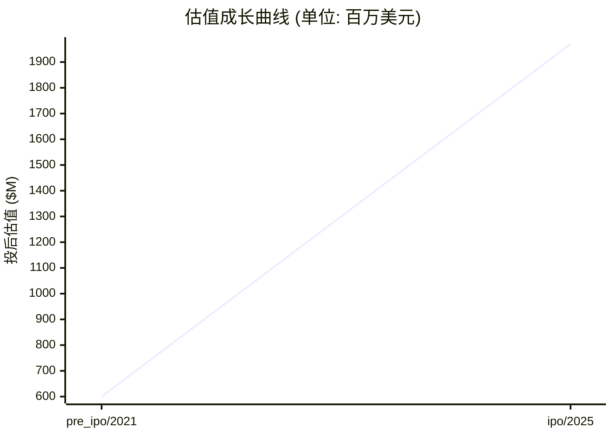

# 📊 比贝特医药 — 创投研报

> **生成时间**: 2026-04-16　|　**分析师**: vc-research v0.1
> **一句话概括**: 科创板第五套标准创新药公司,核心产品 BEBT-908 为全球首创 HDAC/PI3Kα 双靶点抗肿瘤药,已于 2025 年获批上市

---

## 🏢 模块 1 · 企业画像

### 基本信息

| 项目 | 内容 |
|------|------|
| 公司名 | 比贝特医药 (广州必贝特医药股份有限公司 (Guangzhou BeBetter Medicine Technology Co., Ltd.)) |
| 成立时间 | 2012-01-19 |
| 总部 | 广州 (广东省广州市黄埔区/中新广州知识城) |
| 地域 | CN |
| 赛道 | 医药 / 小分子创新药 (肿瘤/自免/代谢, HDAC+PI3K/CDK4/6/EGFR) |
| 商业模式 | 自主研发 First-in-Class 和临床紧缺创新药,靶向小分子新药授权/销售,肿瘤为核心管线 |
| 当前阶段 | **ipo** |
| 员工数 | 154 |

### 创始团队

| 姓名 | 职位 | 持股 | 状态 | 背景 |
|------|------|------|------|------|
| **钱长庚** | 创始人/董事长/总经理/实控人 | 44.0% | ✅ 在任 | 国家重大人才工程特聘专家,美籍华人,30+ 年国际创新药研发经验(曾在美国 Tanabe Research/Pharmacopeia/Jiangsu Hengrui 等),合计控制 43.96% 股份,BEBT-908 共同发明人 |
| **蔡雄** | 联合创始人/首席科学官 | — | ✅ 在任 | 资深药物化学家,BEBT-908 共同发明人,主导多靶点小分子设计平台 |
| **熊燕** | 副董事长 | — | ✅ 在任 | 资本运作背景,招股期间因多位朋友隐名入股迷局被媒体质疑 |

---

## 💰 模块 2 · 融资轨迹

### 融资总览

| 指标 | 数值 |
|------|------|
| 累计融资 | $225,000,000 |
| 最新估值 | $1,970,000,000 |
| 估值复合增长率 (CAGR) | 34.7% |
| 创始团队累计稀释(估算) | ~37% |
| 轮次数 | 3 轮 |

### 历史轮次一览

| 轮次 | 时间 | 金额 | 投前估值 | 投后估值 | 领投方 |
|------|------|------|----------|----------|--------|
| series_a | 2020-06-01 | — | — | — | 广州越秀新兴产业二期投资基金, 国科嘉和, 瑞享源基金 |
| pre_ipo | 2021-11-01 | — | — | $600,000,000 | 盈科资本, 天士力控股, 朗玛峰创投, 粤民投, 中信证券投资, 凌越资本, 三美投资, 小明投资, 前海贝增, 蚁米基金, 弘陶资本, 东方汇昇, 中广投资, 湘医投基金, 前海长城, 乾道基金, 中科科创, 高瑞资本, 湾区资管, 高信资本 |
| ipo | 2025-10-28 | $225,000,000 | — | $1,970,000,000 | 中信证券 (保荐/主承销), 国信证券 (联席主承销) |

### 估值成长曲线

### 🔍 SERIES_A · 2020-06-01
| 项目 | 内容 |
|------|------|
| 备注 | A 轮引入越秀产业基金作为重要外部机构股东;具体金额未完全披露 |

### 🔍 PRE_IPO · 2021-11-01
| 项目 | 内容 |
|------|------|
| 投后估值 | $600,000,000 |
| 备注 | Pre-IPO / B 轮,投后估值约 38.42 亿元人民币(~6 亿美元),投资机构阵容庞大 |

### 🔍 IPO · 2025-10-28
| 项目 | 内容 |
|------|------|
| 融资金额 | $225,000,000 |
| 投后估值 | $1,970,000,000 |
| 备注 | 科创板第五套标准上市,发行价 17.78 元/股,发行 9000 万股,募资总额 16 亿元(~2.25 亿美元),发行市值约 140 亿元(~19.7 亿美元),首日收涨 74.41% 首日成交 11.07 亿元 |

> 💡 **融资轮次** ≈ 《游戏升级关卡》

每一轮融资就像游戏里打通一关:天使→A→B→C→D→Pre-IPO。打到哪一关,大致能判断公司的成熟度。小白要记住:**轮次越后,风险越小,但回报倍数也越小。**

> 💡 **股权稀释** ≈ 《蛋糕切分》

公司是一块蛋糕,融资相当于把蛋糕做大,但要切一小块给新投资人。创始人手里的那片比例变小了,但整块蛋糕更值钱。**稀释本身不可怕,蛋糕没变大才可怕。**

---

## 🎯 模块 3 · 投资依据 (Thesis)

### 团队评估

| 维度 | 值 |
|------|-----|
| 综合评分 | **7/10** &nbsp; `███████░░░` |
| 一句话点评 | 创始人钱长庚为国家重大人才工程专家,具备 30+ 年海外大药企新药研发经验;核心研发团队 116 人,博士 11/硕士 21,研发人员占比 75%+;但委外研发费用占比超 70%,自主产能偏弱,副董事长熊燕存在隐名入股争议 |

### 市场规模

> 💡 **TAM / SAM / SOM** ≈ 《三层海洋》

TAM = 整个海洋(理论最大市场);SAM = 你能游到的海域(产品/地域可覆盖);SOM = 你能抓到的鱼(未来 3-5 年现实份额)。**投资人最看 SOM,因为那是真金白银的天花板。**

| 层级 | 规模 | 说明 |
|------|------|------|
| **TAM** (总可达市场) | $180,000,000,000 | 全球/全品类天花板 |
| **SAM** (可服务市场) | $25,000,000,000 | 公司产品能覆盖的部分 |
| **SOM** (可获取市场) | $2,000,000,000 | 3-5 年内可拿下的份额 |
| 年增速 | 11.0% | CAGR |

### 护城河

> 💡 **护城河** ≈ 《城堡外的水沟》

护城河就是让对手难以进攻的壁垒:① 网络效应(越多人用越值钱,如微信);② 规模效应(量大成本低,如京东);③ 技术专利(如台积电先进制程);④ 品牌心智(如可口可乐);⑤ 数据/切换成本(如 SAP)。**没护城河的公司早晚被价格战拖死。**

| 项目 | 内容 |
|------|------|
| 本案 headline | 全球首创 HDAC/PI3Kα 双靶点平台(BEBT-908);多靶点小分子设计能力;11 款 First-in-Class 候选药物覆盖 19 个适应症,33 个临床批件;科创板第五套标准稀缺标的 |

### 单位经济学

> 💡 **LTV/CAC** ≈ 《渔夫 ROI》

CAC = 买鱼饵的钱(获客成本);LTV = 钓上来的鱼能卖多少(客户生命周期价值)。**健康比例 >= 3 倍**,否则越做越亏。比例 < 1 = 赔本赚吆喝,必须尽快改善单位经济学。

| 指标 | 数值 | 健康度 |
|------|------|--------|

### 增长指标

| 指标 | 数值 |
|------|------|

### 竞争格局

| # | 竞品 |
|---|------|
| 1 | 复星凯瑞 (阿基仑赛 r/r DLBCL) |
| 2 | 药明巨诺 (瑞基奥仑赛) |
| 3 | 恒润达生 (雷尼基奥仑赛) |
| 4 | 罗氏 (格菲妥单抗) |
| 5 | 德琪医药 (塞利尼索) |
| 6 | 瓴路药业/Therapeutics (替朗妥昔单抗) |
| 7 | 辉瑞 (Ibrance/哌柏西利 CDK4/6) |
| 8 | 礼来 (Verzenio/阿贝西利 CDK4/6) |
| 9 | 恒瑞医药 (羟乙磺酸达尔西利 CDK4/6) |
| 10 | 阿斯利康 (奥希替尼 三代 EGFR) |
| 11 | 贝达药业 (贝福替尼) |
| 12 | 翰森制药 (阿美替尼) |

### 🐂 看多理由

| # | 看多理由 |
|:-:|----------|
| 1 | BEBT-908 为全球首个 HDAC/PI3Kα 双靶点抑制剂,2025-06-30 获 CDE 附条件批准上市(r/r DLBCL 三线及以上),商业化元年启动 |
| 2 | BEBT-209 (CDK4/6) 处于 III 期临床,瞄准晚期乳腺癌,国产 CDK4/6 赛道放量期 |
| 3 | BEBT-109 (泛突变 EGFR) 已获 III 期临床批件,对标奥希替尼,2027 有望获批 |
| 4 | 科创板第五套标准重启后首批获批,IPO 募资 16 亿为后续研发投入提供资金 |
| 5 | 首日收涨 74.41%,二级市场反馈积极 |

### 🐻 看空理由

| # | 看空理由 |
|:-:|----------|
| 1 | 目前无营业收入,2022-2024 连年亏损(1.88/1.73/0.56 亿元),2025H1 再亏 7389 万元 |
| 2 | 研发费用中委外研发占比超 70%,核心技术独立性存疑,核心产品部分技术源自授权专利 |
| 3 | BEBT-908 适应症 r/r DLBCL 已有 CAR-T/双抗/ADC 6 款竞品,后线商业化天花板有限 |
| 4 | CDK4/6 和三代 EGFR 赛道红海,国产竞品均已上市,BEBT-209/109 临床差异化证据不足 |
| 5 | 实控人钱长庚为美籍,副董事长熊燕朋友圈隐名入股遭监管和媒体质疑,审计机构天职国际被立案 |
| 6 | 百亿估值对应零营收,估值消化压力大,解禁后抛压风险高 |

---

## 🌊 模块 4 · 产业趋势

### 赛道概览

| 指标 | 数值 |
|------|------|
| 赛道 | 医药 |
| 近 12 月融资总额 | $8,500,000,000 |
| 近 12 月交易数 | 380 |
| Gartner 周期定位 | 期望膨胀期回落至低谷期(小分子创新药),复苏期(双靶点/多特异性) |
| 退出窗口评估 | 已 IPO (2025-10-28 科创板),后续看 BEBT-908 销售爬坡 + BEBT-209/109 III 期读数 |
| 热词 | First-in-Class · 双靶点 · HDAC · PI3K · CDK4/6 · EGFR · r/r DLBCL · 科创板第五套 |

### 政策环境

| 类型 | 内容 |
|------|------|
| 🟢 顺风 | 科创板第五套标准重启,支持未盈利创新药公司上市 |
| 🟢 顺风 | CDE 附条件批准/突破性疗法/优先审评加速通道 |
| 🟢 顺风 | 国家医保谈判常态化,创新药纳入医保路径清晰 |
| 🟢 顺风 | 《十四五医药工业发展规划》持续支持 First-in-Class |
| 🔴 逆风 | 医保谈判价格压力(First-in-Class 议价空间被压缩) |
| 🔴 逆风 | 带量采购向创新药边界靠近,仿制替代加速 |
| 🔴 逆风 | 美籍实控人背景下的中美科技/数据监管风险 |
| 🔴 逆风 | 集采与 DRG 支付改革对新药放量节奏形成压制 |

---

## 💎 模块 5 · 估值分析

### 估值摘要

| 项目 | 数值 |
|------|------|
| 公允价值下限 | $10,695,000,000 |
| 公允价值上限 | $17,825,000,000 |
| 当前估值 | $1,970,000,000 |
| 溢价/折价 | -86.2% 💎 明显折价 |

### 估值方法交叉验证

> 💡 **估值方法** ≈ 《房子评估》

给公司定价就像给一套房定价:① 可比公司法 = 隔壁小区同户型挂牌价;② 可比交易法 = 最近成交价;③ DCF = 未来能收多少租金折回现在;④ VC 逆推 = 退出时能卖多少倒推今天入场价。**至少两种方法交叉验证,才不容易被高估迷惑。**

| 方法 | 估值下限 | 估值上限 | 关键假设 |
|------|----------|----------|----------|
| **VC 逆推法 (TAM × 市占 × 退出倍数 × 风险折现)** | $8,100,000,000 | $45,000,000,000 | TAM=180000000000, 目标市占 3-10%, 退出倍数 5x, 风险折现 30-50% |
| **最近一轮估值 (锚点)** | $1,576,000,000 | $2,364,000,000 | 以最新一轮 post-money 为锚, ±20% 反映市场波动 |

### 敏感性说明
> 关键敏感性: ①TAM 估算误差 ±30% 可改变估值 50%; ②同业倍数受市场情绪影响大,建议看赛道最近 6 月交易区间; ③VC 逆推法中'目标市占'是最大变量,建议分 Bull/Base/Bear 三档。

---

## ⚠️ 模块 6 · 风险矩阵

### 风险概览

| 项目 | 数值 |
|------|------|
| 整体风险等级 | **HIGH** |
| 现金跑道 | 141.2 个月 |
| 月烧钱率 | $1,700,000 |
| 账上现金 | $240,000,000 |

### 风险清单

| # | 类别 | 风险描述 | 等级 | 缓释方案 |
|:-:|------|----------|:----:|----------|
| 1 | 现金流 | 现金跑道约 141.2 个月 | 🟢 低 | 建议 12 个月内完成下一轮融资或实现盈亏平衡 |
| 2 | 商业化 | BEBT-908 为公司唯一获批产品,适应症 r/r DLBCL 后线市场空间有限且面临 CAR-T/双抗 6 款竞品,商业化天花板和放量速度均待验证 | 🔴 高 | 拓展更多适应症(实体瘤、联合用药),推进学术推广网络,寻求 BD 合作出海 |
| 3 | 研发 | 委外研发费用占比 70%+,核心技术部分源自授权专利,自主研发独立性受质疑;BEBT-209/109 面临成熟赛道红海 | 🔴 高 | 加强内部 CMC 和临床团队建设,差异化适应症选择,重点突破一线治疗 |
| 4 | 治理 | 副董事长熊燕多位朋友隐名入股问题,审计机构天职国际被立案,实控人钱长庚美籍身份,公司治理和外部审计独立性存在监管关注 | 🟡 中 | 更换审计机构,补充信披,规范股权代持清理 |
| 5 | 财务 | 零营收状态下发行市值 140 亿元,估值倍数高,解禁后流通盘扩大对股价压力大 | 🟡 中 | 加速 BEBT-908 入院和医保谈判,尽早兑现收入 |
| 6 | 监管 | 中美关系与美籍实控人身份叠加,潜在生物医药领域数据/技术出境审查风险 | 🟡 中 | 保持数据境内合规,减少对美国临床数据和设备依赖 |

> 💡 **烧钱速度** ≈ 《血条消耗》

每个月公司亏多少钱就是烧钱速度。现金 ÷ 月烧钱 = 跑道(还能撑几个月)。**跑道 < 6 月 = 濒死,12 月 = 警戒,18 月+ = 安全。**

---

## 🎯 模块 7 · 投资建议

### 投资裁决

| 项目 | 内容 |
|------|------|
| **裁决** | **推荐** |
| 建议入场估值 | ≤ $9,982,000,000 |
| 核心逻辑 | 【投资裁决: 推荐】核心看多: BEBT-908 为全球首个 HDAC/PI3Kα 双靶点抑制剂,2025-06-30 获 CDE 附条件批准上市(r/r DLBCL 三线及以上),商业化元年启动、BEBT-209 (CDK4/6) 处于 III 期临床,瞄准晚期乳腺癌,国产 CDK4/6 赛道放量期、BEBT-109 (泛突变 EGFR) 已获 III 期临床批件,对标奥希替尼,2027 有望获批。主要风险: 目前无营业收入,2022-2024 连年亏损(1.88/1.73/0.56 亿元),2025H1 再亏 7389 万元、研发费用中委外研发占比超 70%,核心技术独立性存疑,核心产品部分技术源自授权专利,整体风险等级 high。估值判断: 公允区间 $10,695,000,000 - $17,825,000,000。 |

### 建议条款

> 💡 **优先清算权** ≈ 《救生艇优先级》

公司破产/被贱卖时,谁先上救生艇?1x non-participating = 投资人先拿回本金,剩下大家按股比分;2x participating = 投资人先拿 2 倍本金,再一起分 — 对创始人很吃亏。**创始人谈判首要目标:压到 1x non-participating。**

| # | 条款 |
|:-:|------|
| 1 | 优先清算权 1x non-participating |
| 2 | 基于业绩的反稀释保护 (broad-based weighted average) |
| 3 | 对赌条款: 约定关键里程碑,未达则触发估值调整 |
| 4 | 董事会观察员席位(A 轮) / 董事席位(B 轮起) |
| 5 | 信息权: 季度财报 + 年度审计 + 关键事项知情权 |

### 退出情景

| # | 情景 |
|:-:|------|
| 1 | IPO: 若 ARR > $100M 且毛利率 > 70%,3-5 年内可冲刺美股/港股 |
| 2 | 战略并购: 同业龙头或跨界巨头(腾讯/字节/阿里)出手收购 |
| 3 | 回购/老股转让: 下一轮投资人或 SPV 接盘,保证流动性 |

---

## 📚 数据来源

| # | 数据源 |
|:-:|--------|
| 1 | [招股书] 上交所披露 · 广州必贝特医药股份有限公司科创板首次公开发行股票招股说明书(注册稿) 2025-08-07 <https://static.sse.com.cn/stock/disclosure/announcement/c/202508/001274_20250807_7YQ5.pdf> |
| 2 | [保荐书] 中信证券关于广州必贝特医药科创板上市发行保荐书 2025-08-07 <http://file.finance.sina.com.cn/211.154.219.97:9494/MRGG/CNSESH_STOCK/2025/2025-8/2025-08-07/11286448.PDF> |
| 3 | [公告] 必贝特发行安排及初步询价公告 2025-10-09 <https://stockmc.xueqiu.com/202510/688759_20251009_3RAU.pdf> |
| 4 | [公告] 必贝特科创板上市公告书提示性公告 2025-10-27 <http://static.cninfo.com.cn/finalpage/2025-10-27/1224737968.PDF> |
| 5 | [新闻] 腾讯新闻 · 必贝特科创板上市:无营收,半年亏7389万,募资16亿,公司市值140亿 2025-10-28 <https://news.qq.com/rain/a/20251028A03XJI00> |
| 6 | [新闻] 上海证券报 · 必贝特:专注创新药自主研发 力争成为具有国际竞争力的生物制药企业 2025-10-17 <https://paper.cnstock.com/html/2025-10/17/content_2131964.htm> |
| 7 | [研报] 华金证券新股覆盖研究:必贝特 2025-10-10 <https://pdf.dfcfw.com/pdf/H3_AP202510111760197081_1.pdf> |
| 8 | [新闻] 证券时报 · 从必贝特医药IPO发行看中国一类创新药的破晓之路 <https://www.stcn.com/article/detail/3378135.html> |
| 9 | [新闻] 新浪财经 · 必贝特艰难上市路:商业化产品难产又踩雷天职国际 2024-12-26 <https://finance.sina.com.cn/stock/observe/2024-12-26/doc-ineauqsr1181707.shtml> |
| 10 | [官网] 广州必贝特医药官网 <http://www.bebettermed.cn/> / <http://www.bebettermed.com/> |

---

## ⚠️ 免责声明

> 本报告由 vc-research 自动生成,仅供学习研究使用,不构成投资建议。数据截止 generated_at,之后信息需重新拉取。

