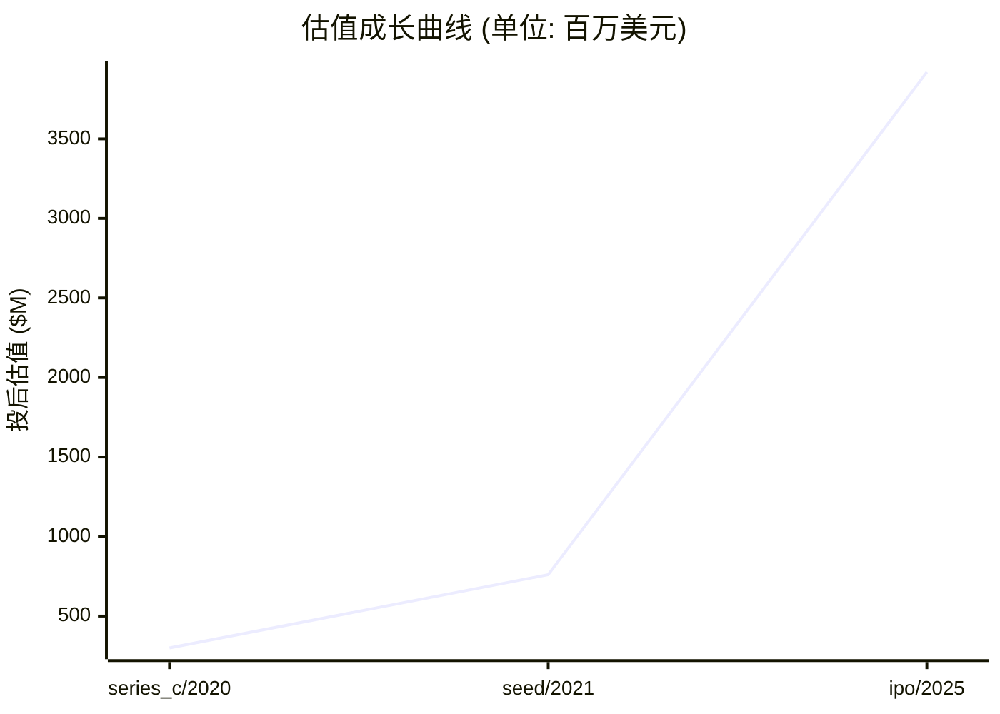

# 📊 汉朔科技 — 创投研报

> **生成时间**: 2026-04-16　|　**分析师**: vc-research v0.1.13
> **一句话概括**: 中国 ESL 龙头、全球市占率前三的门店数字化整体方案商,海外收入占比 94%,是中国 to B 硬件出海代表

---

## 🏢 模块 1 · 企业画像

### 基本信息

| 项目 | 内容 |
|------|------|
| 公司名 | 汉朔科技 (汉朔科技股份有限公司 (Hanshow Technology Co., Ltd.)) |
| 成立时间 | 2012-07-01 |
| 总部 | 浙江嘉兴 (研发与管理中心位于北京) |
| 地域 | CN |
| 赛道 | 硬件/IoT / 电子价签 ESL |
| 商业模式 | ESL 硬件销售 (9,600+ 万片/年) + Stargate IoT/SaaS 云平台订阅 + 门店数字化整体解决方案 (AI 货架/自助结算/边缘屏) |
| 当前阶段 | **ipo** |
| 员工数 | 960 |

### 创始团队

| 姓名 | 职位 | 持股 | 状态 | 背景 |
|------|------|------|------|------|
| **侯世国** | 创始人/董事长/总经理 | 32.0% | ✅ 在任 | 1975 年生,2000-2007 任华为技术开发代表 (芯片/产品线),2011 海外考察发现 ESL 蓝海,2012 创立汉朔,IPO 前通过北京汉朔 + 汉朔领世/领智/领域合计控制 31.97% 表决权 |

---

## 💰 模块 2 · 融资轨迹

### 融资总览

| 指标 | 数值 |
|------|------|
| 累计融资 | $2.60 亿 |
| 最新估值 | $39.20 亿 |
| 估值复合增长率 (CAGR) | 79.8% |
| 创始团队累计稀释(估算) | ~68% |
| 轮次数 | 6 轮 |

### 历史轮次一览

| 轮次 | 时间 | 金额 | 投前估值 | 投后估值 | 领投方 |
|------|------|------|----------|----------|--------|
| series_a | 2015-08-01 | — | — | — | 君联资本 |
| series_b | 2017-12-14 | $1800.00 万 | — | — | 君联资本, 光速光合, 华业天成, 弘章资本 |
| series_b | 2019-08-06 | — | — | — | 中金资本, 经纬创投 |
| series_c | 2020-10-23 | $3700.00 万 | — | $3.00 亿 | 朗玛峰创投, 天堂硅谷 |
| seed | 2021-09-01 | $4300.00 万 | — | $7.60 亿 | 深创投 |
| ipo | 2025-03-11 | $1.62 亿 | — | $39.20 亿 | 中金公司 (保荐主承销) |

### 估值成长曲线

### 🔍 SERIES_A · 2015-08-01
| 项目 | 内容 |
|------|------|
| 备注 | 君联资本首次领投,金额未披露;2016-12 A+ 追加辰悦/追远/星通 |

### 🔍 SERIES_B · 2017-12-14
| 项目 | 内容 |
|------|------|
| 融资金额 | $1800.00 万 |
| 备注 | B 轮 1.21 亿元人民币,当时号称占据国内 95% 电子价签市场 |

### 🔍 SERIES_B · 2019-08-06
| 项目 | 内容 |
|------|------|
| 备注 | 经纬入局,闻名/安超/资乘/正奇跟投 |

### 🔍 SERIES_C · 2020-10-23
| 项目 | 内容 |
|------|------|
| 融资金额 | $3700.00 万 |
| 投后估值 | $3.00 亿 |
| 备注 | C 轮 2.5 亿元人民币,估值 21.2 亿元;青橙/瑞育/志兴安德跟投 |

### 🔍 SEED · 2021-09-01
| 项目 | 内容 |
|------|------|
| 融资金额 | $4300.00 万 |
| 投后估值 | $7.60 亿 |
| 备注 | 2021-09 Pre-IPO 增资 2.8 亿元,估值 54.7 亿元 |

### 🔍 IPO · 2025-03-11
| 项目 | 内容 |
|------|------|
| 融资金额 | $1.62 亿 |
| 投后估值 | $39.20 亿 |
| 备注 | 深交所创业板 301275.SZ,发行价 27.50 元,发行 4224 万股,募资 11.62 亿元,首日涨 143%,首日收盘市值 282.67 亿元 (≈ $39.2B 人民币口径);用户备注 2024-10-24 主板有误,应为 2025-03-11 创业板 |

> 💡 **融资轮次** ≈ 《游戏升级关卡》

每一轮融资就像游戏里打通一关:天使→A→B→C→D→Pre-IPO。打到哪一关,大致能判断公司的成熟度。小白要记住:**轮次越后,风险越小,但回报倍数也越小。**

> 💡 **股权稀释** ≈ 《蛋糕切分》

公司是一块蛋糕,融资相当于把蛋糕做大,但要切一小块给新投资人。创始人手里的那片比例变小了,但整块蛋糕更值钱。**稀释本身不可怕,蛋糕没变大才可怕。**

---

## 🎯 模块 3 · 投资依据 (Thesis)

### 团队评估

| 维度 | 值 |
|------|-----|
| 综合评分 | **8/10** &nbsp; `████████░░` |
| 一句话点评 | 侯世国华为 7 年芯片/产品线背景,对硬件 ROI 和海外大客户打法敏感;研发人员 308 人占比 32%,工程师文化 + 多年海外本地化销售团队沉淀;与法国 VusionGroup 多年专利战打成和解,证明有对垒巨头的底气 |

### 市场规模

> 💡 **TAM / SAM / SOM** ≈ 《三层海洋》

TAM = 整个海洋(理论最大市场);SAM = 你能游到的海域(产品/地域可覆盖);SOM = 你能抓到的鱼(未来 3-5 年现实份额)。**投资人最看 SOM,因为那是真金白银的天花板。**

| 层级 | 规模 | 说明 |
|------|------|------|
| **TAM** (总可达市场) | $54.20 亿 | 全球/全品类天花板 |
| **SAM** (可服务市场) | $23.40 亿 | 公司产品能覆盖的部分 |
| **SOM** (可获取市场) | $8.00 亿 | 3-5 年内可拿下的份额 |
| 年增速 | 14.0% | CAGR |

### 护城河

> 💡 **护城河** ≈ 《城堡外的水沟》

护城河就是让对手难以进攻的壁垒:① 网络效应(越多人用越值钱,如微信);② 规模效应(量大成本低,如京东);③ 技术专利(如台积电先进制程);④ 品牌心智(如可口可乐);⑤ 数据/切换成本(如 SAP)。**没护城河的公司早晚被价格战拖死。**

| 项目 | 内容 |
|------|------|
| 本案 headline | ESL 通讯协议自研 (Nordic/Stargate) + 电子纸屏供应链深度绑定 + 欧美沃尔玛/家乐福/Jeronimo Martins 等 Top 100 零售商一半以上的部署经验 + 55,000 门店 70+ 国家的运营数据 + 招股书注册的核心发明专利及 2025 年与 SES 的交叉许可/和解 |

### 单位经济学

> 💡 **LTV/CAC** ≈ 《渔夫 ROI》

CAC = 买鱼饵的钱(获客成本);LTV = 钓上来的鱼能卖多少(客户生命周期价值)。**健康比例 >= 3 倍**,否则越做越亏。比例 < 1 = 赔本赚吆喝,必须尽快改善单位经济学。

| 指标 | 数值 | 健康度 |
|------|------|--------|
| 毛利率 | 34.8% | 🟡 中等 |
| 回本周期 | 18.0 个月 | 🟡 合理 |

### 增长指标

| 指标 | 数值 |
|------|------|
| ARR (年化经常性收入) | $6.20 亿 |
| 同比增长率 | 19% |

### 竞争格局

| # | 竞品 |
|---|------|
| 1 | VusionGroup (SES-imagotag,法国,全球第一,€1,011M FY24) |
| 2 | Pricer (瑞典,全球第二) |
| 3 | SoluM (韩国三星系) |
| 4 | E Ink (上游电子纸,合作兼博弈) |
| 5 | 思迅/领邦 (国内腰部) |

### 🐂 看多理由

| # | 看多理由 |
|:-:|----------|
| 1 | 海外收入占比 94% + 欧洲占比 53.73%,是为数极少的中国 to B 硬件出海成功样本 |
| 2 | 2024 营收 44.86 亿元 (+18.8%) / 净利 7.1 亿元 / 毛利率 34.8% (较上年再升 2.21 pct),规模效应显现 |
| 3 | Stargate IoT 平台 + AI 货架/自助结算/边缘屏扩展产品矩阵,从价签迈向门店数字化整体方案 |
| 4 | 2025-08 与 VusionGroup 全球和解,终结专利悬剑,打开北美放量空间 |
| 5 | ESL 全球 TAM 2025→2030 从 $2.0B 增至 $5.4B (Mordor 13.9% CAGR),渗透率仍 <15% |

### 🐻 看空理由

| # | 看空理由 |
|:-:|----------|
| 1 | 境内收入虽 +63.6% 但基数低 (仅 2.64 亿元),国内零售资本开支疲弱制约加速 |
| 2 | 汇兑收益 1.15 亿元贡献了近 16% 净利润,欧元/美元波动放大业绩噪声 |
| 3 | 9,600 万片终端中 99% 依赖外协加工,电子纸屏卡在 E Ink/DKE 手里 |
| 4 | Jeronimo Martins 为第一大客户,头部客户集中度高,订单周期性强 |
| 5 | VusionGroup 规模仍 3 倍于己 (€1.0B vs ¥4.5B),欧美大客户直面白刃战 |

---

## 🌊 模块 4 · 产业趋势

### 赛道概览

| 指标 | 数值 |
|------|------|
| 赛道 | 硬件/IoT |
| 近 12 月融资总额 | $3.50 亿 |
| 近 12 月交易数 | 12 |
| Gartner 周期定位 | 实质生产高峰期 (欧美渗透加速);期望膨胀期 (AI 零售/边缘屏) |
| 退出窗口评估 | 已 IPO,短期看 2025-2026 海外订单释放节奏 + Stargate SaaS 毛利爬坡 |
| 热词 | ESL 电子价签 · 门店数字化 · 出海 · 零售 AIoT · 电子纸 |

### 政策环境

| 类型 | 内容 |
|------|------|
| 🟢 顺风 | 欧盟 Digital Product Passport 强制披露推动 ESL 替代纸签 |
| 🟢 顺风 | 中国 '十四五' 智慧零售/数字化转型支持 |
| 🟢 顺风 | 欧美零售商 ESG 报告将纸张减量作为 KPI |
| 🔴 逆风 | 美国关税/实体清单对中国 to B 硬件出海持续施压 |
| 🔴 逆风 | 欧盟 CBAM 碳关税对硬件出口成本上移 |
| 🔴 逆风 | 境外专利诉讼常态化 (与 SES 虽已和解,其他竞品可能再起) |

---

## 💎 模块 5 · 估值分析

### 估值摘要

| 项目 | 数值 |
|------|------|
| 公允价值下限 | $19.55 亿 |
| 公允价值上限 | $32.58 亿 |
| 当前估值 | $39.20 亿 |
| 溢价/折价 | 50.4% ⚠️ 明显溢价 |

### 估值方法交叉验证

> 💡 **估值方法** ≈ 《房子评估》

给公司定价就像给一套房定价:① 可比公司法 = 隔壁小区同户型挂牌价;② 可比交易法 = 最近成交价;③ DCF = 未来能收多少租金折回现在;④ VC 逆推 = 退出时能卖多少倒推今天入场价。**至少两种方法交叉验证,才不容易被高估迷惑。**

| 方法 | 估值下限 | 估值上限 | 关键假设 |
|------|----------|----------|----------|
| **可比公司法 (P/ARR)** | $21.70 亿 | $40.30 亿 | ARR=620000000, 同业 P/ARR 中枢=5.0x, ±30% 区间 |
| **VC 逆推法 (TAM × 市占 × 退出倍数 × 风险折现)** | $2.44 亿 | $13.55 亿 | TAM=5420000000, 目标市占 3-10%, 退出倍数 5x, 风险折现 30-50% |
| **最近一轮估值 (锚点)** | $31.36 亿 | $47.04 亿 | 以最新一轮 post-money 为锚, ±20% 反映市场波动 |

### 敏感性说明
> 关键敏感性: ①TAM 估算误差 ±30% 可改变估值 50%; ②同业倍数受市场情绪影响大,建议看赛道最近 6 月交易区间; ③VC 逆推法中'目标市占'是最大变量,建议分 Bull/Base/Bear 三档。

---

## ⚠️ 模块 6 · 风险矩阵

### 风险概览

| 项目 | 数值 |
|------|------|
| 整体风险等级 | **HIGH** |
| 账上现金 | $3.60 亿 |

### 风险清单

| # | 类别 | 风险描述 | 等级 | 缓释方案 |
|:-:|------|----------|:----:|----------|
| 1 | 供应链 | ESL 终端 99% 依赖外协加工,电子纸屏集中在 E Ink/DKE,上游议价弱 | 🔴 高 | 多供应商并行 + 自研 Stargate 基站/协议 + 募资扩建嘉兴产能 |
| 2 | 法律 | 与 VusionGroup 美欧专利诉讼虽 2025-08 已和解,历史产品仍有部分面临美国市场退出的遗留条款 | 🟡 中 | 核心发明专利自主化 + 设计绕开 + 持续交叉许可谈判 |
| 3 | 财务 | 汇兑损益对净利贡献过大 (2024 年 1.15 亿元),欧元/美元贬值将直接冲击利润率 | 🟡 中 | 扩大自然对冲 (海外本币采购) + 远期合约锁汇 |
| 4 | 市场 | 客户集中度高,Jeronimo Martins 等 Top 5 客户订单节奏影响季度业绩 | 🟡 中 | 持续拓展 Walmart US/ 亚马逊鲜食 / 日韩/ 东南亚新客户分散敞口 |
| 5 | 竞争 | VusionGroup 规模 3 倍于己且在欧美零售根基更深,Pricer/SoluM 紧追,行业价格战风险 | 🔴 高 | Stargate 平台订阅 + AI 货架增值服务提升单店 ARPU,从硬件卖方转向解决方案商 |

> 💡 **烧钱速度** ≈ 《血条消耗》

每个月公司亏多少钱就是烧钱速度。现金 ÷ 月烧钱 = 跑道(还能撑几个月)。**跑道 < 6 月 = 濒死,12 月 = 警戒,18 月+ = 安全。**

---

## 🎯 模块 7 · 投资建议

### 投资裁决

| 项目 | 内容 |
|------|------|
| **裁决** | **回避** |
| 建议入场估值 | ≤ $18.25 亿 |
| 核心逻辑 | 【投资裁决: 回避】核心看多: 海外收入占比 94% + 欧洲占比 53.73%,是为数极少的中国 to B 硬件出海成功样本、2024 营收 44.86 亿元 (+18.8%) / 净利 7.1 亿元 / 毛利率 34.8% (较上年再升 2.21 pct),规模效应显现、Stargate IoT 平台 + AI 货架/自助结算/边缘屏扩展产品矩阵,从价签迈向门店数字化整体方案。主要风险: 境内收入虽 +63.6% 但基数低 (仅 2.64 亿元),国内零售资本开支疲弱制约加速、汇兑收益 1.15 亿元贡献了近 16% 净利润,欧元/美元波动放大业绩噪声,整体风险等级 high。估值判断: 公允区间 $1,954,862,500 - $3,258,104,167。 |

### 建议条款

> 💡 **优先清算权** ≈ 《救生艇优先级》

公司破产/被贱卖时,谁先上救生艇?1x non-participating = 投资人先拿回本金,剩下大家按股比分;2x participating = 投资人先拿 2 倍本金,再一起分 — 对创始人很吃亏。**创始人谈判首要目标:压到 1x non-participating。**

| # | 条款 |
|:-:|------|
| 1 | 优先清算权 1x non-participating |
| 2 | 基于业绩的反稀释保护 (broad-based weighted average) |
| 3 | 对赌条款: 约定关键里程碑,未达则触发估值调整 |
| 4 | 要求预留 ESOP 不低于 10%,激励创始团队 |
| 5 | 董事会观察员席位(A 轮) / 董事席位(B 轮起) |
| 6 | 信息权: 季度财报 + 年度审计 + 关键事项知情权 |

### 退出情景

| # | 情景 |
|:-:|------|
| 1 | IPO: 若 ARR > $100M 且毛利率 > 70%,3-5 年内可冲刺美股/港股 |
| 2 | 战略并购: 同业龙头或跨界巨头(腾讯/字节/阿里)出手收购 |
| 3 | 回购/老股转让: 下一轮投资人或 SPV 接盘,保证流动性 |

---

## 📚 数据来源

| # | 数据源 |
|:-:|--------|
| 1 | [招股书] 深交所创业板 · 汉朔科技 (301275.SZ) 投资风险特别公告 2025-02-27 <https://static.cninfo.com.cn/finalpage/2025-02-27/1222650635.PDF> |
| 2 | [年报] 汉朔科技 2024 年年度报告摘要 (2025-04-25) <https://file.finance.qq.com/finance/hs/pdf/2025/04/25/1223277393.PDF> |
| 3 | [官网] Hanshow Technology <https://www.hanshow.com/en/company> |
| 4 | [新闻] 36Kr · 前华为员工创办的汉朔科技上市 (2025-03-11) <https://36kr.com/p/3201802989675009> |
| 5 | [新闻] 新浪财经 · 汉朔科技 2024 年营收 44.86 亿 (2025-04-25) <https://finance.sina.com.cn/jjxw/2025-04-25/doc-ineuivrw1429981.shtml> |
| 6 | [新闻] 证券时报 · 汉朔科技成功上市 <https://www.stcn.com/article/detail/1578178.html> |
| 7 | [VC 报道] Pencil News · 汉朔科技 B 轮融资 <https://www.pencilnews.cn/p/16577.html> |
| 8 | [专利/诉讼] iPRdaily · 中法电子价签巨头专利诉讼 <http://m.iprdaily.cn/article_35391.html> |
| 9 | [专利/诉讼] 腾讯新闻 · 汉朔科技与法国 SES 正式和解 (2025-08-30) <https://news.qq.com/rain/a/20250830A065EV00> |
| 10 | [年报] VusionGroup (ex SES-imagotag) 2024 FY 营收 €1,011M <https://investor.vusion.com/> |
| 11 | [市场研究] Mordor Intelligence · ESL Market 2025-2030 <https://www.mordorintelligence.com/industry-reports/electronic-shelf-labels-market> |
| 12 | [市场研究] MarketsandMarkets · ESL Market USD 2.34B (2024) <https://www.marketsandmarkets.com/Market-Reports/electronic-shelf-label-market-40815676.html> |

---

## ⚠️ 免责声明

> 本报告由 vc-research 自动生成,仅供学习研究使用,不构成投资建议。数据截止 generated_at,之后信息需重新拉取。

