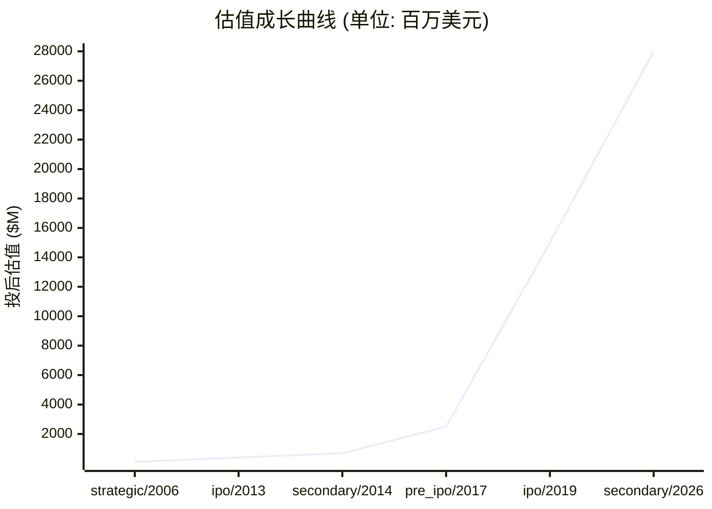

# 📊 澜起科技 — 创投研报

> **生成时间**: 2026-04-16　|　**分析师**: vc-research v0.1
> **一句话概括**: 全球内存接口芯片 Top 3,DDR5 代际领先的服务器'卖水人',AI 算力基建底层供应商

---

## 🏢 模块 1 · 企业画像

### 基本信息

| 项目 | 内容 |
|------|------|
| 公司名 | 澜起科技 (澜起科技股份有限公司 (Montage Technology Co., Ltd.)) |
| 成立时间 | 2004-05-27 |
| 总部 | 上海张江 |
| 地域 | CN |
| 赛道 | 半导体 / 内存接口芯片 + 高速互连芯片 (DDR4/DDR5 RCD/DB, MRCD/MDB, CXL, PCIe Retimer, MXC) |
| 商业模式 | Fabless IC 设计:向服务器/数据中心内存模组厂商(三星/美光/SK 海力士)销售内存接口芯片;通过内存模组配套模式锁定出货,近年扩展高性能运力芯片(PCIe Retimer, CXL 控制器, MXC)拓展第二曲线 |
| 当前阶段 | **ipo** |
| 员工数 | 767 |

### 创始团队

| 姓名 | 职位 | 持股 | 状态 | 背景 |
|------|------|------|------|------|
| **杨崇和 (Howard Yang)** | 创始人/董事长/CEO | 11.0% | ✅ 在任 | 美国俄勒冈州立大学 (Oregon State Univ.) 电子与计算机工程硕博;1990-1994 美国国家半导体 (National Semiconductor) 芯片设计;1994-1996 上海贝岭新产品研发部负责人;1997 创立新涛科技 (NeWave),2001 与 IDT 合并 (中国年度十大并购);2004 共同创立澜起;2010 当选 IEEE Fellow,上海白玉兰荣誉奖;2024 薪酬 ~999 万元 |
| **Stephen Kuong-Io Tai (戴国熙)** | 联合创始人/副董事长 | 5.0% | ✅ 在任 | 硅谷资深芯片产业高管,与杨崇和共同创立澜起,长期负责运营与战略 |

---

## 💰 模块 2 · 融资轨迹

### 融资总览

| 指标 | 数值 |
|------|------|
| 累计融资 | $2,584,000,000 |
| 最新估值 | $28,000,000,000 |
| 估值复合增长率 (CAGR) | 32.5% |
| 创始团队累计稀释(估算) | ~35% |
| 轮次数 | 6 轮 |

### 历史轮次一览

| 轮次 | 时间 | 金额 | 投前估值 | 投后估值 | 领投方 |
|------|------|------|----------|----------|--------|
| strategic | 2006-01-01 | $20,000,000 | — | $100,000,000 | Intel Capital, New Enterprise Associates (NEA), Columbia Capital, Pacific Venture Partners |
| ipo | 2013-09-26 | $71,000,000 | — | $400,000,000 | Deutsche Bank, Barclays |
| secondary | 2014-11-20 | $693,000,000 | — | $693,000,000 | 上海浦东科技投资 (浦东科投), 中国电子投资控股 (CEC) |
| pre_ipo | 2017-06-01 | $400,000,000 | — | $2,500,000,000 | 中国国家集成电路产业投资基金 (大基金), 元禾璞华, 嘉兴华创 |
| ipo | 2019-07-22 | $400,000,000 | — | $15,000,000,000 | 中信证券 |
| secondary | 2026-01-09 | $1,000,000,000 | — | $28,000,000,000 | 中金公司, 高盛, 摩根士丹利 |

### 估值成长曲线

### 🔍 STRATEGIC · 2006-01-01
| 项目 | 内容 |
|------|------|
| 融资金额 | $20,000,000 |
| 投后估值 | $100,000,000 |
| 备注 | 早期多轮战略投资合并记录,Intel 累计持有约 9% 股份,其后陪跑至 2019 科创板 IPO 获 528% 回报 |

### 🔍 IPO · 2013-09-26
| 项目 | 内容 |
|------|------|
| 融资金额 | $71,000,000 |
| 投后估值 | $400,000,000 |
| 备注 | 纳斯达克挂牌 MONT,发行价 $10,募资净额 $46.9M,中国内存芯片第一股赴美 |

### 🔍 SECONDARY · 2014-11-20
| 项目 | 内容 |
|------|------|
| 融资金额 | $693,000,000 |
| 投后估值 | $693,000,000 |
| 备注 | 私有化退市,每股 $22.6,由国资背景的 Montage Technology Global Holdings 完成,管理层+CEC+浦东科投三方持股无单一大股东 |

### 🔍 PRE_IPO · 2017-06-01
| 项目 | 内容 |
|------|------|
| 融资金额 | $400,000,000 |
| 投后估值 | $2,500,000,000 |
| 备注 | 回 A 前的股改战投轮,估值区间保守估计,具体金额见招股书历史沿革 |

### 🔍 IPO · 2019-07-22
| 项目 | 内容 |
|------|------|
| 融资金额 | $400,000,000 |
| 投后估值 | $15,000,000,000 |
| 备注 | 科创板首批 25 家之一,688008.SH,发行价 24.80 元,募资 ~28 亿元,开盘较发行价涨 268%,首日市值破千亿 |

### 🔍 SECONDARY · 2026-01-09
| 项目 | 内容 |
|------|------|
| 融资金额 | $1,000,000,000 |
| 投后估值 | $28,000,000,000 |
| 备注 | 港股 A+H 二次上市,首日涨近 50%,市值约 1900 亿港元 |

> 💡 **融资轮次** ≈ 《游戏升级关卡》

每一轮融资就像游戏里打通一关:天使→A→B→C→D→Pre-IPO。打到哪一关,大致能判断公司的成熟度。小白要记住:**轮次越后,风险越小,但回报倍数也越小。**

> 💡 **股权稀释** ≈ 《蛋糕切分》

公司是一块蛋糕,融资相当于把蛋糕做大,但要切一小块给新投资人。创始人手里的那片比例变小了,但整块蛋糕更值钱。**稀释本身不可怕,蛋糕没变大才可怕。**

---

## 🎯 模块 3 · 投资依据 (Thesis)

### 团队评估

| 维度 | 值 |
|------|-----|
| 综合评分 | **9/10** &nbsp; `█████████░` |
| 一句话点评 | 杨崇和二次创业成功(新涛→IDT 并购+澜起→科创板/港股双 IPO),IEEE Fellow 技术背书深厚;管理层稳定,核心团队 20 年未拆;公司治理采用无实际控制人架构,在中美博弈下形成'全球化持股平衡'智慧 |

### 市场规模

> 💡 **TAM / SAM / SOM** ≈ 《三层海洋》

TAM = 整个海洋(理论最大市场);SAM = 你能游到的海域(产品/地域可覆盖);SOM = 你能抓到的鱼(未来 3-5 年现实份额)。**投资人最看 SOM,因为那是真金白银的天花板。**

| 层级 | 规模 | 说明 |
|------|------|------|
| **TAM** (总可达市场) | $8,000,000,000 | 全球/全品类天花板 |
| **SAM** (可服务市场) | $5,000,000,000 | 公司产品能覆盖的部分 |
| **SOM** (可获取市场) | $2,500,000,000 | 3-5 年内可拿下的份额 |
| 年增速 | 35.0% | CAGR |

### 护城河

> 💡 **护城河** ≈ 《城堡外的水沟》

护城河就是让对手难以进攻的壁垒:① 网络效应(越多人用越值钱,如微信);② 规模效应(量大成本低,如京东);③ 技术专利(如台积电先进制程);④ 品牌心智(如可口可乐);⑤ 数据/切换成本(如 SAP)。**没护城河的公司早晚被价格战拖死。**

| 项目 | 内容 |
|------|------|
| 本案 headline | DDR5 代际领先 (首家量产 Gen2/Gen3 RCD);JEDEC 标准制定核心成员;与 Intel/三星/美光/SK 海力士 20 年合作绑定;DIMM 芯片组全球 Top 3 (Renesas/Montage/Rambus 合计 95%+);内存接口芯片认证周期 3-5 年形成天然壁垒 |

### 单位经济学

> 💡 **LTV/CAC** ≈ 《渔夫 ROI》

CAC = 买鱼饵的钱(获客成本);LTV = 钓上来的鱼能卖多少(客户生命周期价值)。**健康比例 >= 3 倍**,否则越做越亏。比例 < 1 = 赔本赚吆喝,必须尽快改善单位经济学。

| 指标 | 数值 | 健康度 |
|------|------|--------|
| 毛利率 | 58.0% | 🟡 中等 |

### 增长指标

| 指标 | 数值 |
|------|------|
| ARR (年化经常性收入) | $500,000,000 |
| 同比增长率 | 59% |

### 竞争格局

| # | 竞品 |
|---|------|
| 1 | Renesas (瑞萨 / 原 IDT) |
| 2 | Rambus |
| 3 | Astera Labs (CXL/Retimer 新锐) |
| 4 | Marvell (高速互连) |
| 5 | Microchip |

### 🐂 看多理由

| # | 看多理由 |
|:-:|----------|
| 1 | DDR5 渗透率持续提升,2024 年出货首次超越 DDR4,Gen3 RCD 4Q 起放量 |
| 2 | AI 训练/推理推动服务器内存容量激增,单机 DIMM 数量翻倍带动内存接口芯片量价齐升 |
| 3 | CXL 2.0/3.0 生态成型,MXC/Retimer 等运力芯片打开百亿美元新 TAM |
| 4 | 2024 营收 36.39 亿元 (+59.2%),归母净利 14.12 亿元 (+213.1%),毛利率 58.13% 见证定价权 |
| 5 | 2026-01 港股 A+H 完成,募资加码 AI 算力互连,全球机构配置提升 |

### 🐻 看空理由

| # | 看空理由 |
|:-:|----------|
| 1 | 产品线相对单一,内存接口芯片占营收 80%+,若服务器资本开支放缓周期性风险大 |
| 2 | 下游客户集中度高(三星/美光/SK 海力士三家占大头),议价空间被压制 |
| 3 | 美国对中国先进制程/EDA 管制若升级,台积电/三星代工路径存潜在风险 |
| 4 | Astera Labs 等美系对手在 CXL/Retimer 赛道主场优势,超大规模云厂商偏好美企 |
| 5 | 2022-2023 经历内存行业下行周期,营收从 2021 峰值腰斩后才 2024 反转,证明周期性难消除 |

---

## 🌊 模块 4 · 产业趋势

### 赛道概览

| 指标 | 数值 |
|------|------|
| 赛道 | 半导体 |
| 近 12 月融资总额 | $3,000,000,000 |
| 近 12 月交易数 | 120 |
| Gartner 周期定位 | 生产成熟期 (DDR5 内存接口);期望膨胀期 (CXL/MXC/PCIe Gen6 Retimer) |
| 退出窗口评估 | 已完成 A+H 双 IPO,2026 起进入港股通可期,退出窗口从定向减持转向二级市场流动性释放 |
| 热词 | DDR5 · CXL · AI 服务器 · PCIe Retimer · 内存墙 · A+H · 国产互连 |

### 政策环境

| 类型 | 内容 |
|------|------|
| 🟢 顺风 | 国家集成电路产业投资基金三期 (大基金三期) 3440 亿元持续加码 |
| 🟢 顺风 | 科创板对半导体企业注册制倾斜,港股通+H 股双轨打开国际资金通道 |
| 🟢 顺风 | 信创/东数西算/AI 服务器国产化带动国产服务器链需求 |
| 🟢 顺风 | JEDEC 国际标准制定中国席位扩大 |
| 🔴 逆风 | 美国 BIS 对先进半导体出口管制,HBM/CXL 相关可能被纳入 |
| 🔴 逆风 | 台积电对中国大陆 fabless 的 AI/HPC 芯片流片审查趋严 (7nm 以下) |
| 🔴 逆风 | 中美审计监管 PCAOB 合规压力 |
| 🔴 逆风 | 欧盟芯片法案可能对外资芯片限制 |

---

## 💎 模块 5 · 估值分析

### 估值摘要

| 项目 | 数值 |
|------|------|
| 公允价值下限 | $8,795,000,000 |
| 公允价值上限 | $14,658,333,333 |
| 当前估值 | $28,000,000,000 |
| 溢价/折价 | 138.8% ⚠️ 明显溢价 |

### 估值方法交叉验证

> 💡 **估值方法** ≈ 《房子评估》

给公司定价就像给一套房定价:① 可比公司法 = 隔壁小区同户型挂牌价;② 可比交易法 = 最近成交价;③ DCF = 未来能收多少租金折回现在;④ VC 逆推 = 退出时能卖多少倒推今天入场价。**至少两种方法交叉验证,才不容易被高估迷惑。**

| 方法 | 估值下限 | 估值上限 | 关键假设 |
|------|----------|----------|----------|
| **可比公司法 (P/ARR)** | $4,200,000,000 | $7,800,000,000 | ARR=500000000, 同业 P/ARR 中枢=12.0x, ±30% 区间 |
| **VC 逆推法 (TAM × 市占 × 退出倍数 × 风险折现)** | $360,000,000 | $2,000,000,000 | TAM=8000000000, 目标市占 3-10%, 退出倍数 5x, 风险折现 30-50% |
| **最近一轮估值 (锚点)** | $22,400,000,000 | $33,600,000,000 | 以最新一轮 post-money 为锚, ±20% 反映市场波动 |

### 敏感性说明
> 关键敏感性: ①TAM 估算误差 ±30% 可改变估值 50%; ②同业倍数受市场情绪影响大,建议看赛道最近 6 月交易区间; ③VC 逆推法中'目标市占'是最大变量,建议分 Bull/Base/Bear 三档。

---

## ⚠️ 模块 6 · 风险矩阵

### 风险概览

| 项目 | 数值 |
|------|------|
| 整体风险等级 | **HIGH** |
| 账上现金 | $1,200,000,000 |

### 风险清单

| # | 类别 | 风险描述 | 等级 | 缓释方案 |
|:-:|------|----------|:----:|----------|
| 1 | 客户集中度 | 下游三大内存原厂 (Samsung/Micron/SK Hynix) 合计贡献过半营收,议价与库存节奏高度联动 | 🔴 高 | 扩展 CXL/MXC/Retimer 新品类至 CSP (AWS/Azure/Google) 及 Intel/AMD 平台客户,分散终端 |
| 2 | 地缘政治 | 中美科技脱钩下,美国客户采购比例及先进制程代工可得性双向承压 | 🔴 高 | 无实际控制人架构 + 境外持股 + 港股上市以平衡全球化身份;代工上 TSMC/Samsung/SMIC 多元布局 |
| 3 | 周期性 | 内存半导体 4-5 年库存周期,2022-2023 下行期公司营收腰斩已有前例 | 🟡 中 | DDR5 新品类溢价 + AI 服务器逆周期需求 + 互连芯片第二曲线平滑周期波动 |
| 4 | 技术迭代 | CXL/PCIe Gen6 赛道 Astera Labs 等美系新锐凶猛,若错失代际可能丢失制高点 | 🟡 中 | 研发投入 2024 年 7.63 亿元 (+11.98%),研发人员占比 74.65%,JEDEC/CXL 联盟核心席位 |
| 5 | 治理 | 无实际控制人架构在控制权争夺或战投减持时可能放大股价波动,Intel 累计套现超 19 亿元已是前车之鉴 | 🟢 低 | 锁定期+减持预披露+管理层持续增持计划,港股上市后流动性更充裕可对冲抛压 |

> 💡 **烧钱速度** ≈ 《血条消耗》

每个月公司亏多少钱就是烧钱速度。现金 ÷ 月烧钱 = 跑道(还能撑几个月)。**跑道 < 6 月 = 濒死,12 月 = 警戒,18 月+ = 安全。**

---

## 🎯 模块 7 · 投资建议

### 投资裁决

| 项目 | 内容 |
|------|------|
| **裁决** | **观望** |
| 建议入场估值 | ≤ $8,208,666,667 |
| 核心逻辑 | 【投资裁决: 观望】核心看多: DDR5 渗透率持续提升,2024 年出货首次超越 DDR4,Gen3 RCD 4Q 起放量、AI 训练/推理推动服务器内存容量激增,单机 DIMM 数量翻倍带动内存接口芯片量价齐升、CXL 2.0/3.0 生态成型,MXC/Retimer 等运力芯片打开百亿美元新 TAM。主要风险: 产品线相对单一,内存接口芯片占营收 80%+,若服务器资本开支放缓周期性风险大、下游客户集中度高(三星/美光/SK 海力士三家占大头),议价空间被压制,整体风险等级 high。估值判断: 公允区间 $8,795,000,000 - $14,658,333,333。 |

### 建议条款

> 💡 **优先清算权** ≈ 《救生艇优先级》

公司破产/被贱卖时,谁先上救生艇?1x non-participating = 投资人先拿回本金,剩下大家按股比分;2x participating = 投资人先拿 2 倍本金,再一起分 — 对创始人很吃亏。**创始人谈判首要目标:压到 1x non-participating。**

| # | 条款 |
|:-:|------|
| 1 | 优先清算权 1x non-participating |
| 2 | 基于业绩的反稀释保护 (broad-based weighted average) |
| 3 | 对赌条款: 约定关键里程碑,未达则触发估值调整 |
| 4 | 董事会观察员席位(A 轮) / 董事席位(B 轮起) |
| 5 | 信息权: 季度财报 + 年度审计 + 关键事项知情权 |

### 退出情景

| # | 情景 |
|:-:|------|
| 1 | IPO: 若 ARR > $100M 且毛利率 > 70%,3-5 年内可冲刺美股/港股 |
| 2 | 战略并购: 同业龙头或跨界巨头(腾讯/字节/阿里)出手收购 |
| 3 | 回购/老股转让: 下一轮投资人或 SPV 接盘,保证流动性 |

---

## 📚 数据来源

| # | 数据源 |
|:-:|--------|
| 1 | [招股书] 上交所科创板 · 澜起科技 首次公开发行股票并在科创板上市招股说明书(注册稿) 2019-06-26 <http://static.sse.com.cn/stock/disclosure/announcement/c/201906/000060_20190626_2VXQ.pdf> |
| 2 | [年报] 上交所科创板 · 澜起科技 2024 年年度报告 (2025-04-11 披露) <https://star.sse.com.cn/disclosure/listedinfo/announcement/c/new/2025-04-11/688008_20250411_2KIN.pdf> |
| 3 | [上市公告] 新浪财经 · 澜起科技首次公开发行股票科创板上市公告书 (2019-07-18) <http://money.finance.sina.com.cn/corp/view/vCB_AllBulletinDetail.php?stockid=688008&id=5499042> |
| 4 | [百科] Wikipedia · Montage Technology <https://en.wikipedia.org/wiki/Montage_Technology> |
| 5 | [百科] 维基百科 · 澜起科技 <https://zh.wikipedia.org/wiki/%E6%BE%9C%E8%B5%B7%E7%A7%91%E6%8A%80> |
| 6 | [分析师] Yole Group · DRAM Modules & DIMM Chipsets (DDR5) 2023 <https://www.yolegroup.com/product/report/dram-modules-2023/> |
| 7 | [媒体] 界面新闻 · 芯片独角兽澜起科技的做空往事 <https://www.jiemian.com/article/3321543.html> |
| 8 | [媒体] 证券时报 · 澜起科技去年净利润同比增长逾 200% DDR5 内存接口芯片需求旺盛 <https://www.stcn.com/article/detail/1654805.html> |
| 9 | [媒体] 21 世纪经济报道 · 专访澜起科技杨崇和 (2023-12-29) <https://www.21jingji.com/article/20231229/herald/f166023c28b5c4a81c4017c3f70f98b4.html> |
| 10 | [券商研报] 东莞证券 · 澜起科技 2024 年报 & 25Q1 业绩预告点评 (DDR5 渗透率持续提升) <https://www.hibor.com.cn/repinfodetail_4054828.html> |
| 11 | [港股] 证券时报 · 澜起科技港股首秀飙涨 (2026-01-09 H 股挂牌) <https://www.stcn.com/article/detail/3635251.html> |

---

## ⚠️ 免责声明

> 本报告由 vc-research 自动生成,仅供学习研究使用,不构成投资建议。数据截止 generated_at,之后信息需重新拉取。

