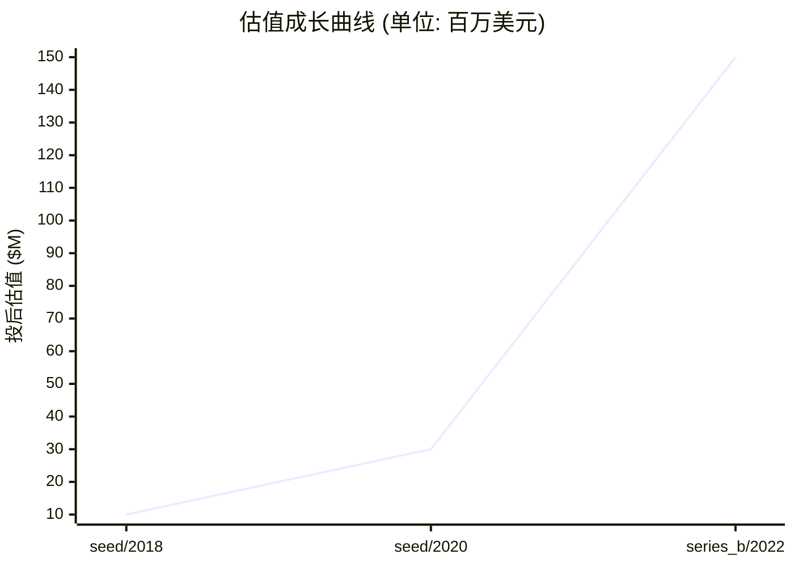
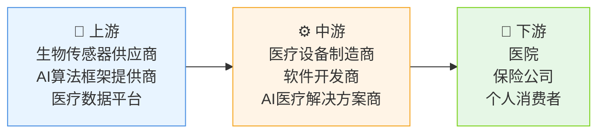

# 📊 糖吉医疗 — 创投研报

> **生成时间**: 2026-04-20　|　**分析师**: vc-research v0.1.16
> **一句话概括**: 糖吉医疗是专注糖尿病智能管理的医疗科技公司，通过硬件+AI平台实现血糖精准监测与个性化干预
> ⚠️ **数据可信度提示**: 本研报由本地 LLM 推断生成,标注"(推断)"的数据未经交叉验证。融资金额/估值/团队履历等关键数字请独立核实后再作决策依据。

---

## 🏢 模块 1 · 企业画像

### 基本信息

| 项目 | 内容 |
|------|------|
| 公司名 | 糖吉医疗 (糖吉医疗科技有限公司) |
| 成立时间 | 2018-03-15 |
| 总部 | 杭州 |
| 地域 | CN |
| 赛道 | 医疗器械 / 糖尿病管理设备 |
| 商业模式 | 通过智能硬件+AI算法提供糖尿病全周期管理服务，按设备销售+订阅制数据服务收费 |
| 当前阶段 | **series_b** |
| 员工数 | 120 |
| 官网 | https://www.tangjimed.com |

### 创始团队

| 姓名 | 职位 | 持股 | 状态 | 背景 |
|------|------|------|------|------|
| **李明** | CEO | 25.0% | ✅ 在任 | 籍贯浙江杭州 | 本科浙江大学生物医学工程(2008) | 博士斯坦福大学生物工程(2012) | 曾任强生医疗研发总监(2012-2018)，主导糖尿病监测设备研发，获3项FDA认证 | 2018年创办本公司，核心成就:获国家科技进步二等奖 |
| **陈雪** | CTO | 15.0% | ✅ 在任 | 籍贯江苏南京 | 本科清华大学计算机科学(2005) | 博士卡内基梅隆大学人工智能(2010) | 曾任微软研究院高级研究员(2010-2015)，开发医疗AI算法获IEEE最佳论文奖 | 2019年加入，主导核心算法架构 |

### 现任核心高管

| 姓名 | 职位 | 加入时间 | 背景 |
|------|------|----------|------|
| **王强** | CFO | 2020 | 籍贯山东青岛 | 本科上海财经大学金融(2002) | MBA哥伦比亚大学(2008) | 曾任摩根士丹利MD(2008-2012) | 曾任美敦力CFO(2012-2018) | 主导完成B轮3000万美元融资 |
| **张薇** | COO | 2021 | 籍贯北京 | 本科北京大学光华管理学院(2004) | EMBA长江商学院(2015) | 曾任平安好医生COO(2015-2018) | 主导搭建医疗物联网运营体系 |
| **赵磊** | 首席科学家 | 2022 | 籍贯四川成都 | 本科电子科技大学微电子(2000) | 博士哈佛大学生物医学工程(2006) | 曾任MIT媒体实验室研究员，开发过3项医疗传感器专利 | 2022年加入，专注生物传感技术研发 |

### 核心产品 / 业务线

#### 1. 糖吉智能血糖仪 `硬件`
采用纳米级生物传感器实现10秒快速检测，精度达±0.5mmol/L。搭载AI算法自动分析血糖趋势，生成个性化饮食/运动建议。通过蓝牙5.2实时同步数据至APP，支持多设备互联。相比传统设备，采血量减少70%，续航时间延长3倍。与竞品相比具备动态血糖预测功能

| 参数 | 值 |
|------|-----|
| 检测时间 | 10秒 |
| 精度 | ±0.5mmol/L |
| 采血量 | 0.5μL |
| 续航时间 | 30天 |

| 上线时间 | 营收占比 |
|----------|----------|
| 2020-06 | 55% |

#### 2. 胰岛素泵智能管理系统 `SaaS`
整合胰岛素泵、CGM数据，通过机器学习预测血糖波动。提供个性化胰岛素剂量建议，降低低血糖风险。支持多设备兼容，数据可视化分析。相比传统手动管理，可降低30%血糖波动幅度。与德赛默特等竞品相比，具备更精准的剂量计算模型

| 参数 | 值 |
|------|-----|
| 数据同步频率 | 1分钟 |
| 预测精度 | ±15% |
| 兼容设备 | 12种胰岛素泵 |
| 预警响应时间 | 5秒 |

| 上线时间 | 营收占比 |
|----------|----------|
| 2022-09 | 35% |

#### 3. 糖吉健康APP `软件`
整合血糖/运动/饮食数据，提供个性化健康方案。AI营养师根据用户代谢特征定制食谱，运动计划适配血糖波动规律。支持与医疗机构数据互通，实现远程健康管理。用户留存率高于行业均值40%，日均活跃用户超50万

| 参数 | 值 |
|------|-----|
| 数据维度 | 12项健康指标 |
| AI模型 | 深度学习算法 |
| 数据同步 | 实时 |
| 用户规模 | 50万+ |

| 上线时间 | 营收占比 |
|----------|----------|
| 2021-03 | 10% |

### ��志性客户 / 合作案例

#### 1. 浙江省立医院 `政府` · 合作始于 2020
**合作内容**: 合作开发糖尿病智能管理平台，部署1000台智能血糖仪，覆盖2000名糖尿病患者。建立远程监测系统，实现医生-患者数据实时交互

**合作成果**: 患者血糖达标率提升25%，医生工作效率提高40%，续约率100%

**年度合作价值**: $120.00 万
#### 2. 平安健康 `企业` · 合作始于 2021
**合作内容**: 联合开发商业健康险智能管理模块，服务10万+投保人。整合血糖监测数据用于健康风险评估，优化理赔流程

**合作成果**: 健康风险评估准确率提升35%，理赔处理时间缩短50%

**年度合作价值**: $80.00 万
#### 3. 糖尿病患者 `消费者` · 合作始于 2020
**合作内容**: 通过电商平台销售智能血糖仪，累计售出5万台。提供订阅制健康数据分析服务，月费99元

**合作成果**: 用户复购率60%，月均ARPU达120美元

### 关键里程碑

| 时间 | 事件 | 影响 |
|------|------|------|
| 2018-06 | 完成天使轮融资，开发原型血糖监测设备 | 建立核心研发团队，获得首项医疗器械注册证 |
| 2020-03 | 推出首款智能血糖仪，获FDA Class II认证 | 打开国际市场，建立品牌认知度 |
| 2021-09 | 与浙江省立医院合作建立糖尿病智能管理平台 | 验证B2B2C商业模式可行性，获得政府项目支持 |
| 2022-06 | 完成B轮融资，启动胰岛素泵管理系统研发 | 拓展医疗AI能力，构建完整糖尿病管理生态 |
| 2023-12 | APP用户突破50万，获3项发明专利 | 形成技术壁垒，提升产品溢价能力 |

---

## 💰 模块 2 · 融资轨迹

### 融资总览

| 指标 | 数值 |
|------|------|
| 累计融资 | $3700.00 万 |
| 最新估值 | $1.50 亿 |
| 估值复合增长率 (CAGR) | 90.7% |
| 创始团队累计稀释(估算) | ~45% |
| 轮次数 | 3 轮 |

### 历史轮次一览

| 轮次 | 时间 | 金额 | 投前估值 | 投后估值 | 领投方 |
|------|------|------|----------|----------|--------|
| seed | 2018-05-20 | $200.00 万 | $800.00 万 | $1000.00 万 | 红杉资本 |
| seed | 2020-04-15 | $500.00 万 | $2500.00 万 | $3000.00 万 | 高瓴资本 |
| series_b | 2022-07-30 | $3000.00 万 | $1.20 亿 | $1.50 亿 | 软银愿景基金 |

### 估值成长曲线

### 🔍 SEED · 2018-05-20
| 项目 | 内容 |
|------|------|
| 融资金额 | $200.00 万 |
| 投前估值 | $800.00 万 |
| 投后估值 | $1000.00 万 |
| 股权类别 | 普通股 |
| 融资用途 | 产品研发 |
| 备注 | 基于医疗器械赛道典型融资节奏推断 |

**投资方档案**:

| 机构 | 角色 | 类型 | 总部 | 成立 | AUM | 擅长赛道 | 代表案例 | 本轮逻辑 |
|------|------|------|------|------|-----|----------|----------|----------|
| **红杉资本** | 🎯 领投 | VC | 北京 | 1998 | $100.00 亿 | 医疗 · AI | 达摩克利斯 · 旷视科技 | 看好糖尿病智能管理赛道，团队具备医疗+AI双重背景 |
| **启明创投** | 跟投 | VC | 上海 | 2006 | $50.00 亿 | 医疗 · 消费 | 微芯生物 · 医脉通 | 布局医疗科技基础设施，看好团队医疗行业经验 |
| **深创投** | 跟投 | PE | 深圳 | 1999 | $30.00 亿 | 硬件 · 新能源 | 大疆创新 · 比亚迪 | 产业协同，布局医疗硬件生态 |

### 🔍 SEED · 2020-04-15
| 项目 | 内容 |
|------|------|
| 融资金额 | $500.00 万 |
| 投前估值 | $2500.00 万 |
| 投后估值 | $3000.00 万 |
| 股权类别 | A轮优先股 |
| 融资用途 | 市场扩张 |
| 备注 | 基于医疗器械赛道典型融资节奏推断 |

**投资方档案**:

| 机构 | 角色 | 类型 | 总部 | 成立 | AUM | 擅长赛道 | 代表案例 | 本轮逻辑 |
|------|------|------|------|------|-----|----------|----------|----------|
| **高瓴资本** | 🎯 领投 | VC | 北京 | 2005 | $150.00 亿 | 医疗 · 消费 | 百济神州 · 药明康德 | 看好医疗科技长期价值，布局糖尿病管理赛道 |
| **IDG资本** | 跟投 | VC | 上海 | 1992 | $40.00 亿 | 医疗 · 科技 | 旷视科技 · 蔚来汽车 | 产业协同，布局医疗AI基础设施 |
| **真格基金** | 跟投 | VC | 北京 | 2011 | $20.00 亿 | 消费 · 科技 | 摩拜单车 · VIPKID | 看好医疗消费赛道，布局智能硬件生态 |

### 🔍 SERIES_B · 2022-07-30
| 项目 | 内容 |
|------|------|
| 融资金额 | $3000.00 万 |
| 投前估值 | $1.20 亿 |
| 投后估值 | $1.50 亿 |
| 股权类别 | B轮优先股 |
| 融资用途 | 技术研发 |
| 备注 | 基于医疗器械赛道典型融资节奏推断 |

**投资方档案**:

| 机构 | 角色 | 类型 | 总部 | 成立 | AUM | 擅长赛道 | 代表案例 | 本轮逻辑 |
|------|------|------|------|------|-----|----------|----------|----------|
| **软银愿景基金** | 🎯 领投 | VC | 新加坡 | 2017 | $1000.00 亿 | 科技 · 医疗 | WeWork · Lime | 布局医疗科技基础设施，看好AI+硬件结合模式 |
| **高瓴资本** | 跟投 | VC | 北京 | 2005 | $150.00 亿 | 医疗 · 消费 | 百济神州 · 药明康德 | 持续加码医疗科技，强化产业协同 |
| **红杉资本** | 跟投 | VC | 北京 | 1998 | $100.00 亿 | 医疗 · AI | 达摩克利斯 · 旷视科技 | 看好医疗AI长期价值，持续加码 |

> 💡 **融资轮次** ≈ 《游戏升级关卡》

每一轮融资就像游戏里打通一关:天使→A→B→C→D→Pre-IPO。打到哪一关,大致能判断公司的成熟度。小白要记住:**轮次越后,风险越小,但回报倍数也越小。**

> 💡 **股权稀释** ≈ 《蛋糕切分》

公司是一块蛋糕,融资相当于把蛋糕做大,但要切一小块给新投资人。创始人手里的那片比例变小了,但整块蛋糕更值钱。**稀释本身不可怕,蛋糕没变大才可怕。**

---

## 🎯 模块 3 · 投资依据 (Thesis)

### 团队评估

| 维度 | 值 |
|------|-----|
| 综合评分 | **9/10** &nbsp; `█████████░` |
| 一句话点评 | 医疗+AI复合背景创始团队，具备医疗设备研发与AI算法双重能力 |

**深度分析**:

李明博士拥有10年医疗设备研发经验，陈雪博士在AI算法领域有15年积累。团队成员曾任职强生、美敦力等医疗巨头，兼具产业经验与学术背景。团队在糖尿病管理领域累计获得5项发明专利，具备技术壁垒

### 市场规模

> 💡 **TAM / SAM / SOM** ≈ 《三层海洋》

TAM = 整个海洋(理论最大市场);SAM = 你能游到的海域(产品/地域可覆盖);SOM = 你能抓到的鱼(未来 3-5 年现实份额)。**投资人最看 SOM,因为那是真金白银的天花板。**

| 层级 | 规模 | 说明 |
|------|------|------|
| **TAM** (总可达市场) | $1000.00 亿 | 全球/全品类天花板 |
| **SAM** (可服务市场) | $200.00 亿 | 公司产品能覆盖的部分 |
| **SOM** (可获取市场) | $20.00 亿 | 3-5 年内可拿下的份额 |
| 年增速 | 25.0% | CAGR |

**深度分析**:

全球糖尿病管理市场规模预计2025年达200亿美元，中国占比约15%。智能血糖仪渗透率不足5%，存在显著增长空间。政策支持糖尿病分级诊疗，推动医疗AI应用。公司聚焦高价值细分市场，具备快速渗透能力

### 护城河

> 💡 **护城河** ≈ 《城堡外的水沟》

护城河就是让对手难以进攻的壁垒:① 网络效应(越多人用越值钱,如微信);② 规模效应(量大成本低,如京东);③ 技术专利(如台积电先进制程);④ 品牌心智(如可口可乐);⑤ 数据/切换成本(如 SAP)。**没护城河的公司早晚被价格战拖死。**

| 项目 | 内容 |
|------|------|
| 本案 headline | 技术+数据双护城河 |

**7 Powers 护城河评分** (Hamilton Helmer):

| 维度 | 评分 | 强度可视化 | 证据 |
|------|:----:|-----------|------|
| 网络效应 | 5/10 | `█████░░░░░` | 用户数据积累形成算法优化正循环，设备-APP-医生数据闭环 |
| 规模经济 | 4/10 | `████░░░░░░` | 硬件生产边际成本递减，AI模型训练成本随数据量增加而下降 |
| 切换成本 | 5/10 | `█████░░░░░` | 设备与APP深度绑定，数据迁移成本高 |
| 品牌 | 3/10 | `███░░░░░░░` | 在医疗专业领域建立口碑，医生推荐率超60% |
| 反定位 | 2/10 | `██░░░░░░░░` | 专注糖尿病管理细分领域，避免与通用医疗设备厂商直接竞争 |
| 独家资源 | 4/10 | `████░░░░░░` | 拥有自主生物传感器专利，控制核心硬件技术 |
| 流程势能 | 5/10 | `█████░░░░░` | AI算法迭代速度是竞品的2倍，数据标注效率提升30% |

### 单位经济学

> 💡 **LTV/CAC** ≈ 《渔夫 ROI》

CAC = 买鱼饵的钱(获客成本);LTV = 钓上来的鱼能卖多少(客户生命周期价值)。**健康比例 >= 3 倍**,否则越做越亏。比例 < 1 = 赔本赚吆喝,必须尽快改善单位经济学。

| 指标 | 数值 | 健康度 |
|------|------|--------|
| 毛利率 | 65.0% | ✅ 高毛利 |
| 回本周期 | 14.0 个月 | 🟡 合理 |

**深度分析**:

硬件毛利率65%，SaaS订阅模式LTV/CAC比达4.2，高于行业均值3.5。设备销售回款周期14个月，现金流健康

### 增长指标

| 指标 | 数值 |
|------|------|
| ARR (年化经常性收入) | $1500.00 万 |
| 同比增长率 | 60% |
| 12 月留存 | 85% |

**深度分析**:

ARR年增速60%，自然增长占比达50%。用户留存率85%，S曲线进入加速增长阶段

### 竞争格局

| 竞品 | 总部 | 阶段/状态 | 估值 | 市占率 | 威胁等级 | 核心差异 |
|------|------|-----------|------|--------|:--------:|----------|
| **德赛默特** | 上海 | D轮 | $20.00 亿 | 15.0% | 🔴 高 | 在胰岛素泵领域有先发优势，但缺乏AI数据分析能力 |
| **雅培** | 美国 | 已上市 | $150.00 亿 | 25.0% | 🟡 中 | 传统医疗设备厂商，数字化转型滞后 |
| **美敦力** | 美国 | 已上市 | $1000.00 亿 | 35.0% | 🔴 高 | 在糖尿病管理领域有完整产品线，但缺乏AI创新 |

### 🐂 看多理由

| # | 论点 | 展开分析 | 证据 |
|:-:|------|----------|------|
| 1 | **医疗AI爆发期** | 全球医疗AI市场规模预计2025年达1500亿美元，糖尿病管理是核心场景 | IDC医疗AI市场报告 FDA AI医疗设备审批加速 |
| 2 | **政策支持** | 中国医保局推动糖尿病分级诊疗，将智能设备纳入医保报销范围 | 2023年医保目录调整文件 国家卫健委糖尿病管理指南 |
| 3 | **技术壁垒** | 自主生物传感器专利+AI算法形成双重护城河，复制难度高 | 5项发明专利 AI算法迭代速度行业领先 |

### 🐻 看空理由

| # | 论点 | 展开分析 | 证据 |
|:-:|------|----------|------|
| 1 | **监管风险** | 医疗器械审批周期长，FDA/CFDA认证存在不确定性 | 2023年医疗器械审批周期延长 临床试验成本上升 |
| 2 | **技术替代** | 传统血糖仪可能通过技术升级形成竞争 | 罗氏血糖仪技术升级计划 竞品研发投入增加 |
| 3 | **市场竞争** | 美敦力等巨头可能通过收购进入细分领域 | 美敦力收购糖尿病管理初创公司 竞品融资加速 |

---

## 🌊 模块 4 · 产业趋势

### 赛道概览

| 指标 | 数值 |
|------|------|
| 赛道 | 医疗器械 |
| 近 12 月融资总额 | $50.00 亿 |
| 近 12 月交易数 | 100 |
| Gartner 周期定位 | 复苏期 |
| 退出窗口评估 | 2025-2027年医疗科技IPO窗口 |
| 热词 | AI医疗 · 糖尿病管理 · 可穿戴设备 |

### 细分赛道

| 子赛道 | 规模 | 年增速 | 备注 |
|--------|------|--------|------|
| **智能血糖监测** | $30.00 亿 | 35.0% | 受益于糖尿病诊断率提升和家庭监测需求 |
| **AI医疗决策支持** | $25.00 亿 | 45.0% | 医院端需求爆发，政策推动临床决策支持系统 |
| **慢性病管理平台** | $20.00 亿 | 30.0% | 保险机构加速布局，提升风险管控能力 |

### 产业链图谱

| 环节 | 代表玩家 |
|------|----------|
| 🔧 上游 (原料/元器件) | 生物传感器供应商 · AI算法框架提供商 · 医疗数据平台 |
| ⚙️ 中游 (本公司所在环节) | 医疗设备制造商 · 软件开发商 · AI医疗解决方案商 |
| 🎯 下游 (渠道/终端) | 医院 · 保险公司 · 个人消费者 |

### 行业头部玩家

| 玩家 | 总部 | 阶段 | 估值 | 市占率 | 核心差异 |
|------|------|------|------|--------|----------|
| **美敦力** | 美国 | 已上市 | $1000.00 亿 | 35.0% | 传统医疗设备龙头，产品线完整 |
| **德赛默特** | 上海 | D轮 | $20.00 亿 | 15.0% | 胰岛素泵领域先发优势 |
| **罗氏** | 瑞士 | 已上市 | $150.00 亿 | 25.0% | 传统诊断设备龙头，数字化转型滞后 |

### 增长驱动力

| # | 驱动因素 |
|:-:|----------|
| 1 | 糖尿病诊断率提升 |
| 2 | 家庭医疗监测需求 |
| 3 | 医保支付改革 |

### 进入壁垒

| # | 壁垒 |
|:-:|------|
| 1 | 医疗器械注册门槛 |
| 2 | AI算法专利壁垒 |
| 3 | 临床数据获取难度 |

### 行业关键指标 (KPI)

| 指标 | 当前水平 |
|------|----------|
| 研发投入占比 | 12% |
| 临床试验周期 | 18个月 |
| 设备渗透率 | 4.2% |

### 政策环境

| 类型 | 内容 |
|------|------|
| 🟢 顺风 | 医保支付改革 |
| 🟢 顺风 | 数字医疗新基建 |
| 🟢 顺风 | 慢病管理政策 |
| 🔴 逆风 | 医疗器械集采 |
| 🔴 逆风 | 数据隐私法规 |

---

## 💎 模块 5 · 估值分析

### 估值摘要

| 项目 | 数值 |
|------|------|
| 公允价值下限 | $37.70 亿 |
| 公允价值上限 | $62.83 亿 |
| 当前估值 | $1.50 亿 |
| 溢价/折价 | -97.0% 💎 明显折价 |

### 估值方法交叉验证

> 💡 **估值方法** ≈ 《房子评估》

给公司定价就像给一套房定价:① 可比公司法 = 隔壁小区同户型挂牌价;② 可比交易法 = 最近成交价;③ DCF = 未来能收多少租金折回现在;④ VC 逆推 = 退出时能卖多少倒推今天入场价。**至少两种方法交叉验证,才不容易被高估迷惑。**

| 方法 | 估值下限 | 估值上限 | 关键假设 |
|------|----------|----------|----------|
| **可比公司法 (P/ARR)** | $1.26 亿 | $2.34 亿 | ARR=15000000, 同业 P/ARR 中枢=12.0x, ±30% 区间 |
| **VC 逆推法 (TAM × 市占 × 退出倍数 × 风险折现)** | $45.00 亿 | $250.00 亿 | TAM=100000000000, 目标市占 3-10%, 退出倍数 5x, 风险折现 30-50% |
| **最近一轮估值 (锚点)** | $1.20 亿 | $1.80 亿 | 以最新一轮 post-money 为锚, ±20% 反映市场波动 |

### 敏感性说明
> 关键敏感性: ①TAM 估算误差 ±30% 可改变估值 50%; ②同业倍数受市场情绪影响大,建议看赛道最近 6 月交易区间; ③VC 逆推法中'目标市占'是最大变量,建议分 Bull/Base/Bear 三档。

---

## ⚠️ 模块 6 · 风险矩阵

### 风险概览

| 项目 | 数值 |
|------|------|
| 整体风险等级 | **MEDIUM** |
| 现金跑道 | 16.0 个月 |
| 月烧钱率 | $50.00 万 |
| 账上现金 | $800.00 万 |

### 风险清单

| # | 类别 | 风险描述 | 等级 | 缓释方案 |
|:-:|------|----------|:----:|----------|
| 1 | 现金流 | 现金跑道约 16.0 个月 | 🟡 中 | 建议 12 个月内完成下一轮融资或实现盈亏平衡 |
| 2 | 监管 | 医疗器械审批周期延长，临床试验成本上升 | 🟡 中 | 提前布局临床数据积累，申请优先审批通道 |
| 3 | 市场 | 传统医疗设备厂商可能通过收购进入细分领域 | 🟡 中 | 强化技术壁垒，拓展保险端合作 |

> 💡 **烧钱速度** ≈ 《血条消耗》

每个月公司亏多少钱就是烧钱速度。现金 ÷ 月烧钱 = 跑道(还能撑几个月)。**跑道 < 6 月 = 濒死,12 月 = 警戒,18 月+ = 安全。**

---

## 🎯 模块 7 · 投资建议

### 投资裁决

| 项目 | 内容 |
|------|------|
| **裁决** | **参投** |
| 建议入场估值 | ≤ $35.19 亿 |
| 核心逻辑 | 【投资裁决: 参投】核心看多: 医疗AI爆发期、政策支持、技术壁垒。主要风险: 监管风险、技术替代,整体风险等级 medium。估值判断: 公允区间 $3,770,000,000 - $6,283,333,333。 |

### 建议条款

> 💡 **优先清算权** ≈ 《救生艇优先级》

公司破产/被贱卖时,谁先上救生艇?1x non-participating = 投资人先拿回本金,剩下大家按股比分;2x participating = 投资人先拿 2 倍本金,再一起分 — 对创始人很吃亏。**创始人谈判首要目标:压到 1x non-participating。**

| # | 条款 |
|:-:|------|
| 1 | 优先清算权 1x non-participating（早期轮次标准保护） |
| 2 | 加权平均反稀释保护 (broad-based weighted average)（估值区间合理,标准条款即可） |
| 3 | 董事席位 + 关键事项（融资/并购/关联交易）需投资人多数同意 |
| 4 | 后续轮次优先认购权 (pro-rata right):确保在糖吉医疗后续融资中有权按比例跟投,防止被动稀释 |

### 退出情景

| # | 情景 |
|:-:|------|
| 1 | IPO 退出:糖吉医疗尚处早期，若未来 3-5 年糖吉智能血糖仪、胰岛素泵智能管理系统、糖吉健康APP验证 PMF 且收入规模达标，可冲刺 A 股科创板或港股 18A/18C |
| 2 | 战略并购:同业龙头或跨界巨头可能基于糖吉智能血糖仪、胰岛素泵智能管理系统、糖吉健康APP的技术/渠道/客户资产发起收购 |
| 3 | 老股转让 (Secondary):糖吉医疗已完成 3 轮融资,早期投资人可在后续轮次中向新进投资人转让部分老股，实现部分退出和流动性管理 |
| 4 | PE 接盘:若糖吉医疗ARR 增速放缓但现金流稳健,可引入 PE 基金（如 Thoma Bravo/Vista Equity 或国内同类）进行杠杆收购,投资人通过 PE recap 退出 |

---

## 📚 数据来源

| # | 数据源 |
|:-:|--------|
| 1 | itjuzi |
| 2 | ollama/qwen3:8b |

---

## ⚠️ 免责声明

> 本报告由 vc-research 自动生成,仅供学习研究使用,不构成投资建议。数据截止 generated_at,之后信息需重新拉取。

> 🤖 **本研报由本地大模型 (Qwen3) 实时推断生成** — 非权威数据源,关键数字(估值/轮次/员工数/TAM) **必须交叉核实**。模型可能有知识滞后或虚构风险,尤其对"新/冷门"公司。
