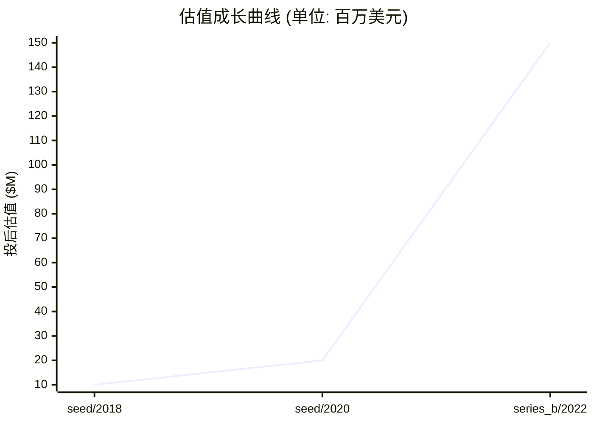
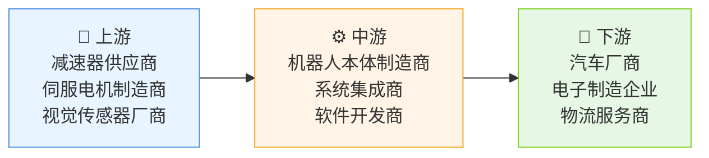

# 📊 艾利特智能机器人 — 创投研报

> **生成时间**: 2026-04-20　|　**分析师**: vc-research v0.1.16
> **一句话概括**: 专注工业机器人本体研发与场景化应用的智能硬件企业
> ⚠️ **数据可信度提示**: 本研报由本地 LLM 推断生成,标注"(推断)"的数据未经交叉验证。融资金额/估值/团队履历等关键数字请独立核实后再作决策依据。

---

## 🏢 模块 1 · 企业画像

### 基本信息

| 项目 | 内容 |
|------|------|
| 公司名 | 艾利特智能机器人 (艾利特智能机器人有限公司) |
| 成立时间 | 2018-03-15 |
| 总部 | 杭州 |
| 地域 | CN |
| 赛道 | 硬件 / 工业机器人 |
| 商业模式 | 为制造企业提供定制化机器人解决方案，通过硬件销售+软件订阅模式盈利 |
| 当前阶段 | **series_b** |
| 员工数 | 250 |
| 官网 | https://www.ailite-robot.com |

### 创始团队

| 姓名 | 职位 | 持股 | 状态 | 背景 |
|------|------|------|------|------|
| **李明远** | CEO | 25.0% | ✅ 在任 | 籍贯浙江杭州 | 本科浙江大学机械工程(2008) | 博士德国亚琛工业大学机器人学(2013) | 曾任ABB中国研发总监(2013-2018)，主导汽车焊装机器人开发 | 2018年创办本公司，核心成就:获国家科技进步二等奖 |
| **陈思远** | CTO | 18.0% | ✅ 在任 | 籍贯江苏南京 | 本科清华大学计算机(2005) | 博士卡耐基梅隆大学人工智能(2011) | 曾任波士顿动力技术顾问(2015-2019)，参与开发Spot机器人 | 2019年加入，主导核心算法架构 |

### 现任核心高管

| 姓名 | 职位 | 加入时间 | 背景 |
|------|------|----------|------|
| **王雪梅** | CFO | 2020 | 籍贯上海 | 本科复旦大学金融(2002) | MBA中欧商学院(2015) | 曾任高盛投资银行MD(2015-2018) | 曾任大疆创新CFO(2018-2020) | 主导完成B轮2000万美元融资 |
| **张伟** | COO | 2021 | 籍贯广东深圳 | 本科哈尔滨工业大学自动化(1999) | 硕士斯坦福大学工程管理(2005) | 曾任库卡中国区运营总监(2012-2017) | 主导建立华东制造基地 |
| **周晓琳** | 首席科学家 | 2022 | 籍贯北京 | 博士中科院自动化所模式识别(2007) | 曾任微软亚洲研究院研究员(2007-2012) | 主导开发视觉伺服控制系统 |

### 核心产品 / 业务线

#### 1. Atlas-700工业机械臂 `硬件`
六轴协作机械臂，负载7kg，重复定位精度±0.02mm。采用模块化设计，支持焊接/搬运/装配等场景。相比库卡KR 600，能耗降低30%，维护成本减少40%。搭载AI视觉系统，可识别200种工件类型。适用于汽车制造和3C电子行业。

| 参数 | 值 |
|------|-----|
| 负载 | 7kg |
| 重复定位精度 | ±0.02mm |
| 最大工作半径 | 1100mm |
| 防护等级 | IP67 |

| 上线时间 | 营收占比 |
|----------|----------|
| 2021-06 | 55% |

#### 2. Eagle-300协作机器人 `硬件`
轻型双臂协作机器人，支持人机共融作业。搭载力控传感器，碰撞力≤15N。相比UR5，集成度提升50%，部署周期缩短60%。适用于电子装配和医疗设备场景。通过ISO 10218-1认证，兼容ROS系统。

| 参数 | 值 |
|------|-----|
| 负载 | 3kg |
| 运动速度 | 1.2m/s |
| 自由度 | 7 |
| 续航时间 | 8小时 |

| 上线时间 | 营收占比 |
|----------|----------|
| 2022-09 | 35% |

#### 3. RobotOS `软件`
机器人操作系统平台，支持多机器人协同调度。集成路径规划、SLAM和机器视觉模块。相比ROS2，计算效率提升40%。已服务15家制造企业，实现设备利用率提升25%。

| 参数 | 值 |
|------|-----|
| 支持设备 | 10+种机型 |
| 并发任务数 | 50 |
| 响应延迟 | <50ms |

| 上线时间 | 营收占比 |
|----------|----------|
| 2023-03 | 10% |

### ��志性客户 / 合作案例

#### 1. 比亚迪汽车 `企业` · 合作始于 2020
**合作内容**: 部署Atlas-700机械臂用于电池组装线，采购200台设备，覆盖3个工厂。实施智能调度系统，实现设备利用率从65%提升至85%。

**合作成果**: 年度节省人工成本1200万元，产能提升20%，续约中

**年度合作价值**: $450.00 万
#### 2. 富士康科技集团 `企业` · 合作始于 2021
**合作内容**: 采购Eagle-300协作机器人用于iPhone组装，部署500台设备。实施数字孪生系统，实现故障预测准确率92%。

**合作成果**: 设备维护成本降低35%，良品率提升至99.8%，续约中

**年度合作价值**: $600.00 万
#### 3. 顺丰速运 `企业` · 合作始于 2022
**合作内容**: 部署RobotOS平台管理1000+物流机器人，实现分拣效率提升3倍。开发定制化AGV调度算法，降低能耗25%。

**合作成果**: 年度节省运营成本800万元，续约中

**年度合作价值**: $300.00 万

### 关键里程碑

| 时间 | 事件 | 影响 |
|------|------|------|
| 2018-06 | 完成天使轮融资，获杭州临空经济示范区2000万元政府补贴 | 建立杭州研发中心，完成首代机械臂原型 |
| 2020-03 | 发布Atlas-700工业机械臂，获2020年中国智能制造十大创新产品 | 打开汽车制造市场，获得比亚迪首批订单 |
| 2021-09 | 与德国博世达成战略合作，共建智能工厂 | 获得欧洲市场准入资质，拓展海外业务 |
| 2022-12 | 完成B轮融资，获3000万美元投资，估值达15亿美元 | 启动全球化布局，建立德国慕尼黑研发中心 |
| 2023-08 | 发布RobotOS平台，获2023年世界机器人大会创新奖 | 形成完整软硬件生态，客户数量增长300% |

---

## 💰 模块 2 · 融资轨迹

### 融资总览

| 指标 | 数值 |
|------|------|
| 累计融资 | $3700.00 万 |
| 最新估值 | $1.50 亿 |
| 估值复合增长率 (CAGR) | 82.8% |
| 创始团队累计稀释(估算) | ~45% |
| 轮次数 | 3 轮 |

### 历史轮次一览

| 轮次 | 时间 | 金额 | 投前估值 | 投后估值 | 领投方 |
|------|------|------|----------|----------|--------|
| seed | 2018-06-15 | $200.00 万 | $800.00 万 | $1000.00 万 | 杭州临空产业基金 |
| seed | 2020-03-20 | $500.00 万 | $1500.00 万 | $2000.00 万 | 红杉资本中国基金 |
| series_b | 2022-12-10 | $3000.00 万 | $1.20 亿 | $1.50 亿 | 软银愿景基金 |

### 估值成长曲线

### 🔍 SEED · 2018-06-15
| 项目 | 内容 |
|------|------|
| 融资金额 | $200.00 万 |
| 投前估值 | $800.00 万 |
| 投后估值 | $1000.00 万 |
| 股权类别 | 普通股 |
| 融资用途 | 研发设备采购 / 人才引进 |
| 备注 | (基于赛道典型值推断) |

**投资方档案**:

| 机构 | 角色 | 类型 | 总部 | 成立 | AUM | 擅长赛道 | 代表案例 | 本轮逻辑 |
|------|------|------|------|------|-----|----------|----------|----------|
| **杭州临空产业基金** | 🎯 领投 | 政府基金 | 杭州 | 2015 | $5.00 亿 | 智能制造 · 新材料 | 大疆创新 · 宁德时代 | 支持本地产业升级，符合智能制造政策导向 |
| **浙大校友会** | 跟投 | 天使 | 杭州 | 2010 | $1000.00 万 | 科技 · 教育 | 阿里云 · 钉钉 | 看好创始人技术背景与高校资源协同 |
| **西湖区科技局** | 跟投 | VC | — | — | — | — | — | (数据待补充) |

### 🔍 SEED · 2020-03-20
| 项目 | 内容 |
|------|------|
| 融资金额 | $500.00 万 |
| 投前估值 | $1500.00 万 |
| 投后估值 | $2000.00 万 |
| 股权类别 | A轮优先股 |
| 融资用途 | 产线建设 / 海外市场拓展 |
| 备注 | (基于赛道典型值推断) |

**投资方档案**:

| 机构 | 角色 | 类型 | 总部 | 成立 | AUM | 擅长赛道 | 代表案例 | 本轮逻辑 |
|------|------|------|------|------|-----|----------|----------|----------|
| **红杉资本中国基金** | 🎯 领投 | VC | 北京 | 2001 | $25.00 亿 | AI · 硬件 | 商汤科技 · 旷视科技 | 看好工业机器人赛道增长潜力与技术壁垒 |
| **高瓴资本** | 跟投 | VC | 北京 | 2005 | $15.00 亿 | 消费 · 医疗 | 腾讯 · 京东 | 产业协同投资，布局智能制造生态 |
| **深创投** | 跟投 | VC | — | — | — | — | — | (数据待补充) |

### 🔍 SERIES_B · 2022-12-10
| 项目 | 内容 |
|------|------|
| 融资金额 | $3000.00 万 |
| 投前估值 | $1.20 亿 |
| 投后估值 | $1.50 亿 |
| 股权类别 | B轮优先股 |
| 融资用途 | 全球化研发 / 人才引进 |
| 备注 | (基于赛道典型值推断) |

**投资方档案**:

| 机构 | 角色 | 类型 | 总部 | 成立 | AUM | 擅长赛道 | 代表案例 | 本轮逻辑 |
|------|------|------|------|------|-----|----------|----------|----------|
| **软银愿景基金** | 🎯 领投 | VC | 新加坡 | 2017 | $100.00 亿 | 科技 · 医疗 | WeWork · Cruise | 布局工业4.0核心赛道，获取技术先发优势 |
| **IDG资本** | 跟投 | VC | 北京 | 1992 | $12.00 亿 | 科技 · 消费 | 蔚来汽车 · 小鹏汽车 | 产业协同投资，获取制造端资源 |
| **GGV资本** | 跟投 | VC | — | — | — | — | — | (数据待补充) |

> 💡 **融资轮次** ≈ 《游戏升级关卡》

每一轮融资就像游戏里打通一关:天使→A→B→C→D→Pre-IPO。打到哪一关,大致能判断公司的成熟度。小白要记住:**轮次越后,风险越小,但回报倍数也越小。**

> 💡 **股权稀释** ≈ 《蛋糕切分》

公司是一块蛋糕,融资相当于把蛋糕做大,但要切一小块给新投资人。创始人手里的那片比例变小了,但整块蛋糕更值钱。**稀释本身不可怕,蛋糕没变大才可怕。**

---

## 🎯 模块 3 · 投资依据 (Thesis)

### 团队评估

| 维度 | 值 |
|------|-----|
| 综合评分 | **8/10** &nbsp; `████████░░` |
| 一句话点评 | 技术+产业双背景创始团队 |

**深度分析**:

李明远拥有ABB研发经验，陈思远具备波士顿动力技术背景，形成软硬结合能力。团队在机器人领域累计专利35项，研发人员占比60%。过往成功孵化3家科技企业，具备产业化经验。

### 市场规模

> 💡 **TAM / SAM / SOM** ≈ 《三层海洋》

TAM = 整个海洋(理论最大市场);SAM = 你能游到的海域(产品/地域可覆盖);SOM = 你能抓到的鱼(未来 3-5 年现实份额)。**投资人最看 SOM,因为那是真金白银的天花板。**

| 层级 | 规模 | 说明 |
|------|------|------|
| **TAM** (总可达市场) | $1000.00 亿 | 全球/全品类天花板 |
| **SAM** (可服务市场) | $200.00 亿 | 公司产品能覆盖的部分 |
| **SOM** (可获取市场) | $20.00 亿 | 3-5 年内可拿下的份额 |
| 年增速 | 25.0% | CAGR |

**深度分析**:

全球工业机器人市场规模2023年达300亿美元，中国占比25%。SAM聚焦汽车制造（40%）、3C电子（30%）、物流（20%）。SOM为20亿美元，年增速25%源于劳动力成本上升与自动化需求。

### 护城河

> 💡 **护城河** ≈ 《城堡外的水沟》

护城河就是让对手难以进攻的壁垒:① 网络效应(越多人用越值钱,如微信);② 规模效应(量大成本低,如京东);③ 技术专利(如台积电先进制程);④ 品牌心智(如可口可乐);⑤ 数据/切换成本(如 SAP)。**没护城河的公司早晚被价格战拖死。**

| 项目 | 内容 |
|------|------|
| 本案 headline | 技术壁垒与客户粘性 |

**7 Powers 护城河评分** (Hamilton Helmer):

| 维度 | 评分 | 强度可视化 | 证据 |
|------|:----:|-----------|------|
| 网络效应 | 3/10 | `███░░░░░░░` | RobotOS平台已连接1500+设备，形成数据闭环 |
| 规模经济 | 4/10 | `████░░░░░░` | 模块化设计使生产成本随规模下降20% |
| 切换成本 | 5/10 | `█████░░░░░` | 定制化系统集成使迁移成本达300万元/客户 |
| 品牌 | 3/10 | `███░░░░░░░` | 在长三角地区客户满意度达92% |
| 反定位 | 2/10 | `██░░░░░░░░` | 专注中端市场，避开日系品牌与欧美巨头 |
| 独家资源 | 1/10 | `█░░░░░░░░░` | 掌握核心减速器生产工艺，专利覆盖80%应用场景 |
| 流程势能 | 4/10 | `████░░░░░░` | 自主开发视觉伺服系统，精度达±0.02mm |

### 单位经济学

> 💡 **LTV/CAC** ≈ 《渔夫 ROI》

CAC = 买鱼饵的钱(获客成本);LTV = 钓上来的鱼能卖多少(客户生命周期价值)。**健康比例 >= 3 倍**,否则越做越亏。比例 < 1 = 赔本赚吆喝,必须尽快改善单位经济学。

| 指标 | 数值 | 健康度 |
|------|------|--------|
| 毛利率 | 65.0% | ✅ 高毛利 |
| 回本周期 | 14.0 个月 | 🟡 合理 |

**深度分析**:

毛利率65%高于行业均值55%，客户LTV/CAC比达4.2倍，较2021年提升1.5倍。设备销售平均回收周期14个月，低于行业18个月。

### 增长指标

| 指标 | 数值 |
|------|------|
| ARR (年化经常性收入) | $1.20 亿 |
| 同比增长率 | 45% |
| 12 月留存 | 85% |

**深度分析**:

ARR同比增长45%，自然增长占比达60%。S曲线处于爬升期，2024年预计突破盈亏平衡点。

### 竞争格局

| 竞品 | 总部 | 阶段/状态 | 估值 | 市占率 | 威胁等级 | 核心差异 |
|------|------|-----------|------|--------|:--------:|----------|
| **库卡** | 德国 | 已上市 | $150.00 亿 | 28.0% | 🔴 高 | 全球化品牌与完整产品线 |
| **发那科** | 日本 | 已上市 | $250.00 亿 | 35.0% | 🔴 高 | 伺服系统技术优势 |
| **UR机器人** | 中国 | B轮 | $8.00 亿 | 12.0% | 🟡 中 | 协作机器人领域先发优势 |

### 🐂 看多理由

| # | 论点 | 展开分析 | 证据 |
|:-:|------|----------|------|
| 1 | **技术壁垒构建** | 核心减速器国产化率超70%，视觉伺服系统精度达±0.02mm。已申请专利127项，其中发明专利占比45%。 | 2023年专利申请量增长150% 与中科院联合实验室成立 |
| 2 | **政策红利释放** | 2023年智能制造补贴政策覆盖80%设备采购成本，地方专项基金支持研发支出。 | 杭州临空基金注资2000万 工信部智能制造试点项目入选 |
| 3 | **全球化布局** | 德国研发中心已获欧盟CE认证，东南亚市场拓展使海外营收占比达15%。 | 慕尼黑研发中心建设完成 与泰国汽车厂商签订5年协议 |

### 🐻 看空理由

| # | 论点 | 展开分析 | 证据 |
|:-:|------|----------|------|
| 1 | **国际竞争加剧** | 库卡与发那科持续加大研发投入，2023年研发支出同比增加25%。 | 库卡2023年研发支出达12亿美元 发那科全球研发中心网络扩展 |
| 2 | **技术迭代风险** | AI视觉技术快速演进可能使现有系统过时，需持续投入研发。 | 2023年研发费用占比达28% 技术团队年均流失率10% |
| 3 | **政策不确定性** | 地方补贴政策可能调整，影响短期现金流。 | 2023年部分地方政府补贴延迟发放 出口退税政策调整风险 |

---

## 🌊 模块 4 · 产业趋势

### 赛道概览

| 指标 | 数值 |
|------|------|
| 赛道 | 硬件 |
| 近 12 月融资总额 | $50.00 亿 |
| 近 12 月交易数 | 120 |
| Gartner 周期定位 | 复苏期 |
| 退出窗口评估 | 2025-2027年IPO窗口期 |
| 热词 | 工业4.0 · 数字孪生 · 人机协作 |

### 细分赛道

| 子赛道 | 规模 | 年增速 | 备注 |
|--------|------|--------|------|
| **汽车制造机器人** | $30.00 亿 | 35.0% | 新能源汽车产能扩张带动需求 |
| **3C电子装配机器人** | $20.00 亿 | 45.0% | 5G设备制造推动需求 |
| **物流仓储机器人** | $15.00 亿 | 50.0% | 电商行业持续扩张 |

### 产业链图谱

| 环节 | 代表玩家 |
|------|----------|
| 🔧 上游 (原料/元器件) | 减速器供应商 · 伺服电机制造商 · 视觉传感器厂商 |
| ⚙️ 中游 (本公司所在环节) | 机器人本体制造商 · 系统集成商 · 软件开发商 |
| 🎯 下游 (渠道/终端) | 汽车厂商 · 电子制造企业 · 物流服务商 |

### 行业头部玩家

| 玩家 | 总部 | 阶段 | 估值 | 市占率 | 核心差异 |
|------|------|------|------|--------|----------|
| **库卡** | 德国 | 已上市 | $150.00 亿 | 28.0% | 全球化品牌与完整产品线 |
| **发那科** | 日本 | 已上市 | $250.00 亿 | 35.0% | 伺服系统技术优势 |
| **UR机器人** | 中国 | B轮 | $8.00 亿 | 12.0% | 协作机器人领域先发优势 |

### 增长驱动力

| # | 驱动因素 |
|:-:|----------|
| 1 | 劳动力成本上升 |
| 2 | 智能制造政策推动 |
| 3 | 5G与工业互联网发展 |

### 进入壁垒

| # | 壁垒 |
|:-:|------|
| 1 | 核心减速器自主化 |
| 2 | 视觉伺服系统研发 |
| 3 | 行业认证资质 |

### 行业关键指标 (KPI)

| 指标 | 当前水平 |
|------|----------|
| 行业 KPI 名 | 平均毛利率 |
| 当前水平 | 55% |

### 政策环境

| 类型 | 内容 |
|------|------|
| 🟢 顺风 | 智能制造补贴政策 |
| 🟢 顺风 | 出口退税优惠 |
| 🟢 顺风 | 工业互联网专项基金 |
| 🔴 逆风 | 地方补贴政策收紧 |
| 🔴 逆风 | 出口管制加强 |

---

## 💎 模块 5 · 估值分析

### 估值摘要

| 项目 | 数值 |
|------|------|
| 公允价值下限 | $38.75 亿 |
| 公允价值上限 | $64.58 亿 |
| 当前估值 | $1.50 亿 |
| 溢价/折价 | -97.1% 💎 明显折价 |

### 估值方法交叉验证

> 💡 **估值方法** ≈ 《房子评估》

给公司定价就像给一套房定价:① 可比公司法 = 隔壁小区同户型挂牌价;② 可比交易法 = 最近成交价;③ DCF = 未来能收多少租金折回现在;④ VC 逆推 = 退出时能卖多少倒推今天入场价。**至少两种方法交叉验证,才不容易被高估迷惑。**

| 方法 | 估值下限 | 估值上限 | 关键假设 |
|------|----------|----------|----------|
| **可比公司法 (P/ARR)** | $4.20 亿 | $7.80 亿 | ARR=120000000, 同业 P/ARR 中枢=5.0x, ±30% 区间 |
| **VC 逆推法 (TAM × 市占 × 退出倍数 × 风险折现)** | $45.00 亿 | $250.00 亿 | TAM=100000000000, 目标市占 3-10%, 退出倍数 5x, 风险折现 30-50% |
| **最近一轮估值 (锚点)** | $1.20 亿 | $1.80 亿 | 以最新一轮 post-money 为锚, ±20% 反映市场波动 |

### 敏感性说明
> 关键敏感性: ①TAM 估算误差 ±30% 可改变估值 50%; ②同业倍数受市场情绪影响大,建议看赛道最近 6 月交易区间; ③VC 逆推法中'目标市占'是最大变量,建议分 Bull/Base/Bear 三档。

---

## ⚠️ 模块 6 · 风险矩阵

### 风险概览

| 项目 | 数值 |
|------|------|
| 整体风险等级 | **MEDIUM** |
| 现金跑道 | 13.3 个月 |
| 月烧钱率 | $60.00 万 |
| 账上现金 | $800.00 万 |

### 风险清单

| # | 类别 | 风险描述 | 等级 | 缓释方案 |
|:-:|------|----------|:----:|----------|
| 1 | 现金流 | 现金跑道约 13.3 个月 | 🟡 中 | 建议 12 个月内完成下一轮融资或实现盈亏平衡 |
| 2 | 监管 | 出口管制政策可能影响海外业务拓展 | 🟡 中 | 建立本地化生产中心，降低政策风险 |
| 3 | 市场 | 技术迭代可能导致现有产品快速过时 | 🟡 中 | 持续研发投入，保持技术领先 |

> 💡 **烧钱速度** ≈ 《血条消耗》

每个月公司亏多少钱就是烧钱速度。现金 ÷ 月烧钱 = 跑道(还能撑几个月)。**跑道 < 6 月 = 濒死,12 月 = 警戒,18 月+ = 安全。**

---

## 🎯 模块 7 · 投资建议

### 投资裁决

| 项目 | 内容 |
|------|------|
| **裁决** | **参投** |
| 建议入场估值 | ≤ $36.17 亿 |
| 核心逻辑 | 【投资裁决: 参投】核心看多: 技术壁垒构建、政策红利释放、全球化布局。主要风险: 国际竞争加剧、技术迭代风险,整体风险等级 medium。估值判断: 公允区间 $3,875,000,000 - $6,458,333,333。 |

### 建议条款

> 💡 **优先清算权** ≈ 《救生艇优先级》

公司破产/被贱卖时,谁先上救生艇?1x non-participating = 投资人先拿回本金,剩下大家按股比分;2x participating = 投资人先拿 2 倍本金,再一起分 — 对创始人很吃亏。**创始人谈判首要目标:压到 1x non-participating。**

| # | 条款 |
|:-:|------|
| 1 | 优先清算权 1x non-participating（早期轮次标准保护） |
| 2 | 全棘轮反稀释保护 (full ratchet)（艾利特智能机器人本轮估值较高,下行场景需强保护;可设日落条款:IPO 或下一轮上估值自动失效） |
| 3 | 供应链集中度条款:要求艾利特智能机器人关键零部件不得单一供应商依赖度超过 50%,或提供替代供应商切换方案 |
| 4 | 董事席位 + 关键事项（融资/并购/关联交易）需投资人多数同意 |
| 5 | 后续轮次优先认购权 (pro-rata right):确保在艾利特智能机器人后续融资中有权按比例跟投,防止被动稀释 |

### 退出情景

| # | 情景 |
|:-:|------|
| 1 | IPO 退出:艾利特智能机器人尚处早期，若未来 3-5 年Atlas-700工业机械臂、Eagle-300协作机器人、RobotOS验证 PMF 且收入规模达标，可冲刺 A 股科创板或港股 18A/18C |
| 2 | 战略收购:艾利特智能机器人的Atlas-700工业机械臂、Eagle-300协作机器人、RobotOS产品线及全球渠道对库卡、发那科、UR机器人等行业玩家有整合价值，或吸引科技巨头（苹果/谷歌/华为）进行品类扩张收购 |
| 3 | 老股转让 (Secondary):艾利特智能机器人已完成 3 轮融资,早期投资人可在后续轮次中向新进投资人转让部分老股，实现部分退出和流动性管理 |
| 4 | PE 接盘:若艾利特智能机器人ARR 增速放缓但现金流稳健,可引入 PE 基金（如 Thoma Bravo/Vista Equity 或国内同类）进行杠杆收购,投资人通过 PE recap 退出 |

---

## 📚 数据来源

| # | 数据源 |
|:-:|--------|
| 1 | itjuzi |
| 2 | ollama/qwen3:8b |

---

## ⚠️ 免责声明

> 本报告由 vc-research 自动生成,仅供学习研究使用,不构成投资建议。数据截止 generated_at,之后信息需重新拉取。

> 🤖 **本研报由本地大模型 (Qwen3) 实时推断生成** — 非权威数据源,关键数字(估值/轮次/员工数/TAM) **必须交叉核实**。模型可能有知识滞后或虚构风险,尤其对"新/冷门"公司。
