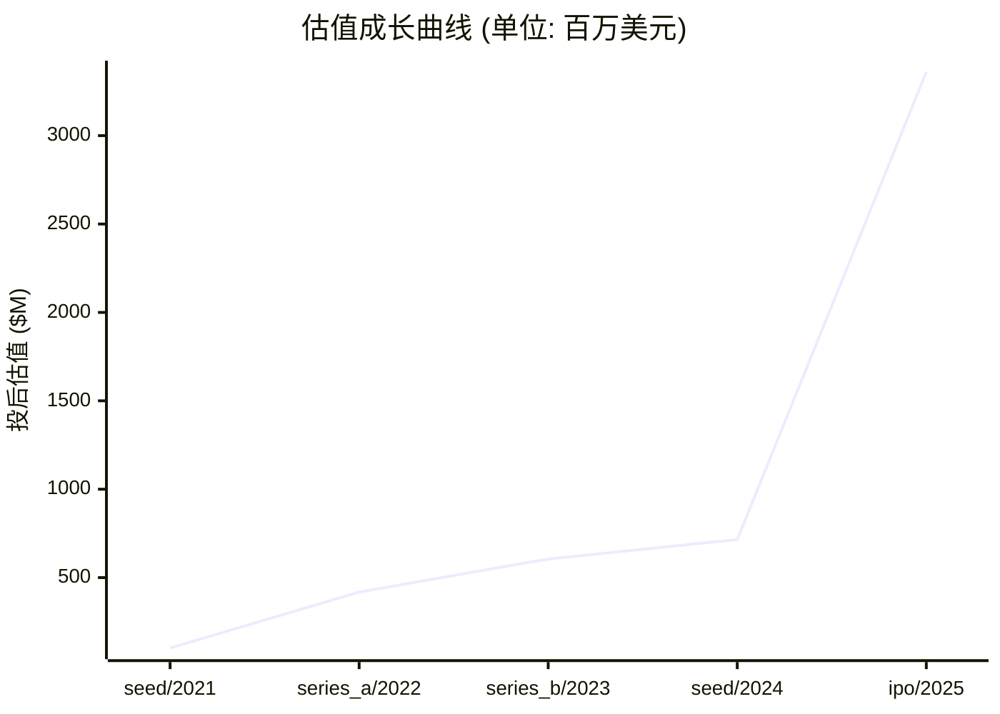

# 📊 银诺医药 — 创投研报

> **生成时间**: 2026-04-20　|　**分析师**: vc-research v0.1.16
> **一句话概括**: 亚洲首款原研人源长效 GLP-1 受体激动剂(半衰期 204h)商业化公司,聚焦糖尿病+肥胖+MASH

---

## 🏢 模块 1 · 企业画像

### 基本信息

| 项目 | 内容 |
|------|------|
| 公司名 | 银诺医药 (广州银诺医药集团股份有限公司 (Guangzhou Innogen Pharmaceutical Group Co., Ltd.)) |
| 成立时间 | 2014-12-01 |
| 总部 | 广州 (生物岛 · 黄埔区)；商业化生产基地在上海临港 |
| 地域 | CN |
| 赛道 | 医药 / GLP-1 创新药 |
| 商业模式 | 18A 生物科技 · 核心产品依苏帕格鲁肽α(怡诺轻)商业化销售 + 在研管线(肥胖/MASH)授权+自营 |
| 当前阶段 | **ipo** |
| 员工数 | 180 |

### 创始团队

| 姓名 | 职位 | 持股 | 状态 | 背景 |
|------|------|------|------|------|
| **王庆华 (Wang Qinghua)** | 创始人/董事长/总经理/依苏帕格鲁肽α 发明人 | 36.0% | ✅ 在任 | 加拿大籍华人科学家,65 岁;多伦多大学生理系博士后(1999-2002)→助理教授(2001-2007)→副教授(2007-2013) 终身教职;圣迈克尔医院 Li Ka Shing 知识研究所/内分泌代谢科高级科学家(2008-);国家特聘专家,十二五/十三五'重大新药创制'项目首席科学家;2014 年放弃终身教职回国创办银诺,带回十余年 GLP-1 分子工程研究成果 |

### 核心产品 / 业务线

#### 1. 依苏帕格鲁肽α注射液 (怡诺轻® / Efsubaglutide Alfa) `GLP-1受体激动剂 · 2型糖尿病`
人源超长效GLP-1受体激动剂，半衰期204小时（全球已上市GLP-1中最长），每周一次皮下注射。SUPER1试验3mg组HbA1c降2.15%，SUPER2联合二甲双胍24周HbA1c降1.60%、体重降2.74kg。

| 上线时间 | 营收占比 |
|----------|----------|
| — | 1.0 |

#### 2. 依苏帕格鲁肽α (肥胖/超重适应症 · ENLIGHT研究) `GLP-1受体激动剂 · 肥胖/超重`
ENLIGHT IIb/III期临床试验，2025年3月启动。IIb期已达主要终点，20mg QW剂量组体重较基线降幅10.58%。预计2026Q4完成III期。

| 上线时间 | 营收占比 |
|----------|----------|
| — | 0 |

#### 3. 依苏帕格鲁肽α (MASH适应症) `GLP-1受体激动剂 · 代谢功能障碍相关性脂肪性肝炎`
针对MASH(原NASH)的IIa期临床试验，计划2026年在美国和中国启动多中心试验。已获FDA及NMPA IND批准。

| 上线时间 | 营收占比 |
|----------|----------|
| — | 0 |

#### 4. YN014 (阿尔茨海默病) `脑靶向多肽 · 神经退行性疾病`
靶向大脑特异性靶点的创新多肽，用于阿尔茨海默病治疗，计划2026年提交IND申请。

| 上线时间 | 营收占比 |
|----------|----------|
| — | 0 |

#### 5. YN401 (1型糖尿病) `β细胞靶向多肽 · 1型糖尿病`
靶向β细胞特异性靶点的创新候选药物，用于1型糖尿病治疗，计划2025-2026年提交IND申请。

| 上线时间 | 营收占比 |
|----------|----------|
| — | 0 |

### ��志性客户 / 合作案例

#### 1. 迈富时 (Marketforce, 2556.HK) `战略合作伙伴 / AI数字化赋能` · 合作始于 2025
**合作内容**: AI-Agentforce智能体中台战略合作，赋能银诺医药全链路数字化升级（医药营销+患者管理）；同时为IPO基石投资者

**合作成果**: IPO基石投资+商业化数字基建

#### 2. 澳门特别行政区药物监督管理局 `海外监管注册 / BLA获批` · 合作始于 2025
**合作内容**: 2025年6月依苏帕格鲁肽α在澳门获BLA批准上市，成为海外商业化首站

**合作成果**: 大中华区全覆盖，为东南亚/拉美注册提供参照

#### 3. 东南亚合作方 (国家未披露) `海外注册/商业化合作伙伴` · 合作始于 2025
**合作内容**: 2025年6月向东南亚某国提交BLA申请，计划2025下半年向拉美某国提交BLA申请，推进国际商业化

**合作成果**: 海外市场拓展中

#### 4. 中信证券 / 中金公司 `联席保荐人 / 资本市场合作` · 合作始于 2025
**合作内容**: 担任港股18A IPO联席保荐人，协助募资6.83亿港元，后续提供持续资本市场服务

**合作成果**: 成功上市，首日涨206%，市值超260亿港元

### 关键里程碑

| 时间 | 事件 | 影响 |
|------|------|------|
| 2014-12 | 公司成立，创始人王庆华放弃多伦多大学终身教职回国创业 | 将十余年GLP-1分子工程研究成果产业化 |
| 2021-03 | 完成Pre-A轮融资2.16亿元人民币（中金资本、广州产投领投） | 首轮机构融资，投后估值6.66亿元 |
| 2023-11 | SUPER1 IIb/III期试验结果在CDS 2023首发，3mg组HbA1c降2.15% | 确证依苏帕格鲁肽α降糖疗效，为NDA申报提供关键数据 |
| 2024-09 | SUPER2联合二甲双胍试验数据在EASD 2024公布，HbA1c降1.60%+减重2.74kg | 验证联合用药方案有效性，拓宽临床使用场景 |
| 2025-01 | 依苏帕格鲁肽α（怡诺轻®）获NMPA批准上市，用于成人2型糖尿病 | 亚洲首款+全球第三款原研人源长效GLP-1RA上市，银诺进入商业化阶段 |
| 2025-02 | 怡诺轻®正式商业化销售启动 | 从零收入跨越到营收阶段，2025H1收入5640万元 |
| 2025-03 | 肥胖/超重适应症ENLIGHT IIb/III期临床试验启动 | 拓展减重适应症，打开千亿级肥胖市场 |
| 2025-06 | 依苏帕格鲁肽α在澳门获BLA批准；同月向东南亚某国提交BLA申请 | 开启国际化注册路径，海外商业化破冰 |
| 2025-08 | 港交所18A主板上市(02591.HK)，发行价18.68港元，首日涨206%，募资6.83亿港元 | 打开资本市场融资通道，孖展超购3133倍，26万人认购 |
| 2025-08 | 肥胖适应症澳洲II期临床试验首例患者入组 | 获取海外人群临床数据，为全球注册铺路 |
| 2025-12 | ENLIGHT IIb期达主要终点，20mg QW组体重降幅10.58% | 减重数据优异，为III期推进和肥胖适应症NDA奠定基础 |

---

## 💰 模块 2 · 融资轨迹

### 融资总览

| 指标 | 数值 |
|------|------|
| 累计融资 | $3.19 亿 |
| 最新估值 | $33.60 亿 |
| 估值复合增长率 (CAGR) | 119.0% |
| 创始团队累计稀释(估算) | ~63% |
| 轮次数 | 5 轮 |

### 历史轮次一览

| 轮次 | 时间 | 金额 | 投前估值 | 投后估值 | 领投方 |
|------|------|------|----------|----------|--------|
| seed | 2021-03-01 | $3300.00 万 | — | $1.02 亿 | 中金资本, 广州产投 |
| series_a | 2022-02-01 | $1.10 亿 | — | $4.18 亿 | 江阴国调洪泰, 中金资本, 广州产投 |
| series_b | 2023-03-01 | $5100.00 万 | — | $6.05 亿 | 上海诺临医药, 产业投资方 |
| seed | 2024-02-01 | $3800.00 万 | — | $7.15 亿 | 原有股东跟投 |
| ipo | 2025-08-15 | $8700.00 万 | — | $33.60 亿 | 中信证券 (联席保荐), 中金公司 (联席保荐), 基石:骏昇环球 / Ginkgo Fund / 迈富时(2556.HK) / 邓海峰 / 黎慧凤 |

### 估值成长曲线

### 🔍 SEED · 2021-03-01
| 项目 | 内容 |
|------|------|
| 融资金额 | $3300.00 万 |
| 投后估值 | $1.02 亿 |
| 备注 | 2.16 亿 RMB Pre-A,投后 6.66 亿 RMB(约 1.02 亿 USD @6.5汇率) |

### 🔍 SERIES_A · 2022-02-01
| 项目 | 内容 |
|------|------|
| 融资金额 | $1.10 亿 |
| 投后估值 | $4.18 亿 |
| 备注 | 7.16 亿 RMB A 轮,投后 27.16 亿 RMB;PreA→A 估值 4 倍抬升 |

### 🔍 SERIES_B · 2023-03-01
| 项目 | 内容 |
|------|------|
| 融资金额 | $5100.00 万 |
| 投后估值 | $6.05 亿 |
| 备注 | 3.31 亿 RMB B 轮,投后 39.3 亿 RMB |

### 🔍 SEED · 2024-02-01
| 项目 | 内容 |
|------|------|
| 融资金额 | $3800.00 万 |
| 投后估值 | $7.15 亿 |
| 备注 | 2.5 亿 RMB B+ 轮,投后 46.5 亿 RMB,上市前最后一轮,累计四轮融资 15.58 亿 RMB |

### 🔍 IPO · 2025-08-15
| 项目 | 内容 |
|------|------|
| 融资金额 | $8700.00 万 |
| 投后估值 | $33.60 亿 |
| 备注 | 港股 18A 主板 02591.HK,发行价 18.68 HKD,全球发售 3655.64 万股,募资 6.83 亿 HKD(~$87M);开盘 72 HKD(+285%),收盘 57.25 HKD(+206%),市值约 261.5 亿 HKD(~$33.6B HKD ≈ $4.3B USD 开盘/$3.36B 收盘);新回拨机制第一股;孖展超购 3133 倍,认购 26 万人 |

> 💡 **融资轮次** ≈ 《游戏升级关卡》

每一轮融资就像游戏里打通一关:天使→A→B→C→D→Pre-IPO。打到哪一关,大致能判断公司的成熟度。小白要记住:**轮次越后,风险越小,但回报倍数也越小。**

> 💡 **股权稀释** ≈ 《蛋糕切分》

公司是一块蛋糕,融资相当于把蛋糕做大,但要切一小块给新投资人。创始人手里的那片比例变小了,但整块蛋糕更值钱。**稀释本身不可怕,蛋糕没变大才可怕。**

---

## 🎯 模块 3 · 投资依据 (Thesis)

### 团队评估

| 维度 | 值 |
|------|-----|
| 综合评分 | **8/10** &nbsp; `████████░░` |
| 一句话点评 | 创始人王庆华多伦多大学终身教授+国家特聘专家,GLP-1 分子工程十余年积累;投资方反馈:董监高团队仅董事长为初创成员,中高层商业化经验相对薄弱;研发驱动 > 销售驱动;35.07% 集中控股保证决策一致性 |

### 市场规模

> 💡 **TAM / SAM / SOM** ≈ 《三层海洋》

TAM = 整个海洋(理论最大市场);SAM = 你能游到的海域(产品/地域可覆盖);SOM = 你能抓到的鱼(未来 3-5 年现实份额)。**投资人最看 SOM,因为那是真金白银的天花板。**

| 层级 | 规模 | 说明 |
|------|------|------|
| **TAM** (总可达市场) | $1575.00 亿 | 全球/全品类天花板 |
| **SAM** (可服务市场) | $63.00 亿 | 公司产品能覆盖的部分 |
| **SOM** (可获取市场) | $5.00 亿 | 3-5 年内可拿下的份额 |
| 年增速 | 14.3% | CAGR |

### 护城河

> 💡 **护城河** ≈ 《城堡外的水沟》

护城河就是让对手难以进攻的壁垒:① 网络效应(越多人用越值钱,如微信);② 规模效应(量大成本低,如京东);③ 技术专利(如台积电先进制程);④ 品牌心智(如可口可乐);⑤ 数据/切换成本(如 SAP)。**没护城河的公司早晚被价格战拖死。**

| 项目 | 内容 |
|------|------|
| 本案 headline | 亚洲首款+全球第三款原研人源长效 GLP-1 受体激动剂(此前仅诺和诺德/礼来);半衰期 204 小时全球已上市 GLP-1 中最长,支持双周给药(SUPER2 试验 HbA1c -1.45% 双周 vs -1.53% 周);NMPA 2025-01-26 获批 2 型糖尿病;人源序列(非类似肽) 免疫原性潜在优势;1 项核心专利+管线梯队(肥胖/MASH/减重 ENLIGHT 试验) |

### 单位经济学

> 💡 **LTV/CAC** ≈ 《渔夫 ROI》

CAC = 买鱼饵的钱(获客成本);LTV = 钓上来的鱼能卖多少(客户生命周期价值)。**健康比例 >= 3 倍**,否则越做越亏。比例 < 1 = 赔本赚吆喝,必须尽快改善单位经济学。

| 指标 | 数值 | 健康度 |
|------|------|--------|
| 毛利率 | 80.0% | ✅ 高毛利 |
| 回本周期 | 36.0 个月 | ⚠️ 过长 |

### 增长指标

| 指标 | 数值 |
|------|------|

### 竞争格局

| # | 竞品 |
|---|------|
| 1 | 诺和诺德 (Ozempic/Wegovy 司美格鲁肽) |
| 2 | 礼来 (Mounjaro/Zepbound 替尔泊肽) |
| 3 | 信达生物 (玛仕度肽 Mazdutide) |
| 4 | 恒瑞医药 (HRS9531) |
| 5 | 先为达生物 (Ecnoglutide 伊诺格鲁肽) |
| 6 | 华东医药 (利拉鲁肽仿制+自研) |
| 7 | 博瑞医药 |
| 8 | 联邦制药 |

### 🐂 看多理由

| # | 看多理由 |
|:-:|----------|
| 1 | 中国糖尿病患者 1.4 亿 + 超重/肥胖 >50% 成年人,Lancet 2025 预测中国 GLP-1 市场 2033 达 63 亿 USD CAGR 14.3% |
| 2 | 依苏帕格鲁肽α 2025-01 获批并已在上海临港基地准备商业化,IPO 募资 90% 用于临床+商业化上量 |
| 3 | 204h 半衰期支持月度/双周剂型,差异化跑道+潜在国际 BD 授权空间 |
| 4 | 港交所 IPO 超购 3133 倍+首日 +206% 反映市场对 GLP-1 赛道热情,打开后续定增/权益融资通道 |

### 🐻 看空理由

| # | 看空理由 |
|:-:|----------|
| 1 | 2022-2024 累计亏损超 11 亿 RMB,2023 净亏 7.33 亿/2024 前 5 个月亏 9788 万 RMB,2024 年估值较 B+ 轮递表前一度下滑 37% |
| 2 | 单产品依赖风险极高:怡诺轻占全部收入来源,而同赛道司美格鲁肽专利 2026 年起陆续到期,国内仿制药海啸在即 |
| 3 | 商业化团队薄弱:董监高仅创始人是初创成员,缺少诺和/礼来级别的代谢病销售操盘手 |
| 4 | 与礼来替尔泊肽/诺和司美格鲁肽 SELECT 心血管结局数据相比,银诺缺乏大规模头对头+长期硬终点数据 |
| 5 | IPO 前战投方低价减持信号,PE 对短期商业化兑现能力存疑 |

---

## 🌊 模块 4 · 产业趋势

### 赛道概览

| 指标 | 数值 |
|------|------|
| 赛道 | 医药 |
| 近 12 月融资总额 | $35.00 亿 |
| 近 12 月交易数 | 45 |
| Gartner 周期定位 | 过热期顶峰 (全球 GLP-1 减重热潮);中国市场处启动期 → 泡沫期过渡 |
| 退出窗口评估 | 已 IPO(2025-08-15 港股 02591.HK),6 个月基石+战投锁定期至 2026-02;早期 PE 通过 IPO 退出通道打开 |
| 热词 | GLP-1 · 减重 · 司美格鲁肽 · 替尔泊肽 · 长效 · MASH · 18A · 人源多肽 |

### 政策环境

| 类型 | 内容 |
|------|------|
| 🟢 顺风 | 健康中国 2030 糖尿病/肥胖防治纳入核心指标 |
| 🟢 顺风 | NMPA 加速审评创新药(突破性治疗品种) |
| 🟢 顺风 | 国家医保谈判向原研创新药倾斜 |
| 🟢 顺风 | 港交所 18A 未盈利生物科技通道持续开放 |
| 🔴 逆风 | 医保集采压价预期(司美格鲁肽 2026+ 进集采概率高) |
| 🔴 逆风 | GLP-1 电商推广合规收紧(超适应症宣传面临处罚) |
| 🔴 逆风 | 减肥药非治疗用途使用的伦理/监管争议 |
| 🔴 逆风 | FDA/EMA 出海需额外全球 III 期,投入巨大 |

---

## 💎 模块 5 · 估值分析

### 估值摘要

| 项目 | 数值 |
|------|------|
| 公允价值下限 | $99.72 亿 |
| 公允价值上限 | $166.20 亿 |
| 当前估值 | $33.60 亿 |
| 溢价/折价 | -74.7% 💎 明显折价 |

### 估值方法交叉验证

> 💡 **估值方法** ≈ 《房子评估》

给公司定价就像给一套房定价:① 可比公司法 = 隔壁小区同户型挂牌价;② 可比交易法 = 最近成交价;③ DCF = 未来能收多少租金折回现在;④ VC 逆推 = 退出时能卖多少倒推今天入场价。**至少两种方法交叉验证,才不容易被高估迷惑。**

| 方法 | 估值下限 | 估值上限 | 关键假设 |
|------|----------|----------|----------|
| **VC 逆推法 (TAM × 市占 × 退出倍数 × 风险折现)** | $70.88 亿 | $393.75 亿 | TAM=157500000000, 目标市占 3-10%, 退出倍数 5x, 风险折现 30-50% |
| **最近一轮估值 (锚点)** | $26.88 亿 | $40.32 亿 | 以最新一轮 post-money 为锚, ±20% 反映市场波动 |

### 敏感性说明
> 关键敏感性: ①TAM 估算误差 ±30% 可改变估值 50%; ②同业倍数受市场情绪影响大,建议看赛道最近 6 月交易区间; ③VC 逆推法中'目标市占'是最大变量,建议分 Bull/Base/Bear 三档。

---

## ⚠️ 模块 6 · 风险矩阵

### 风险概览

| 项目 | 数值 |
|------|------|
| 整体风险等级 | **HIGH** |
| 现金跑道 | 54.0 个月 |
| 月烧钱率 | $250.00 万 |
| 账上现金 | $1.35 亿 |

### 风险清单

| # | 类别 | 风险描述 | 等级 | 缓释方案 |
|:-:|------|----------|:----:|----------|
| 1 | 现金流 | 现金跑道约 54.0 个月 | 🟢 低 | 建议 12 个月内完成下一轮融资或实现盈亏平衡 |
| 2 | 产品 | 单产品依赖 — 依苏帕格鲁肽α 占全部潜在收入,若商业化放量不及预期或遭遇司美格鲁肽仿制海啸(2026+),公司现金流承压 | 🔴 高 | 加速肥胖适应症 III 期 ENLIGHT 读出;推进 MASH 适应症拓展;寻求海外 license-out 授权分散单市场风险 |
| 3 | 竞争 | GLP-1 赛道卷成红海 — 信达玛仕度肽/恒瑞 HRS9531/先为达伊诺格鲁肽/博瑞/华东等十余家国产对手,叠加诺和/礼来品牌护城河 | 🔴 高 | 主打 204h 超长效差异化(月度剂型路径);聚焦中国三四线城市渗透;加强学术推广+真实世界数据积累 |
| 4 | 商业化 | 初创团队偏研发,销售渠道建设+医保准入经验有限,董监高仅创始人为初创成员 | 🟡 中 | IPO 后引进 MNC 背景销售/市场准入 VP;与 CSO/连锁药房/互联网医疗合作加速渗透 |
| 5 | 财务 | 累计亏损 >11 亿 RMB,2025 商业化爬坡期烧钱加剧,现金储备需覆盖至少 3 年盈亏平衡 | 🟡 中 | IPO 募资 6.1 亿 HKD 净额 + B+ 轮剩余现金 ~9.69 亿 RMB;严控三费;后续可能需增发/BD 首付款补流 |
| 6 | 监管 | 医保集采+超适应症宣传合规风险,FDA 出海需重复大规模 III 期投入 | 🟡 中 | 合规培训 + 电商监控;出海优先东南亚/中东/拉美等医保体系较友好市场 |

> 💡 **烧钱速度** ≈ 《血条消耗》

每个月公司亏多少钱就是烧钱速度。现金 ÷ 月烧钱 = 跑道(还能撑几个月)。**跑道 < 6 月 = 濒死,12 月 = 警戒,18 月+ = 安全。**

---

## 🎯 模块 7 · 投资建议

### 投资裁决

| 项目 | 内容 |
|------|------|
| **裁决** | **参投** |
| 建议入场估值 | ≤ $93.07 亿 |
| 核心逻辑 | 【投资裁决: 参投】核心看多: 中国糖尿病患者 1.4 亿 + 超重/肥胖 >50% 成年人,Lancet 2025 预测中国 GLP-1 市场 2033 达 63 亿 USD CAGR 14.3%、依苏帕格鲁肽α 2025-01 获批并已在上海临港基地准备商业化,IPO 募资 90% 用于临床+商业化上量、204h 半衰期支持月度/双周剂型,差异化跑道+潜在国际 BD 授权空间。主要风险: 2022-2024 累计亏损超 11 亿 RMB,2023 净亏 7.33 亿/2024 前 5 个月亏 9788 万 RMB,2024 年估值较 B+ 轮递表前一度下滑 37%、单产品依赖风险极高:怡诺轻占全部收入来源,而同赛道司美格鲁肽专利 2026 年起陆续到期,国内仿制药海啸在即,整体风险等级 high。估值判断: 公允区间 $9,971,718,750 - $16,619,531,250。 |

### 建议条款

> 💡 **优先清算权** ≈ 《救生艇优先级》

公司破产/被贱卖时,谁先上救生艇?1x non-participating = 投资人先拿回本金,剩下大家按股比分;2x participating = 投资人先拿 2 倍本金,再一起分 — 对创始人很吃亏。**创始人谈判首要目标:压到 1x non-participating。**

| # | 条款 |
|:-:|------|
| 1 | 优先清算权 1x non-participating |
| 2 | 基于业绩的反稀释保护 (broad-based weighted average) |
| 3 | 对赌条款: 约定关键里程碑,未达则触发估值调整 |
| 4 | 要求预留 ESOP 不低于 10%,激励创始团队 |
| 5 | 董事会观察员席位(A 轮) / 董事席位(B 轮起) |
| 6 | 信息权: 季度财报 + 年度审计 + 关键事项知情权 |

### 退出情景

| # | 情景 |
|:-:|------|
| 1 | IPO: 若 ARR > $100M 且毛利率 > 70%,3-5 年内可冲刺美股/港股 |
| 2 | 战略并购: 同业龙头或跨界巨头(腾讯/字节/阿里)出手收购 |
| 3 | 回购/老股转让: 下一轮投资人或 SPV 接盘,保证流动性 |

---

## 📚 数据来源

| # | 数据源 |
|:-:|--------|
| 1 | [招股书] 港交所披露易 · 广州银诺医药集团 (2591.HK) 2025 年 IPO 招股章程 <https://www1.hkexnews.hk/listedco/listconews/sehk/2025/0807/2025080700014_c.pdf> |
| 2 | [聆讯资料] 港交所披露易 · 银诺医药 PHIP 2025-08-14 <https://www1.hkexnews.hk/listedco/listconews/sehk/2025/0814/2025081401623_c.pdf> |
| 3 | [官网] 广州银诺医药集团 <https://www.innogenpharm.com/> |
| 4 | [融资聚合] 医药魔方 ByDrug · 银诺医药企业档案 <https://bydrug.pharmcube.com/investgo/company/detail/d4a2aba685c743a60ad5833fb2107e30> |
| 5 | [融资聚合] 动脉网 VBData · 广州银诺医药集团 <https://www.vbdata.cn/companyDetail/8f140b7ce13ad10b1e9420afd1a69007> |
| 6 | [新闻] 36Kr · 国产司美格鲁肽刚刚 IPO 了 <https://36kr.com/p/3423475877612932> |
| 7 | [新闻] SCMP · Innogen shares soar in HK trading debut (2025-08-15) <https://www.scmp.com/business/banking-finance/article/3321922> |
| 8 | [新闻] Bloomberg · Chinese drugmaker triples in HK's best trading debut (2025-08-15) |
| 9 | [临床] Diabetologia · SUPER1 Phase IIb/III trial of efsubaglutide alfa <https://link.springer.com/article/10.1007/s00125-025-06593-2> |
| 10 | [临床] PubMed · Biweekly dosing of efsubaglutide alfa (SUPER2) <https://pubmed.ncbi.nlm.nih.gov/41208635/> |
| 11 | [流行病学] The Lancet Diabetes & Endocrinology 2025 · Obesity in China <https://www.thelancet.com/journals/landia/article/PIIS2213-8587(25)00357-2/abstract> |
| 12 | [市场] Grand View Research · China GLP-1 Receptor Agonist Market Outlook 2033 |

---

## ⚠️ 免责声明

> 本报告由 vc-research 自动生成,仅供学习研究使用,不构成投资建议。数据截止 generated_at,之后信息需重新拉取。

