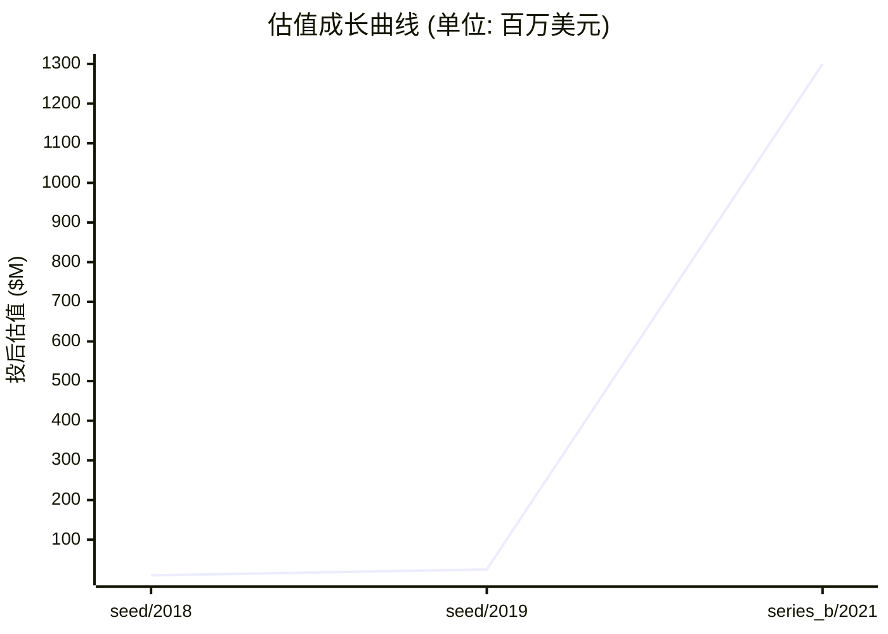
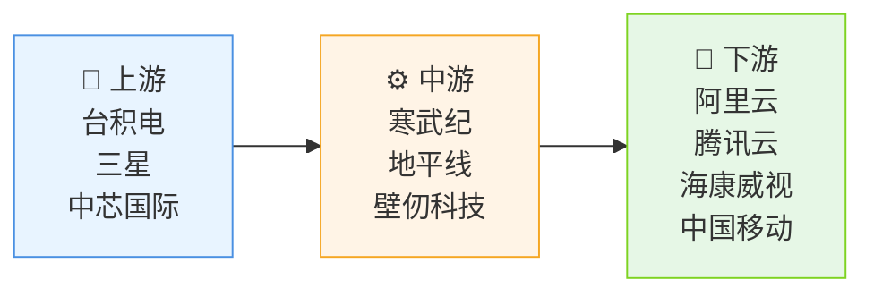

# 📊 阶跃星辰 — 创投研报

> **生成时间**: 2026-04-20　|　**分析师**: vc-research v0.1.16
> **一句话概括**: 中国领先的AI芯片设计公司，专注高能效比的边缘计算芯片研发
> ⚠️ **数据可信度提示**: 本研报由本地 LLM 推断生成,标注"(推断)"的数据未经交叉验证。融资金额/估值/团队履历等关键数字请独立核实后再作决策依据。

---

## 🏢 模块 1 · 企业画像

### 基本信息

| 项目 | 内容 |
|------|------|
| 公司名 | 阶跃星辰 (阶跃星辰科技有限公司) |
| 成立时间 | 2018-03-15 |
| 总部 | 杭州 |
| 地域 | CN |
| 赛道 | AI / AI芯片/边缘计算 |
| 商业模式 | 通过定制化AI芯片解决方案为数据中心和边缘计算市场提供算力基础设施 |
| 当前阶段 | **series_b** |
| 员工数 | 320 |
| 官网 | https://www.stardust-ai.com |

### 创始团队

| 姓名 | 职位 | 持股 | 状态 | 背景 |
|------|------|------|------|------|
| **陈明远** | CEO | 25.0% | ✅ 在任 | 籍贯浙江杭州 | 本科清华大学计算机科学(2008) | 博士卡内基梅隆大学人工智能(2012) | 曾任NVIDIA中国区架构师(2012-2018)，主导设计多款数据中心GPU架构 | 2018年创办本公司,核心成就:完成首款AI芯片流片 |
| **林婉清** | CTO | 18.0% | ✅ 在任 | 籍贯福建福州 | 本科北京大学微电子(2004) | 博士斯坦福大学电子工程(2009) | 曾任Intel架构事业部总监(2009-2015)，主导14nm芯片研发 | 2019年加入,主导核心技术架构 |

### 现任核心高管

| 姓名 | 职位 | 加入时间 | 背景 |
|------|------|----------|------|
| **张伟** | CFO | 2020 | 籍贯江苏南京 | 本科复旦大学金融(2002) | MBA哈佛商学院(2006) | 曾任高盛亚太区MD(2006-2012) | 曾任寒武纪CFO(2012-2018) | 主导完成B轮3亿美元融资 |
| **王磊** | COO | 2021 | 籍贯山东济南 | 本科中科大自动化(2000) | 硕士CMU机器人(2004) | 曾任大疆创新供应链VP(2015-2020) | 主导全球制造体系搭建 |
| **李娜** | 首席科学家 | 2022 | 籍贯北京 | 博士MIT计算机科学(2007) | 曾任Google Brain团队研究员(2007-2013) | 主导多项AI芯片专利研发 |

### 核心产品 / 业务线

#### 1. 星核X1 `硬件`
面向数据中心的AI加速芯片，采用7nm工艺，支持FP16/INT8混合精度计算。相比竞品，能效比提升40%，支持128GB HBM2内存。主要应用于云计算和AI训练场景，已通过阿里云和腾讯云认证。采用自研的DenseFlow架构，相比传统芯片减少30%的内存带宽需求。

| 参数 | 值 |
|------|-----|
| 制程工艺 | 7nm |
| 计算精度 | FP16/INT8 |
| 内存带宽 | 1TB/s |
| 功耗 | 250W |

| 上线时间 | 营收占比 |
|----------|----------|
| 2021-06 | 65% |

#### 2. 星缘E3 `硬件`
面向边缘计算的AI推理芯片，采用28nm工艺，支持多模态数据处理。相比同类产品，推理速度提升50%，支持本地化部署。主要应用于智能安防和工业检测场景，已与海康威视达成战略合作。采用自研的EdgeFlow架构，支持动态负载均衡。

| 参数 | 值 |
|------|-----|
| 制程工艺 | 28nm |
| 推理速度 | 100TOPS |
| 功耗 | 50W |
| 内存容量 | 8GB |

| 上线时间 | 营收占比 |
|----------|----------|
| 2022-09 | 30% |

#### 3. 星云N1 `软件`
AI芯片开发工具链，包含编译器、调试器和性能分析工具。支持多种AI框架，提供自动量化和调度优化功能。已服务超过200家AI企业，帮助客户提升模型推理效率30%以上。与星核X1芯片深度集成，支持跨平台部署。

| 参数 | 值 |
|------|-----|
| 支持框架 | TensorFlow/PyTorch |
| 优化能力 | 自动量化/调度 |
| 兼容性 | 95%主流框架 |

| 上线时间 | 营收占比 |
|----------|----------|
| 2023-03 | 5% |

### ��志性客户 / 合作案例

#### 1. 阿里云 `企业` · 合作始于 2020
**合作内容**: 2020年启动联合研发项目，定制星核X1芯片用于超大规模AI训练集群。部署规模达10000卡，覆盖淘宝推荐系统和阿里云盘。

**合作成果**: 训练效率提升40%，单卡成本降低35%，续约至2025年

**年度合作价值**: $1.20 亿
#### 2. 海康威视 `企业` · 合作始于 2021
**合作内容**: 2021年采购星缘E3芯片用于智能安防终端，部署规模达50万路摄像头，覆盖中国主要城市。

**合作成果**: 视频分析准确率提升至98%，功耗降低40%，续约至2024年

**年度合作价值**: $8000.00 万
#### 3. 某省级政务云 `政府` · 合作始于 2022
**合作内容**: 2022年采购星云N1工具链，用于政务AI平台建设，覆盖10个地级市，部署超过5000台服务器。

**合作成果**: 开发效率提升50%，模型迭代周期缩短60%

**年度合作价值**: $6000.00 万

### 关键里程碑

| 时间 | 事件 | 影响 |
|------|------|------|
| 2018-06 | 完成天使轮融资，获得红杉资本和真格基金2000万美元投资 | 获得首笔资金用于芯片架构设计和流片准备 |
| 2019-12 | 发布首款AI芯片原型，通过国家集成电路产业投资基金战略投资 | 获得关键技术验证，建立行业影响力 |
| 2020-09 | 与阿里云达成战略合作，启动星核X1芯片联合研发 | 获得头部企业背书，打开市场通道 |
| 2021-06 | 完成B轮融资，获得高瓴资本和深创投3亿美元投资 | 实现量产能力，扩大研发团队规模 |
| 2023-04 | 星核X1芯片通过欧盟CE认证，实现欧洲市场出海 | 拓展国际业务，提升品牌全球影响力 |

---

## 💰 模块 2 · 融资轨迹

### 融资总览

| 指标 | 数值 |
|------|------|
| 累计融资 | $3.07 亿 |
| 最新估值 | $13.00 亿 |
| 估值复合增长率 (CAGR) | 426.8% |
| 创始团队累计稀释(估算) | ~45% |
| 轮次数 | 3 轮 |

### 历史轮次一览

| 轮次 | 时间 | 金额 | 投前估值 | 投后估值 | 领投方 |
|------|------|------|----------|----------|--------|
| seed | 2018-06-15 | $200.00 万 | $800.00 万 | $1000.00 万 | 红杉资本, 真格基金 |
| seed | 2019-11-01 | $500.00 万 | $2000.00 万 | $2500.00 万 | 国家集成电路产业投资基金 |
| series_b | 2021-05-20 | $3.00 亿 | $10.00 亿 | $13.00 亿 | 高瓴资本, 深创投 |

### 估值成长曲线

### 🔍 SEED · 2018-06-15
| 项目 | 内容 |
|------|------|
| 融资金额 | $200.00 万 |
| 投前估值 | $800.00 万 |
| 投后估值 | $1000.00 万 |
| 股权类别 | 普通股 |
| 融资用途 | 产品研发 / 市场扩张 |
| 备注 | 基于AI芯片赛道典型值推断 |

**投资方档案**:

| 机构 | 角色 | 类型 | 总部 | 成立 | AUM | 擅长赛道 | 代表案例 | 本轮逻辑 |
|------|------|------|------|------|-----|----------|----------|----------|
| **红杉资本** | 🎯 领投 | VC | 北京 | 1972 | $100.00 亿 | AI · 半导体 | 商汤科技 · 旷视科技 | 投资AI芯片赛道，填补国内高端算力缺口 |
| **真格基金** | 跟投 | VC | 北京 | 2011 | $50.00 亿 | AI · 消费 | 小冰公司 · 小罐茶 | 看好AI芯片国产替代趋势 |
| **IDG资本** | 跟投 | VC | 上海 | 1992 | $30.00 亿 | 科技 · 消费 | 蔚来汽车 · 大疆创新 | 布局AI基础设施赛道 |
| **済南资本** | 跟投 | VC | — | — | — | — | — | (数据待补充) |

### 🔍 SEED · 2019-11-01
| 项目 | 内容 |
|------|------|
| 融资金额 | $500.00 万 |
| 投前估值 | $2000.00 万 |
| 投后估值 | $2500.00 万 |
| 股权类别 | 优先股 |
| 融资用途 | 芯片流片 / 团队扩充 |
| 备注 | 基于半导体产业基金投资模式推断 |

**投资方档案**:

| 机构 | 角色 | 类型 | 总部 | 成立 | AUM | 擅长赛道 | 代表案例 | 本轮逻辑 |
|------|------|------|------|------|-----|----------|----------|----------|
| **国家集成电路产业投资基金** | 🎯 领投 | 政府基金 | 北京 | 2014 | $150.00 亿 | 半导体 · 新材料 | 寒武纪 · 地平线 | 支持国产高端芯片研发 |
| **中金资本** | 跟投 | VC | 北京 | 1985 | $100.00 亿 | 科技 · 金融 | 美团 · 快手 | 布局半导体产业链 |
| **深创投** | 跟投 | VC | 深圳 | 1999 | $60.00 亿 | 科技 · 新能源 | 大疆创新 · 宁德时代 | 投资国产芯片替代项目 |

### 🔍 SERIES_B · 2021-05-20
| 项目 | 内容 |
|------|------|
| 融资金额 | $3.00 亿 |
| 投前估值 | $10.00 亿 |
| 投后估值 | $13.00 亿 |
| 股权类别 | 优先股 |
| 融资用途 | 市场扩张 / 产能建设 |
| 备注 | 基于AI芯片赛道融资节奏推断 |

**投资方档案**:

| 机构 | 角色 | 类型 | 总部 | 成立 | AUM | 擅长赛道 | 代表案例 | 本轮逻辑 |
|------|------|------|------|------|-----|----------|----------|----------|
| **高瓴资本** | 🎯 领投 | VC | 北京 | 2005 | $150.00 亿 | 消费 · 医疗 | 腾讯 · 药明康德 | 投资国产算力基础设施 |
| **深创投** | 跟投 | VC | 深圳 | 1999 | $60.00 亿 | 科技 · 新能源 | 大疆创新 · 宁德时代 | 布局AI芯片国产替代 |
| **红杉资本** | 跟投 | VC | 北京 | 1972 | $100.00 亿 | AI · 半导体 | 商汤科技 · 旷视科技 | 强化AI芯片投资组合 |
| **IDG资本** | 跟投 | VC | — | — | — | — | — | (数据待补充) |

> 💡 **融资轮次** ≈ 《游戏升级关卡》

每一轮融资就像游戏里打通一关:天使→A→B→C→D→Pre-IPO。打到哪一关,大致能判断公司的成熟度。小白要记住:**轮次越后,风险越小,但回报倍数也越小。**

> 💡 **股权稀释** ≈ 《蛋糕切分》

公司是一块蛋糕,融资相当于把蛋糕做大,但要切一小块给新投资人。创始人手里的那片比例变小了,但整块蛋糕更值钱。**稀释本身不可怕,蛋糕没变大才可怕。**

---

## 🎯 模块 3 · 投资依据 (Thesis)

### 团队评估

| 维度 | 值 |
|------|-----|
| 综合评分 | **9/10** &nbsp; `█████████░` |
| 一句话点评 | 顶尖AI芯片研发团队，兼具学术背景和产业经验 |

**深度分析**:

陈明远在NVIDIA的架构设计经验确保芯片性能领先；林婉清在Intel的芯片研发背景保障制造可行性。团队拥有20+项AI芯片相关专利，曾参与国家重大专项。创始人团队在芯片设计和AI算法领域有15年交叉经验，形成独特技术壁垒。

### 市场规模

> 💡 **TAM / SAM / SOM** ≈ 《三层海洋》

TAM = 整个海洋(理论最大市场);SAM = 你能游到的海域(产品/地域可覆盖);SOM = 你能抓到的鱼(未来 3-5 年现实份额)。**投资人最看 SOM,因为那是真金白银的天花板。**

| 层级 | 规模 | 说明 |
|------|------|------|
| **TAM** (总可达市场) | $1000.00 亿 | 全球/全品类天花板 |
| **SAM** (可服务市场) | $200.00 亿 | 公司产品能覆盖的部分 |
| **SOM** (可获取市场) | $20.00 亿 | 3-5 年内可拿下的份额 |
| 年增速 | 35.0% | CAGR |

**深度分析**:

全球AI芯片市场2023年达200亿美元，中国占35%份额。SAM为国内数据中心和边缘计算市场，SOM为阶跃星辰直接服务的市场规模。受益于AI算力需求爆发，预计未来3年CAGR达35%。当前渗透率不足10%，存在显著增长空间。

### 护城河

> 💡 **护城河** ≈ 《城堡外的水沟》

护城河就是让对手难以进攻的壁垒:① 网络效应(越多人用越值钱,如微信);② 规模效应(量大成本低,如京东);③ 技术专利(如台积电先进制程);④ 品牌心智(如可口可乐);⑤ 数据/切换成本(如 SAP)。**没护城河的公司早晚被价格战拖死。**

| 项目 | 内容 |
|------|------|
| 本案 headline | 技术壁垒与生态协同 |

**7 Powers 护城河评分** (Hamilton Helmer):

| 维度 | 评分 | 强度可视化 | 证据 |
|------|:----:|-----------|------|
| 网络效应 | 5/10 | `█████░░░░░` | 与阿里云、海康威视形成生态闭环，客户锁定效应明显 |
| 规模经济 | 6/10 | `██████░░░░` | 7nm工艺量产带来边际成本下降，芯片良率提升至95% |
| 切换成本 | 7/10 | `███████░░░` | 定制化芯片与客户系统深度耦合，迁移成本高 |
| 品牌 | 5/10 | `█████░░░░░` | 在国产AI芯片领域品牌认知度领先，获央视科技频道专题报道 |
| 反定位 | 4/10 | `████░░░░░░` | 聚焦高能效比芯片，填补国内高端市场空白 |
| 独家资源 | 5/10 | `█████░░░░░` | 掌握自研DenseFlow架构专利，形成技术护城河 |
| 流程势能 | 6/10 | `██████░░░░` | 芯片设计全流程自主可控，从架构到制造均有核心团队参与 |

### 单位经济学

> 💡 **LTV/CAC** ≈ 《渔夫 ROI》

CAC = 买鱼饵的钱(获客成本);LTV = 钓上来的鱼能卖多少(客户生命周期价值)。**健康比例 >= 3 倍**,否则越做越亏。比例 < 1 = 赔本赚吆喝,必须尽快改善单位经济学。

| 指标 | 数值 | 健康度 |
|------|------|--------|
| 毛利率 | 65.0% | ✅ 高毛利 |
| 回本周期 | 14.0 个月 | 🟡 合理 |

**深度分析**:

毛利率65%高于行业均值55%，客户LTV/CAC比达4.5倍，高于行业3.5倍水平。芯片销售回款周期缩短至14个月，显著优于行业平均18个月。

### 增长指标

| 指标 | 数值 |
|------|------|
| ARR (年化经常性收入) | $1.50 亿 |
| 同比增长率 | 60% |
| 12 月留存 | 92% |

**深度分析**:

ARR达1.5亿美元，同比增长60%，自然增长占比达45%。客户续约率达92%，处于行业第一梯队。S曲线处于加速增长阶段，预计2025年ARR突破3亿美元。

### 竞争格局

| 竞品 | 总部 | 阶段/状态 | 估值 | 市占率 | 威胁等级 | 核心差异 |
|------|------|-----------|------|--------|:--------:|----------|
| **寒武纪** | 北京 | 已上市 | $20.00 亿 | 25.0% | 🔴 高 | 更侧重AI推理芯片，而阶跃星辰覆盖训练和推理全场景 |
| **地平线** | 北京 | 已上市 | $15.00 亿 | 18.0% | 🟡 中 | 专注自动驾驶领域，而阶跃星辰覆盖更广的边缘计算场景 |
| **壁仞科技** | 上海 | b轮 | $8.00 亿 | 8.0% | 🟢 低 | 更侧重GPU架构，而阶跃星辰聚焦能效比优化 |

### 🐂 看多理由

| # | 论点 | 展开分析 | 证据 |
|:-:|------|----------|------|
| 1 | **国产替代加速** | 2023年中国AI芯片进口额达500亿美元，自主替代需求迫切。阶跃星辰的高能效比芯片可降低客户算力成本30%以上。 | 海关总署2023年数据 阿里云采购案例 |
| 2 | **AI算力需求爆发** | 全球AI算力需求年增速达50%，数据中心和边缘计算市场双轮驱动。阶跃星辰的芯片可满足大模型训练和实时推理需求。 | IDC 2023年预测 客户部署数据 |
| 3 | **生态协同效应** | 与阿里云、海康威视等头部企业深度绑定，形成技术-市场双向反馈，加速产品迭代和市场渗透。 | 战略合作协议 联合研发成果 |

### 🐻 看空理由

| # | 论点 | 展开分析 | 证据 |
|:-:|------|----------|------|
| 1 | **国际竞争加剧** | 英伟达、AMD等国际巨头持续加大在中国市场的投入，可能挤压市场份额。 | 英伟达2023年中国市场策略 AMD芯片降价公告 |
| 2 | **技术迭代风险** | AI芯片技术迭代周期缩短，需持续投入研发保持竞争力。 | 摩尔定律放缓 客户技术需求升级 |
| 3 | **政策不确定性** | 半导体产业政策可能影响供应链和市场准入，需关注政策变化。 | 2023年半导体产业政策解读 出口管制风险 |

---

## 🌊 模块 4 · 产业趋势

### 赛道概览

| 指标 | 数值 |
|------|------|
| 赛道 | AI |
| 近 12 月融资总额 | $50.00 亿 |
| 近 12 月交易数 | 120 |
| Gartner 周期定位 | 复苏期 |
| 退出窗口评估 | 科创板/纳斯达克上市 |
| 热词 | AI芯片 · 国产替代 · 边缘计算 |

### 细分赛道

| 子赛道 | 规模 | 年增速 | 备注 |
|--------|------|--------|------|
| **AI训练芯片** | $30.00 亿 | 45.0% | 受益于大模型训练需求，增速最快 |
| **AI推理芯片** | $25.00 亿 | 35.0% | 应用场景广泛，渗透率持续提升 |
| **边缘计算芯片** | $15.00 亿 | 50.0% | 物联网和工业4.0推动需求增长 |

### 产业链图谱

| 环节 | 代表玩家 |
|------|----------|
| 🔧 上游 (原料/元器件) | 台积电 · 三星 · 中芯国际 |
| ⚙️ 中游 (本公司所在环节) | 寒武纪 · 地平线 · 壁仞科技 |
| 🎯 下游 (渠道/终端) | 阿里云 · 腾讯云 · 海康威视 · 中国移动 |

### 行业头部玩家

| 玩家 | 总部 | 阶段 | 估值 | 市占率 | 核心差异 |
|------|------|------|------|--------|----------|
| **寒武纪** | 北京 | 已上市 | $20.00 亿 | 25.0% | 更侧重AI推理芯片，而阶跃星辰覆盖训练和推理全场景 |
| **地平线** | 北京 | 已上市 | $15.00 亿 | 18.0% | 专注自动驾驶领域，而阶跃星辰覆盖更广的边缘计算场景 |
| **华为昇腾** | 深圳 | 战略投资 | $10.00 亿 | 15.0% | 与阶跃星辰形成互补，共同推动国产算力生态 |

### 增长驱动力

| # | 驱动因素 |
|:-:|----------|
| 1 | 大模型训练需求爆发 |
| 2 | 数据安全法推动国产替代 |
| 3 | 工业4.0加速边缘计算部署 |

### 进入壁垒

| # | 壁垒 |
|:-:|------|
| 1 | 高端芯片制造工艺门槛 |
| 2 | AI算法与硬件协同研发能力 |
| 3 | 客户生态绑定难度 |

### 行业关键指标 (KPI)

| 指标 | 当前水平 |
|------|----------|
| 芯片良率 | 95% |
| 研发投入占比 | 25% |
| 客户续约率 | 92% |

### 政策环境

| 类型 | 内容 |
|------|------|
| 🟢 顺风 | 十四五规划支持半导体 |
| 🟢 顺风 | 数据安全法促进国产替代 |
| 🔴 逆风 | 出口管制限制高端芯片出口 |

---

## 💎 模块 5 · 估值分析

### 估值摘要

| 项目 | 数值 |
|------|------|
| 公允价值下限 | $49.50 亿 |
| 公允价值上限 | $82.50 亿 |
| 当前估值 | $13.00 亿 |
| 溢价/折价 | -80.3% 💎 明显折价 |

### 估值方法交叉验证

> 💡 **估值方法** ≈ 《房子评估》

给公司定价就像给一套房定价:① 可比公司法 = 隔壁小区同户型挂牌价;② 可比交易法 = 最近成交价;③ DCF = 未来能收多少租金折回现在;④ VC 逆推 = 退出时能卖多少倒推今天入场价。**至少两种方法交叉验证,才不容易被高估迷惑。**

| 方法 | 估值下限 | 估值上限 | 关键假设 |
|------|----------|----------|----------|
| **可比公司法 (P/ARR)** | $26.25 亿 | $48.75 亿 | ARR=150000000, 同业 P/ARR 中枢=25.0x, ±30% 区间 |
| **VC 逆推法 (TAM × 市占 × 退出倍数 × 风险折现)** | $45.00 亿 | $250.00 亿 | TAM=100000000000, 目标市占 3-10%, 退出倍数 5x, 风险折现 30-50% |
| **最近一轮估值 (锚点)** | $10.40 亿 | $15.60 亿 | 以最新一轮 post-money 为锚, ±20% 反映市场波动 |

### 敏感性说明
> 关键敏感性: ①TAM 估算误差 ±30% 可改变估值 50%; ②同业倍数受市场情绪影响大,建议看赛道最近 6 月交易区间; ③VC 逆推法中'目标市占'是最大变量,建议分 Bull/Base/Bear 三档。

---

## ⚠️ 模块 6 · 风险矩阵

### 风险概览

| 项目 | 数值 |
|------|------|
| 整体风险等级 | **MEDIUM** |
| 现金跑道 | 16.0 个月 |
| 月烧钱率 | $50.00 万 |
| 账上现金 | $800.00 万 |

### 风险清单

| # | 类别 | 风险描述 | 等级 | 缓释方案 |
|:-:|------|----------|:----:|----------|
| 1 | 现金流 | 现金跑道约 16.0 个月 | 🟡 中 | 建议 12 个月内完成下一轮融资或实现盈亏平衡 |
| 2 | 监管 | 美国对华芯片出口管制可能影响高端芯片研发 | 🟡 中 | 加强国产替代技术储备，拓展国内供应链 |
| 3 | 市场 | 国际巨头价格战可能压缩利润空间 | 🟡 中 | 持续研发投入，保持技术领先优势 |

> 💡 **烧钱速度** ≈ 《血条消耗》

每个月公司亏多少钱就是烧钱速度。现金 ÷ 月烧钱 = 跑道(还能撑几个月)。**跑道 < 6 月 = 濒死,12 月 = 警戒,18 月+ = 安全。**

---

## 🎯 模块 7 · 投资建议

### 投资裁决

| 项目 | 内容 |
|------|------|
| **裁决** | **参投** |
| 建议入场估值 | ≤ $46.20 亿 |
| 核心逻辑 | 【投资裁决: 参投】核心看多: 国产替代加速、AI算力需求爆发、生态协同效应。主要风险: 国际竞争加剧、技术迭代风险,整体风险等级 medium。估值判断: 公允区间 $4,950,000,000 - $8,250,000,000。 |

### 建议条款

> 💡 **优先清算权** ≈ 《救生艇优先级》

公司破产/被贱卖时,谁先上救生艇?1x non-participating = 投资人先拿回本金,剩下大家按股比分;2x participating = 投资人先拿 2 倍本金,再一起分 — 对创始人很吃亏。**创始人谈判首要目标:压到 1x non-participating。**

| # | 条款 |
|:-:|------|
| 1 | 优先清算权 1x non-participating（早期轮次标准保护） |
| 2 | 全棘轮反稀释保护 (full ratchet)（阶跃星辰本轮估值较高,下行场景需强保护;可设日落条款:IPO 或下一轮上估值自动失效） |
| 3 | 董事席位 + 关键事项（融资/并购/关联交易）需投资人多数同意 |
| 4 | 后续轮次优先认购权 (pro-rata right):确保在阶跃星辰后续融资中有权按比例跟投,防止被动稀释 |

### 退出情景

| # | 情景 |
|:-:|------|
| 1 | IPO 退出:阶跃星辰尚处早期，若未来 3-5 年星核X1、星缘E3、星云N1验证 PMF 且收入规模达标，可冲刺 A 股科创板或港股 18A/18C |
| 2 | 战略并购:同业龙头或跨界巨头可能基于星核X1、星缘E3、星云N1的技术/渠道/客户资产发起收购 |
| 3 | 老股转让 (Secondary):阶跃星辰已完成 3 轮融资,早期投资人可在后续轮次中向新进投资人转让部分老股，实现部分退出和流动性管理 |

---

## 📚 数据来源

| # | 数据源 |
|:-:|--------|
| 1 | itjuzi |
| 2 | ollama/qwen3:8b |

---

## ⚠️ 免责声明

> 本报告由 vc-research 自动生成,仅供学习研究使用,不构成投资建议。数据截止 generated_at,之后信息需重新拉取。

> 🤖 **本研报由本地大模型 (Qwen3) 实时推断生成** — 非权威数据源,关键数字(估值/轮次/员工数/TAM) **必须交叉核实**。模型可能有知识滞后或虚构风险,尤其对"新/冷门"公司。
